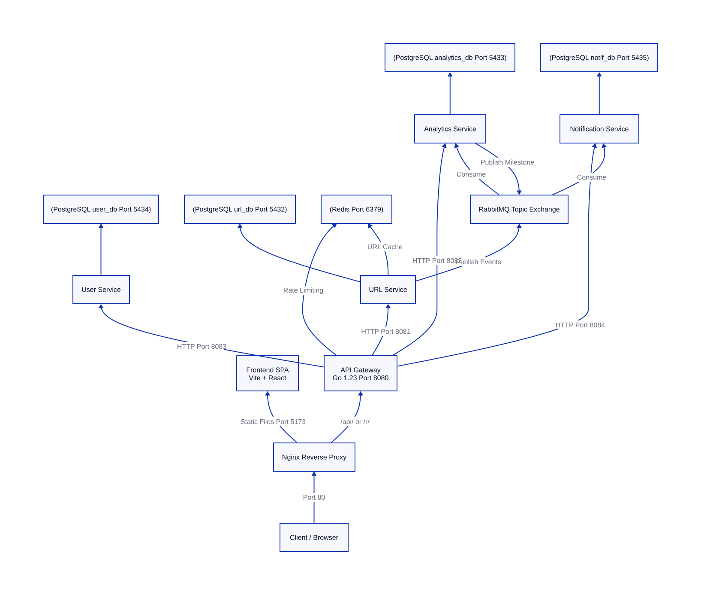
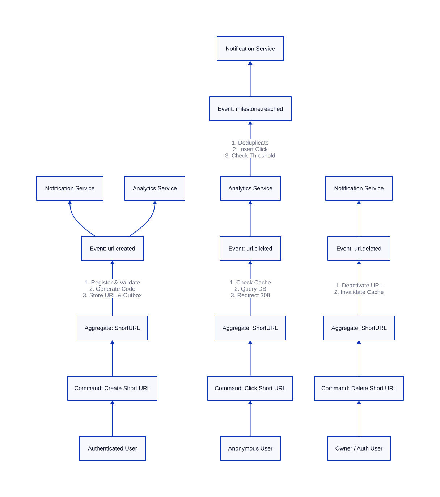
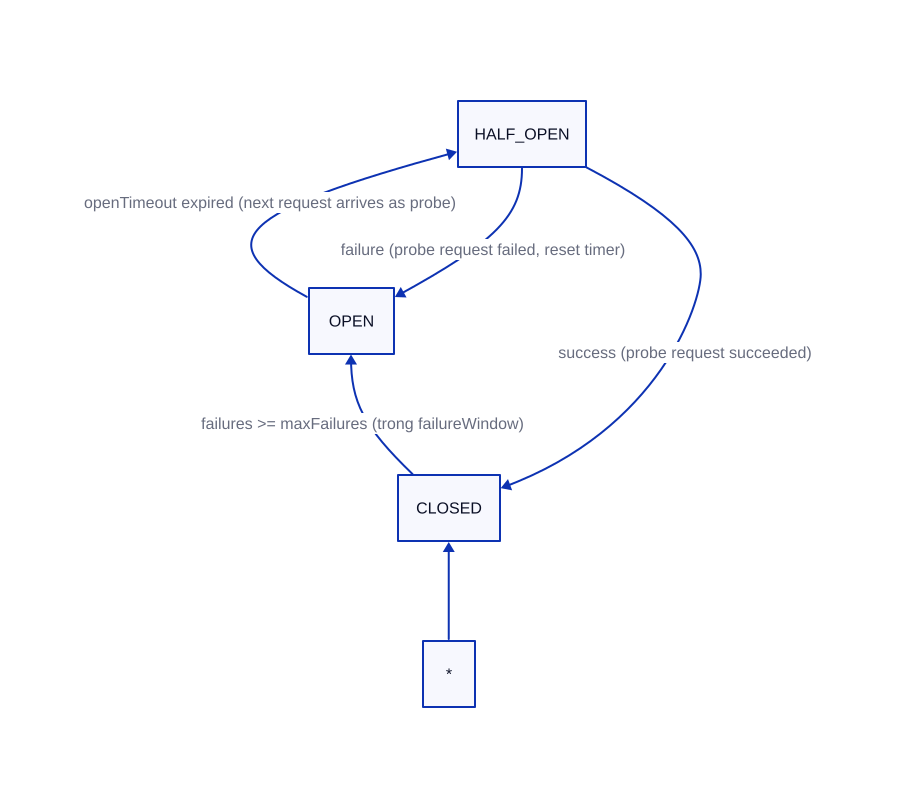
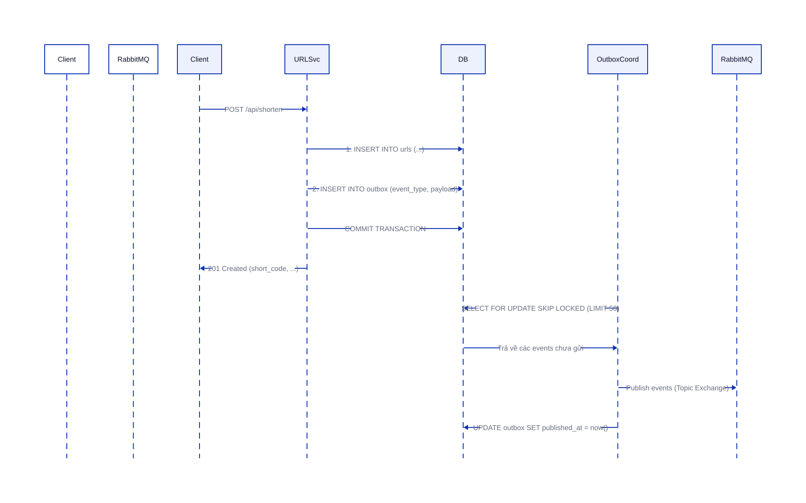
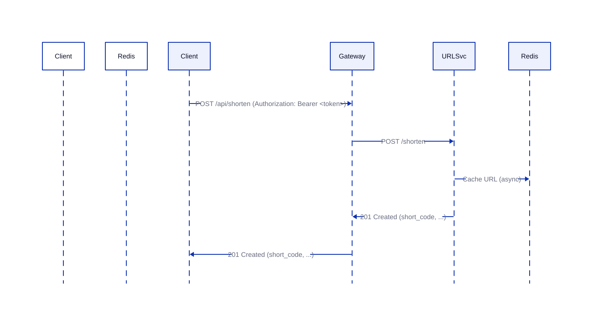

# Báo Cáo Phân Tích Kiến Trúc Hệ Thống URL Shortener Microservices

---
## Mục Lục

1. [Tổng Quan Kiến Trúc Microservices](#1-tổng-quan-kiến-trúc-microservices)
2. [Domain-Driven Design & Bounded Context Analysis](#2-domain-driven-design--bounded-context-analysis)
3. [API Gateway - Thành Phần & Cơ Chế Hoạt Động](#3-api-gateway---thành-phần--cơ-chế-hoạt-động)
4. [Phân Tích Kiến Trúc Các Service](#4-phân-tích-kiến-trúc-các-service)
5. [Shared Packages](#5-shared-packages)
6. [Event-Driven Architecture & Outbox Pattern](#6-event-driven-architecture--outbox-pattern)
7. [Infrastructure & Deployment](#7-infrastructure--deployment)
8. [Monitoring & Observability](#8-monitoring--observability)
9. [Các Thuật Toán & Cơ Chế Cốt Lõi](#9-các-thuật-toán--cơ-chế-cốt-lõi)
10. [Điểm Mạnh, Điểm Yếu & Khuyến Nghị](#10-điểm-mạnh-điểm-yếu--khuyến-nghị)
11. [Kết Luận](#11-kết-luận)
12. [Phụ Lục](#phụ-lục)

---

## 1. Tổng Quan Kiến Trúc Microservices

### 1.1 Danh sách 5 Services

Hệ thống được thiết kế theo kiến trúc microservices với **5 services chính** và **3 shared packages**, được tổ chức trong một Go workspace monorepo (`go.work`):

| #   | Service                                                     | Vai trò                                                                             | DB riêng                              | Port |
| --- | ----------------------------------------------------------- | ----------------------------------------------------------------------------------- | ------------------------------------- | ---- |
| 1   | **Gateway** (`gateway/`)                                    | API Gateway, reverse proxy, authentication, rate limiting, circuit breaker, metrics | Redis (rate limit)                    | 8080 |
| 2   | **User Service** (`services/user-service/`)                 | Đăng ký, đăng nhập, quản lý người dùng                                              | PostgreSQL (`user_db`)                | 8083 |
| 3   | **URL Service** (`services/url-service/`)                   | Tạo, đọc, xóa short URL, redirect, caching                                          | PostgreSQL (`url_db`) + Redis (cache) | 8081 |
| 4   | **Analytics Service** (`services/analytics-service/`)       | Ghi nhận click, thống kê, milestone                                                 | PostgreSQL (`analytics_db`)           | 8082 |
| 5   | **Notification Service** (`services/notification-service/`) | Thông báo URL events cho người dùng                                                 | PostgreSQL (`notification_db`)        | 8084 |

**Frontend** là một SPA (Single Page Application) dựng bằng Vite + React (tại `frontend/`), giao tiếp với backend qua Gateway.

### 1.2 Tech Stack Chi Tiết

- **Ngôn ngữ**: Go 1.23.0 (Backend), TypeScript/React (Frontend)
- **Thư viện chính**: `net/http` (stdlib), `ReverseProxy` (stdlib), `pgx/v5` (PostgreSQL), `go-redis/v9` (Redis), `amqp091-go` (RabbitMQ), `jwt/v5` (JWT), `prometheus/client_golang` (Metrics).
- **Cơ sở dữ liệu**: PostgreSQL 16 (Relational DBs), Redis 7 (Rate limit, Caching), RabbitMQ 3.13 (Message broker).
- **Hạ tầng**: Nginx 1.27 (Reverse Proxy đầu vào), Docker Compose (Local development), Kubernetes (Production deployment).
- **Giám sát**: Prometheus 2.53 (Metrics), Grafana 11.1 (Dashboards), Loki 2.9 + Promtail (Log aggregation).

### 1.3 Luồng Request Điển Hình

- **Luồng 1 (User Đăng Ký/Login)**: Client → Nginx → Gateway (Bỏ qua Auth/Rate Limit) → User Service → PostgreSQL (`user_db`). Trả về JWT token khi đăng nhập thành công.
- **Luồng 2 (Tạo Short URL)**: Client → Nginx → Gateway (JWT Verify → Rate Limit → Circuit Breaker) → URL Service (Auth Verify → DB Insert & Outbox Insert trong cùng 1 Transaction → Redis Cache) → Trả về Short Code. Background Outbox Coordinator sẽ poll event từ DB và publish lên RabbitMQ.
- **Luồng 3 (Redirect URL)**: Client → Nginx → Gateway (Rate Limit → Circuit Breaker) → URL Service (Check Redis Cache -> HIT: Redirect ngay; MISS: Query PostgreSQL -> Cache write -> Redirect). Event click được đẩy bất đồng bộ vào Outbox để xử lý sau.

### 1.4 Sơ Đồ Kiến Trúc Tổng Thể



---

---

## 2. Domain-Driven Design & Bounded Context Analysis

### 2.1 Xác định 4 Bounded Contexts

Hệ thống được mô hình hóa rõ ràng thành **4 Bounded Contexts**:

#### Bounded Context 1: User & Authentication

- **Service & Database**: `user-service` / PostgreSQL (`user_db`)
- **Aggregate Root**: `User` (id, email, password_hash, created_at)
- **Value Objects**: `Password` (bcrypt-hashed), `Email` (validated), `JWT Token` (HMAC-SHA256 signed)
- **Repositories**: `UserRepository` interface (`pgxUserStore` implementation)

#### Bounded Context 2: URL Shortening

- **Service & Databases**: `url-service` / PostgreSQL (`url_db`) + Redis (cache)
- **Aggregate Root**: `ShortURL` (id, shortCode, originalURL, userID, userEmail, expiresAt, isActive)
- **Entities & Value Objects**: `URLRecord`, `OutboxRecord`, `ShortCode` (base62), `CachedURL`
- **Domain Events**: `URLCreatedEvent`, `URLClickedEvent`, `URLDeletedEvent` (published via Outbox)
- **Domain Services**: `URLService` (business logic), `ShortCodeGenerator`, `OutboxCoordinator`, `URLValidator`

#### Bounded Context 3: Analytics & Milestones

- **Service & Database**: `analytics-service` / PostgreSQL (`analytics_db`)
- **Aggregate Root**: `Click` (shortCode, clickedAt, ipHash, userAgent, referer)
- **Entities**: `ClickRecord`, `DeduplicationRecord` (event_id), `MilestoneRecord`
- **Domain Events**: Consumes `URLClickedEvent` → Emit `MilestoneReachedEvent` (khi đạt 10, 100, 1000 clicks)
- **Domain Services**: `MilestoneChecker`, `DeduplicationService` (đảm bảo idempotency)

#### Bounded Context 4: Notifications

- **Service & Database**: `notification-service` / PostgreSQL (`notification_db`)
- **Aggregate Root**: `Notification` (id, userID, userEmail, eventType, payload, createdAt)
- **Domain Events**: Consumes `URLCreatedEvent`, `URLDeletedEvent`, `MilestoneReachedEvent`

### 2.2 Context Mapping

Mối quan hệ giữa các Bounded Context được định nghĩa thông qua các pattern:

- **Open Host Service (OHS)**: Tất cả services expose REST API qua Gateway.
- **Published Language / Event-Driven**: Giao tiếp bất đồng bộ thông qua RabbitMQ (Downstream services consume events từ topic exchange).
- **Separate Ways**: Dữ liệu hoàn toàn độc lập, mỗi service sở hữu DB riêng.
- **Anti-Corruption Layer (ACL)**: Gateway đóng vai trò làm ACL để bảo vệ hệ thống nội bộ (Authentication, Rate Limiting, CORS, Circuit Breaker).

### 2.3 Event Storming - Domain Events

| Event Type          | Producer          | Consumer(s)             | Trigger                        | Payload                                                                   |
| ------------------- | ----------------- | ----------------------- | ------------------------------ | ------------------------------------------------------------------------- |
| `url.created`       | URL Service       | Analytics, Notification | Tạo short URL thành công       | short_code, original_url, user_id, user_email, expires_at                 |
| `url.clicked`       | URL Service       | Analytics               | Click vào short URL            | short_code, user_id, user_email, ip_hash, user_agent, referer, clicked_at |
| `url.deleted`       | URL Service       | Notification            | Xóa/Hủy kích hoạt short URL    | short_code, user_id, user_email                                           |
| `milestone.reached` | Analytics Service | Notification            | Đạt ngưỡng click (10/100/1000) | short_code, user_id, user_email, milestone, total_clicks                  |

#### Sơ đồ Luồng Sự Kiện (Event Flow Diagram - Event Storming)



### 2.4 Aggregate Roots

#### `User` Aggregate (User Context)

- **Schema**:
  ```
  User {
      id: string (UUID)
      email: Email (Value Object)
      passwordHash: string (bcrypt)
      createdAt: timestamp
  }
  ```
- **Invariants**: Email phải là độc nhất (unique), password đã được mã hóa bằng thuật toán an toàn.
- **Repository**: `UserRepository`.

#### `ShortURL` Aggregate (URL Context)

- **Schema**:
  ```
  ShortURL {
      id: string (UUID)
      shortCode: ShortCode (7-char base62)
      originalURL: URL (Value Object)
      userID: string
      userEmail: string
      createdAt: timestamp
      expiresAt: timestamp | nil
      isActive: boolean
  }
  ```
- **Invariants**: `shortCode` phải độc nhất, `originalURL` phải tuân thủ đúng định dạng scheme (http/https).
- **Business Rules**:
  - Không chuyển hướng nếu URL đã quá hạn hoặc đã bị hủy kích hoạt (`isActive = false`).
  - Chỉ người sở hữu URL (owner) mới có quyền hủy kích hoạt URL đó.
- **Repository**: `URLStore`.
- **Caching**: `Cache` interface cho Redis projection.

#### `Click` Aggregate (Analytics Context)

- **Schema**:
  ```
  Click {
      shortCode: string
      clickedAt: timestamp
      ipHash: string (one-way hash)
      userAgent: string
      referer: string
  }
  ```
- **Invariants**: Đảm bảo idempotency bằng cách kiểm tra trùng lặp thông qua `event_id` trước khi insert click record.
- **Repository**: `ClickRepository`.

#### `Notification` Aggregate (Notification Context)

- **Schema**:
  ```
  Notification {
      id: string (UUID)
      userID: string
      userEmail: string
      eventType: string
      payload: json
      createdAt: timestamp
  }
  ```
- **Repository**: `NotificationRepository`.

### 2.5 Ubiquitous Language

| Thuật ngữ           | Định nghĩa                                                     | Context        |
| :------------------ | :------------------------------------------------------------- | :------------- |
| **Short Code**      | Mã 7 ký tự Base62 đại diện cho URL gốc.                        | URL            |
| **Short URL**       | URL đầy đủ dạng `http://host/r/{short_code}`.                  | URL            |
| **Original URL**    | URL đích dài cần rút gọn.                                      | URL            |
| **Redirect**        | Chuyển hướng HTTP 308 từ Short URL sang Original URL.          | URL            |
| **Click**           | Một lần truy cập thực tế vào Short URL của người dùng.         | Analytics      |
| **Milestone**       | Ngưỡng click đạt cột mốc (10, 100, 1000 clicks).               | Analytics      |
| **Outbox**          | Bảng database tạm thời lưu trữ các domain events chờ publish.  | URL            |
| **Deduplication**   | Cơ chế lọc trùng lặp event để đảm bảo tính idempotent.         | Analytics      |
| **Hash IP**         | Băm một chiều địa chỉ IP của client để bảo vệ quyền riêng tư.  | URL, Analytics |
| **Rate Limit**      | Giới hạn số lượng request trong một khoảng thời gian xác định. | Gateway        |
| **Circuit Breaker** | Cơ chế ngắt kết nối tạm thời tới upstream service khi có lỗi.  | Gateway        |

### 2.6 Quyết định Thiết kế Chiến lược (Strategic Design Decisions)

1. **Tách biệt Database hoàn toàn**: Mỗi service sở hữu PostgreSQL riêng. Đảm bảo loose coupling tối đa và cho phép schema tiến hóa độc lập.
2. **Giao tiếp hướng sự kiện (Event-Driven)**: Sử dụng RabbitMQ với Topic Exchange pattern. URL Service publish events, các downstream services consume bất đồng bộ, tránh làm chậm luồng chính.
3. **Transactional Outbox Pattern**: Đảm bảo tính nhất quán (eventual consistency) giữa trạng thái database và tin nhắn gửi đi mà không cần dùng distributed transactions.
4. **API Gateway làm Anti-Corruption Layer (ACL)**: Tập trung hóa authentication, rate limiting, và circuit breaker tại Gateway để giải phóng các service nội bộ khỏi các nghiệp vụ phụ trợ này.
5. **Double JWT Verification**: Cả Gateway và internal services đều verify JWT nhằm gia tăng tính bảo mật (Defense in Depth).
6. **Cache-aside Pattern**: Sử dụng Redis cache kèm TTL hợp lý để giảm tải cho PostgreSQL của URL Service trong luồng redirect.

---

## 3. API Gateway - Thành Phần & Cơ Chế Hoạt Động

API Gateway là cửa ngõ duy nhất của hệ thống, chịu trách nhiệm cho các vấn đề cross-cutting concerns:

### 3.1 Cơ Chế Cấu Hình
Cấu hình hoàn toàn qua biến môi trường (Environment Variables). Hệ thống sẽ dừng hoạt động ngay lập tức (fail-fast) nếu thiếu các cấu hình bắt buộc.

### 3.2 Cơ Chế Routing & Path Rewriting
Gateway sử dụng cơ chế so khớp tiền tố đường dẫn (First-match prefix matching) để phân phối requests tới các upstream services phù hợp:

| Method | PathPrefix           | Upstream Service       | Auth | Rate Limit Key | Strip Prefix |
| :----- | :------------------- | :--------------------- | :--- | :------------- | :----------- |
| POST   | `/api/auth/register` | `user-service`         | ✗    | -              | `/api/auth`  |
| POST   | `/api/auth/login`    | `user-service`         | ✗    | -              | `/api/auth`  |
| GET    | `/api/me`            | `user-service`         | ✓    | -              | `/api`       |
| POST   | `/api/shorten`       | `url-service`          | ✓    | `shorten`      | `/api`       |
| GET    | `/api/urls`          | `url-service`          | ✓    | -              | `/api`       |
| DELETE | `/api/urls/`         | `url-service`          | ✓    | -              | `/api`       |
| GET    | `/r/`                | `url-service`          | ✗    | `redirect`     | `/r`         |
| GET    | `/api/stats/`        | `analytics-service`    | ✗    | -              | `/api`       |
| GET    | `/api/notifications` | `notification-service` | ✓    | -              | `/api`       |

#### Phân tích quyết định định tuyến (Routing Decisions):
- **Các endpoints xác thực (Auth) không giới hạn tần suất (Rate limit)**: Đăng ký (`/register`) và Đăng nhập (`/login`) hiện tại không bị giới hạn rate limit. Đây là một rủi ro bảo mật lớn (dễ bị tấn công brute-force mật khẩu). Cần đề xuất bổ sung rate limit riêng cho các endpoints này.
- **Endpoint rút gọn URL (`/shorten`) giới hạn 10 req/60s**: Hợp lý để ngăn ngừa hành vi spam tạo URL rác làm tràn ngập dữ liệu.
- **Endpoint redirect `/r/` giới hạn cao (300 req/60s)**: Phục vụ lượng truy cập lớn của người dùng phổ thông, đảm bảo tính sẵn sàng cao của dịch vụ chính.
- **Endpoint thống kê (`/stats/`) công khai**: Bất kỳ người dùng ẩn danh nào cũng có thể xem thống kê của URL nếu biết short code. Điều này phù hợp với mô hình chia sẻ thông số công khai của nhiều nền tảng rút gọn URL.
- **Endpoint Notifications yêu cầu JWT ở cả 2 đầu**: Chỉ người dùng sở hữu tài khoản mới xem được thông báo tương ứng của mình, đảm bảo tính riêng tư dữ liệu.

### 3.3 Reverse Proxy Implementation
Sử dụng `net/http/httputil.ReverseProxy` của Go Standard Library. Đường dẫn gốc được viết lại (strip prefix) và lưu vào request context trước khi proxy chuyển tiếp. Hỗ trợ forward các header chuẩn: `X-Forwarded-For`, `X-Real-IP`, và `X-Correlation-ID`.
- **Điểm mạnh (Strengths)**: Tận dụng tối đa thư viện chuẩn của Go để tối ưu hiệu năng (zero allocation hot path); viết lại đường dẫn linh hoạt; hỗ trợ forward header chuẩn.
- **Điểm yếu (Weaknesses)**: Thiếu cơ chế tự động thử lại (retry logic) khi upstream lỗi; cấu hình hồ chứa kết nối (connection pooling) mặc định; thiếu cấu hình timeout độc lập cho từng service.

### 3.4 JWT Authentication Middleware
Trước khi chuyển tiếp request đến các route yêu cầu xác thực (`RequiresAuth: true`), Middleware sẽ:
1. Trích xuất Bearer token từ `Authorization` header.
2. Kiểm tra chữ ký số JWT bằng `JWT_SECRET`.
3. Giải mã và lưu thông tin `Claims` vào request context cho các handler tiếp theo sử dụng.
- **Lý do thiết kế**: Đóng vai trò là lớp kiểm soát truy cập vòng ngoài (ACL). Giúp lọc bỏ các request không hợp lệ sớm nhất có thể trước khi chạm vào các service nghiệp vụ bên trong.

### 3.5 Request Handler & Health Check
Đóng vai trò điều phối chính cho request đi qua Gateway.
- **Quy trình xử lý (Request Flow)**: So khớp Route -> Check Auth (JWT) -> Check Rate Limiting -> Strip Prefix -> Check Circuit Breaker (cho url-service) -> Thực hiện Proxy -> Ghi nhận Prometheus Metrics.
- **Thiết kế**: Sử dụng Dependency Injection (DI) để truyền đối tượng qua các interfaces (`rateLimiter`, `circuitBreaker`), hỗ trợ cô lập và dễ viết unit test.
- **Tối ưu & An toàn**: Bản tin phản hồi JSON `/health` được pre-encoded khi khởi động để tối ưu hiệu năng. Sử dụng shallow check (không ping database) để tránh gây quá tải DB.

### 3.6 Rate Limiting & Cơ Chế Fail-Open
- **Thuật toán**: Fixed Window, lưu trữ counters trong Redis với thời gian timeout cho mỗi thao tác là 100ms.
- **Key format**: `rl:{route_key}:{client_ip}` (ví dụ: `rl:shorten:192.168.1.1`).
- **Thiết kế Fail-Open**: Nếu kết nối Redis gặp sự cố, hệ thống chỉ ghi log cảnh báo và **vẫn cho phép request đi qua** nhằm đảm bảo tính sẵn sàng tối đa của dịch vụ (Availability > Consistency).
- **Điểm yếu**: Thuật toán Fixed Window dễ bị vượt ngưỡng giới hạn ở biên của 2 cửa sổ thời gian (Boundary problem); phụ thuộc vào Redis (SPOF); dễ bị vượt qua bằng cách đổi IP (nếu không giới hạn theo User ID) hoặc giả mạo header `X-Forwarded-For`.

### 3.7 Circuit Breaker State Machine
Bảo vệ Gateway khỏi tình trạng cascading failure khi URL Service gặp sự cố:



- **CLOSED**: Requests được chuyển tiếp bình thường.
- **OPEN**: Requests bị reject ngay lập tức tại Gateway với HTTP 503 Service Unavailable mà không gọi upstream.
- **HALF-OPEN**: Khi hết timeout, cho phép **duy nhất 1 request** đi qua để kiểm tra (probe). Thành công → CLOSED; Thất bại → OPEN trở lại.
- **Điểm mạnh**: Hỗ trợ lock-free tối đa cho hầu hết các hoạt động đọc trạng thái; tích hợp kiểm tra hủy bỏ context (`context cancellation`); cơ chế Half-Open probe chỉ cho phép 1 request đi qua để thử nghiệm nhằm bảo vệ hệ thống triệt để.
- **Điểm yếu**: CB không có bộ định thời phục hồi tự động (chỉ chuyển từ Open sang Half-open khi có request mới tới Gateway); chỉ đang cấu hình bảo vệ cho duy nhất `url-service`; coi tất cả mọi loại lỗi (gồm cả lỗi từ client 4xx hoặc network timeout) là lỗi hệ thống để tăng counter.

### 3.8 Correlation ID & CORS Middleware
- **Correlation ID**: Trích xuất hoặc tự sinh UUID mới thông qua header `X-Correlation-ID` và inject vào ngữ cảnh request context. Giúp trace log phân tán một cách đồng bộ xuyên suốt qua toàn bộ hệ thống các service nội bộ.
- **CORS**: Thiết lập CORS mở rộng cho môi trường local (`Access-Control-Allow-Origin: *`).
- **Điểm yếu**: Sử dụng wildcard Origin `*` là một lỗ hổng bảo mật nếu deploy trực tiếp lên production. Cần cấu hình động dựa trên domain cụ thể.

---

## 4. Phân Tích Kiến Trúc Các Service

Mỗi microservice tuân thủ kiến trúc phân tầng (Handlers/Controllers → Business Services → Repositories/Stores) nhằm đảm bảo tính độc lập và khả năng viết unit test dễ dàng:

### 4.1 User Service

- **Nhiệm vụ**: Quản lý định danh và phiên đăng nhập.
- **Cơ chế bảo mật nổi bật**:
  - **Bảo vệ tấn công Timing Attack**: Khi user không tồn tại trong DB, hệ thống vẫn thực hiện so khớp password với một "dummy hash" ngẫu nhiên để tránh việc kẻ tấn công dò tìm email tồn tại dựa trên thời gian phản hồi.
  - Sử dụng Bcrypt (cost=12) để băm mật khẩu.

### 4.2 URL Service

- **Nhiệm vụ**: Rút gọn URL, điều hướng redirect và quản lý vòng đời short code.
- **Cơ chế lưu kho (Caching)**: Cache-aside pattern với Redis. Endpoint redirect check Redis trước (timeout 50ms), nếu miss mới query DB và lưu lại vào cache bất đồng bộ.
- **Bảo toàn Event**: Sử dụng transactional outbox pattern để đảm bảo việc tạo URL và ghi nhận event tạo mới luôn diễn ra atomic (cùng thành công hoặc cùng thất bại).

### 4.3 Analytics Service

- **Nhiệm vụ**: Thống kê click chuột, tổng hợp dữ liệu theo timeline và phát hiện Milestone.
- **Xử lý idempotent**: Đảm bảo mỗi event click từ RabbitMQ chỉ được xử lý một lần thông qua bảng đối chiếu deduplication (`event_id` làm khóa chính).

### 4.4 Notification Service

- **Nhiệm vụ**: Lắng nghe các event từ hệ thống và tạo thông báo tương ứng cho người dùng.
- **Cơ chế hoạt động**: Sử dụng Manual Acknowledgement (ACK) khi consume tin nhắn từ RabbitMQ. Chỉ ACK khi đã lưu thông báo vào DB thành công; nếu lỗi sẽ gửi NACK kèm cơ chế Requeue để xử lý lại.

---

## 5. Shared Packages

Các thư viện dùng chung được định nghĩa độc lập để tránh trùng lặp code:

1.  **`shared/auth`**: Chứa logic sinh/verify JWT Token, cấu hình Middleware kiểm tra xác thực và các helper trích xuất claims từ context.
2.  **`shared/events`**: Định nghĩa cấu trúc chuẩn của các Domain Events (`BaseEvent`, `URLCreatedEvent`, `URLClickedEvent`, `URLDeletedEvent`, `MilestoneReachedEvent`).
3.  **`shared/logger`**: Logger cấu trúc sử dụng thư viện chuẩn `log/slog` định dạng JSON. Tự động trích xuất Correlation ID từ context và ghi nhận thông tin HTTP request.

---

## 6. Event-Driven Architecture & Outbox Pattern

### 6.1 Transactional Outbox Pattern

Nhằm giải quyết bài toán phân tán dữ liệu mà không cần dùng Distributed Transactions (như 2PC), hệ thống áp dụng Transactional Outbox Pattern:



Cơ chế này đảm bảo thuộc tính **At-Least-Once Delivery** – tin nhắn chắc chắn sẽ được gửi đi, dù cho broker RabbitMQ có bị down tại thời điểm tạo URL.

### 6.2 RabbitMQ Topic Exchange

Hệ thống sử dụng Topic Exchange (`url-shortener`) để định tuyến tin nhắn linh hoạt:

- `url.created` → Gửi đến Queue của Notification Service.
- `url.clicked` → Gửi đến Queue của Analytics Service.
- `url.deleted` → Gửi đến Queue của Notification Service.
- `milestone.reached` → Gửi đến Queue của Notification Service.

---

## 7. Infrastructure & Deployment

### 7.1 Nginx Reverse Proxy

Nginx đứng ở ngoài cùng làm cổng tiếp nhận traffic HTTP (port 80):

- Prefix `/api/` và `/health` → Chuyển tiếp tới Upstream API Gateway.
- Prefix `/r/` (Redirect) → Chuyển tiếp tới Upstream API Gateway.
- Các path khác `/` → Phục vụ giao diện tĩnh của Frontend.

### 7.2 Docker Compose Topology

Trong môi trường phát triển local, Docker Compose quản lý **18 containers**:

- 4 Database PostgreSQL riêng biệt.
- 1 Redis instance + 1 RabbitMQ broker.
- 5 backend services (Gateway + 4 services).
- Frontend SPA server.
- Monitoring stack (Prometheus, Grafana, Loki, Promtail, Adminer).
  Tất cả container được cấu hình Healthcheck rõ ràng nhằm đảm bảo thứ tự khởi động (ví dụ: DB khởi động xong thì Service mới chạy).

### 7.3 Kubernetes Manifests

Mô tả kiến trúc triển khai trên Production:

- **`url-service`**: Scale lên 3 bản sao (Replicas) để đáp ứng lượng traffic redirect lớn.
- **`gateway`**: Scale lên 2 bản sao đảm bảo High Availability (HA), expose qua NodePort.
- **ConfigMap & Secrets**: Dùng `app-config` cho các chuỗi kết nối và `JWT_SECRET` được bảo mật qua Secret.

---

## 8. Monitoring & Observability

Hệ thống được tích hợp sẵn giải pháp quan sát toàn diện:

- **Prometheus**: Thu thập metrics định kỳ (scrape_interval: 5s) từ `/metrics` endpoint của tất cả 5 services. Gateway export metrics về trạng thái Circuit Breaker, số lượng requests, và biểu đồ phân bố latency.
- **Grafana**: Cấu hình sẵn 2 dashboards (`circuit_breaker.json` và `services_overview.json`) hiển thị trực quan sức khỏe hệ thống.
- **Loki + Promtail**: Gom log tập trung từ các container và hiển thị trên Grafana.

---

## 9. Các Thuật Toán & Cơ Chế Cốt Lõi

### 9.1 Base62 Codec (Thuật toán rút gọn URL)

Để tạo short code ngắn gồm 7 ký tự từ một URL gốc:

1. Hệ thống sinh số ngẫu nhiên lớn bằng `crypto/rand` (đảm bảo tính ngẫu nhiên an toàn cao hơn `math/rand`).
2. Sử dụng thuật toán Base62 (`math/big`) để mã hóa số ngẫu nhiên này thành chuỗi ký tự chứa `[a-zA-Z0-9]`.
3. Số lượng mã tối đa: 62⁷ ≈ 3.52 nghìn tỷ mã. Xác suất va chạm cực kỳ thấp. Hệ thống hỗ trợ retry 3 lần nếu có va chạm code trong DB.

### 9.2 Outbox Coordinator Worker Pool

Để publish events hiệu quả mà không gây nghẽn:

- Một Goroutine chính thực hiện poll bảng `outbox` mỗi 2 giây, lấy tối đa 50 bản ghi chưa publish.
- Sử dụng truy vấn SQL `FOR UPDATE SKIP LOCKED` để các worker chạy song song không tranh chấp dữ liệu.
- Phân phối các công việc này cho 3 Worker Goroutines chạy ngầm thực hiện gửi message sang RabbitMQ và cập nhật DB.

### 9.3 Khóa mịn trong Circuit Breaker (Fine-grained Locking)

Để tránh deadlock và không chặn request khi ghi nhận metrics:

- Sử dụng `sync.Mutex` để đồng bộ trạng thái state machine của CB.
- Hàm callback thông báo đổi trạng thái (`notifyStateChange`) được gọi **sau khi đã unlock** mutex để đảm bảo các tiến trình khác có thể tiếp tục truy cập CB ngay lập tức.

---

## 10. Điểm Mạnh, Điểm Yếu & Khuyến Nghị

### 10.1 Điểm Mạnh (Strengths)

1.  **Thiết kế chuẩn Microservices**: Tách biệt DB hoàn toàn, loose coupling tốt, giao tiếp qua message broker.
2.  **Độ tin cậy cao (Resiliency)**:
    - Tích hợp Circuit Breaker ngăn lỗi lan chuyền (cascading failure).
    - Áp dụng Outbox Pattern giúp chống mất mát dữ liệu sự kiện.
    - Thiết kế Rate Limit kiểu Fail-open bảo vệ dịch vụ.
3.  **DDD Rõ Ràng**: Phân chia bounded contexts, aggregate roots và ubiquitous language nhất quán.
4.  **Bảo mật**: Cơ chế dummy hash chống timing attack, mã hóa IP người dùng, bảo mật JWT hai lớp.
5.  **DevOps-ready**: Cấu hình Kubernetes hoàn chỉnh, tích hợp đầy đủ Prometheus, Grafana, Loki.

### 10.2 Điểm Yếu (Weaknesses)

1.  **Hạn chế của CB**: Chỉ mới áp dụng bảo vệ cho `url-service`, các service khác (User, Notification) chưa được cấu hình Circuit Breaker.
2.  **Thuật toán Rate Limit đơn giản**: Sử dụng Fixed Window dễ gặp vấn đề quá tải đột biến tại biên giới hạn (Boundary problem).
3.  **Cấu hình CORS quá thoáng**: Dùng `Access-Control-Allow-Origin: *` không an toàn cho production.
4.  **Thiếu cơ chế tự động phục hồi của CB**: Circuit Breaker chỉ chuyển từ Open sang Half-Open khi có request mới tới (chứ không tự động phục hồi chủ động theo timer).
5.  **Bảo mật**: Login endpoint chưa được cấu hình rate limit chống tấn công brute-force.
6.  **Thiếu Distributed Tracing**: Gây khó khăn khi trace luồng lỗi giữa các service phân tán trong production.

### 10.3 Khuyến Nghị Cải Thiện (Recommendations)

#### Ưu tiên 1 (Cần làm ngay)

- **Thêm Circuit Breaker cho toàn bộ Upstream**: Đảm bảo tất cả các service gọi qua Gateway đều được bảo vệ.
- **Rate Limit cho Auth Endpoints**: Đặt giới hạn chặt chẽ cho các API `/register` và `/login`.
- **Sửa cấu hình CORS**: Thay thế wildcard `*` bằng danh sách tên miền được cho phép cụ thể qua env vars.
- **Thêm Timeout Graceful Shutdown**: Thiết lập timeout (ví dụ: 30s) cho hàm `Shutdown` của Gateway để tránh bị treo tiến trình vĩnh viễn khi có kết nối bị kẹt.

#### Ưu tiên 2 (High Priority)

- **Chuyển sang Sliding Window Rate Limit**: Để khắc phục nhược điểm biên của Fixed Window.
- **Tích hợp Distributed Tracing (Jaeger)**: Kết hợp với Correlation ID có sẵn để vẽ bản đồ cuộc gọi phân tán.
- **Bổ sung Sentry**: Để bắt lỗi và cảnh báo ngoại lệ tập trung.

---

## 11. Kết Luận

Hệ thống URL Shortener Microservices là một mô hình thiết kế chuẩn chỉ và hoàn chỉnh bằng ngôn ngữ Go. Các thành phần được cấu trúc khoa học, tuân thủ các best practices về cloud-native, DDD và tính sẵn sàng cao. Bằng cách áp dụng một vài cải tiến nhỏ về mặt bảo mật (CORS, Rate Limit Auth) và độ tin cậy (CB cho toàn bộ services, Graceful Shutdown timeout), hệ thống hoàn toàn đáp ứng tốt các yêu cầu vận hành thực tế ở quy mô sản xuất.

---

## Phụ Lục

### Phụ Lục A: Các Quyết Định Kiến Trúc Chính

- **A.1 Sử dụng `ReverseProxy` của stdlib**: Tránh phụ thuộc thư viện ngoài, tối ưu hiệu năng, dễ bảo trì. Đánh đổi: Phải tự xây dựng Circuit Breaker và cơ chế Load Balancing.
- **A.2 Sử dụng RabbitMQ thay vì Kafka**: Do nhu cầu hệ thống là Event-Driven xử lý nghiệp vụ thông thường (chứ không phải Event Streaming khối lượng lớn), RabbitMQ cung cấp cơ chế định tuyến (Topic Exchange) linh hoạt và dễ vận hành hơn.
- **A.3 Cơ chế Fail-open của Rate Limiter**: Hệ thống coi Redis Rate Limiter là thành phần bảo vệ bổ sung. Nếu Redis gặp sự cố, hệ thống chọn hy sinh tính năng giới hạn để giữ cho dịch vụ hoạt động bình thường, thay vì chặn đứng toàn bộ người dùng.
- **A.4 Xác thực JWT hai lớp**: Gateway verify JWT để chặn sớm request xấu, nhưng các internal service vẫn thực hiện verify lại nhằm đảm bảo an toàn tuyệt đối phòng trường hợp mạng nội bộ bị xâm nhập hoặc request gọi trực tiếp bypass Gateway.

### Phụ Lục B: Phân Tích Bảo Mật (Security)

#### Luồng Authorized Request Flow



#### Bảng Đánh Giá Mối Đe Dọa (Security Threat Assessment)

| Mối đe dọa                     | Mức độ     | Biện pháp giảm thiểu hiện tại                                        |
| :----------------------------- | :--------- | :------------------------------------------------------------------- |
| **Đánh cắp token JWT**         | Cao        | Đặt TTL ngắn (24h), khuyến nghị HTTPS trên production.               |
| **Tấn công Brute force Login** | Trung bình | Mã hóa Bcrypt cost=12 (chậm), cơ chế dummy hash chống timing attack. |
| **SQL Injection**              | Cao        | Sử dụng pgx với parameterized queries (truy vấn tham số hóa).        |
| **CSRF**                       | Trung bình | Token JWT truyền qua `Authorization` header thay vì Cookie.          |
| **Bypass Rate limit**          | Thấp       | Rate limit dựa trên IP người dùng kết hợp fail-open.                 |

### Phụ Lục C: Phân Tích Hiệu Năng (Performance)

- **Xác suất va chạm Short Code**: Với độ dài 7 ký tự Base62 (62⁷ ≈ 3.52 nghìn tỷ kết hợp), áp dụng nghịch lý ngày sinh nhật (Birthday paradox), sau khi tạo 1 triệu URLs, xác suất va chạm chỉ khoảng 1.4×10⁻⁷. Với cơ chế sinh lại tối đa 3 lần, khả năng thất bại do va chạm là hoàn toàn không đáng kể (2.7×10⁻²¹).
- **Hiệu năng cache**: Redis cache check được cài đặt timeout chặt chẽ ở mức 50ms. Nếu Redis phản hồi chậm, hệ thống tự động fallback sang database để tránh gây nghẽn cục bộ cho client. Tỉ lệ cache hit kỳ vọng cho flow redirect (đọc nhiều hơn ghi) là trên 90%.

### Phụ Lục D: Phân Tích Cấu Trúc File & Dòng Code (Summary)

#### Thống kê quy mô mã nguồn

| Component         | Số lượng Files | Tổng số dòng code | Vai trò chính                                          |
| :---------------- | :------------: | :---------------: | :----------------------------------------------------- |
| **Gateway**       |       12       |      ~1,000       | Routing, Auth, Rate limit, Circuit Breaker             |
| **URL Service**   |       16       |      ~1,500       | Quản lý URL, Redirect, Cache-aside, Outbox coordinator |
| **User Service**  |       11       |       ~600        | Quản lý người dùng, Xác thực mật khẩu Bcrypt           |
| **Shared Auth**   |       2        |       ~180        | JWT Verify, Auth Middleware dùng chung                 |
| **Shared Logger** |       1        |        ~80        | Structured logger `slog` JSON + Correlation ID         |

---

_Báo cáo hoàn chỉnh. Hết tài liệu._
