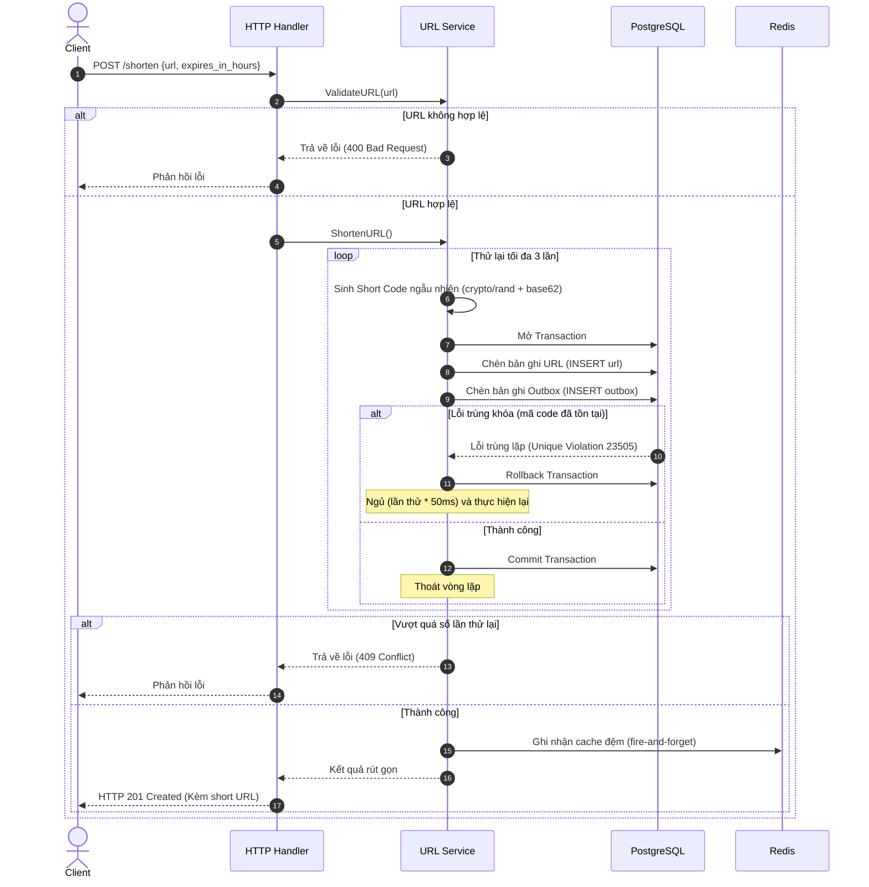
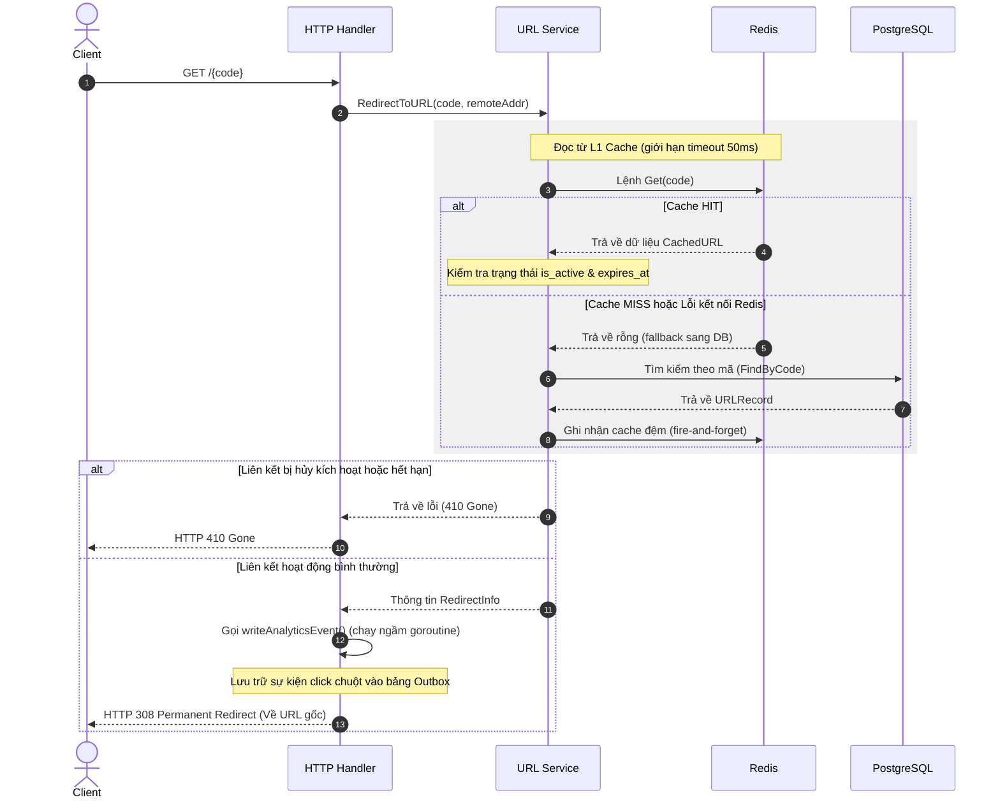
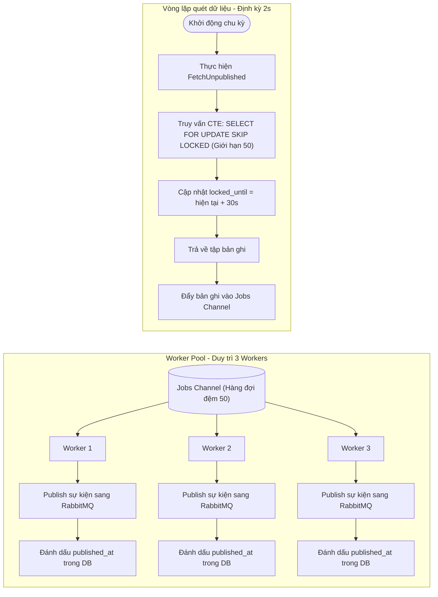
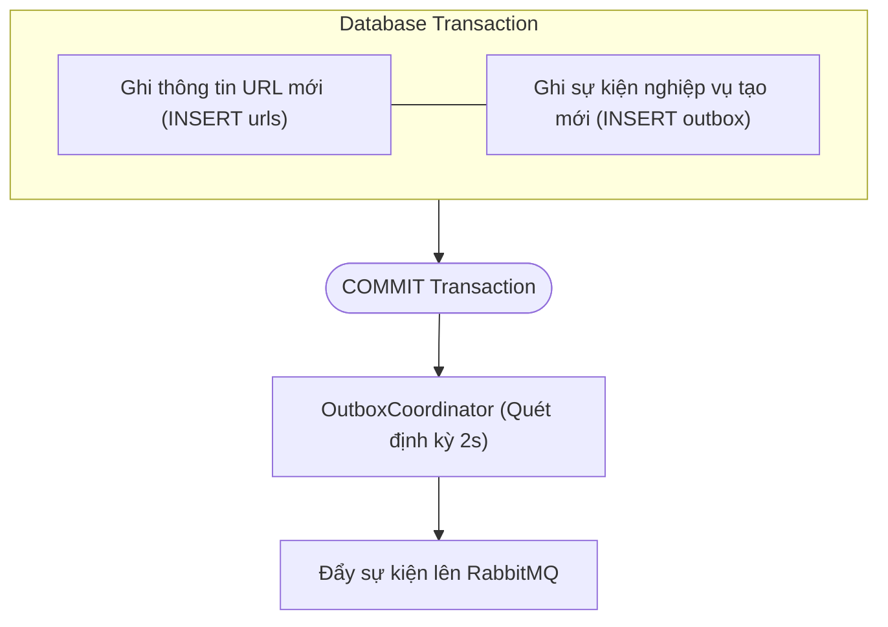

# Phân Tích Chi Tiết URL Service — Microservice Rút Gọn URL

> **Tác giả:** Agent AI  
> **Dự án:** url-shortener-microservices  
> **Ngày:** 2026-07-12  
> **Phiên bản phân tích:** v1.5  
> **Phạm vi phân tích:** Thiết kế kiến trúc và mô hình hóa URL Service

---

## Mục Lục

1. [Tổng Quan URL Service](#1-tổng-quan-url-service)
2. [Cấu Hình & Kết Nối Hạ Tầng](#2-cấu-hình--kết-nối-hạ-tầng)
3. [Thiết Kế Cơ Sở Dữ Liệu (Schema Database)](#3-thiết-kế-cơ-sở-dữ-liệu-schema-database)
4. [Các Hợp Phần Tiện Ích & Helper](#4-các-hợp-phần-tiện-ích--helper)
5. [Tầng Lưu Trữ & Hạ Tầng Dữ Liệu](#5-tầng-lưu-trữ--hạ-tầng-dữ-liệu)
6. [Tầng Xử Lý Logic & Bootstrapping](#6-tầng-xử-lý-logic--bootstrapping)
7. [Bản Đồ Luồng Hoạt Động & Hiệu Năng](#7-bản-đồ-luồng-hoạt-động--hiệu-năng)
8. [Phân Tích Phi Chức Năng (Bảo Mật, Tin Cậy, Mở Rộng)](#8-phân-tích-phi-chức-năng-bảo-mật-tin-cậy-mở-rộng)
9. [Tích Hợp Shared Packages](#9-tích-hợp-shared-packages)
10. [Kết Luận](#10-kết-luận)

---

## 1. Tổng Quan URL Service

URL Service là microservice chịu trách nhiệm quản lý vòng đời của liên kết rút gọn trong hệ thống `url-shortener-microservices`. Chi tiết về kiến trúc tổng thể của toàn hệ thống và cách URL Service kết nối với các microservices khác đã được mô tả tại [Báo cáo Tổng quan Kiến trúc](file:///e:/Code/url-shortener-microservices/reports/01-agent-tong-quan-kien-truc.md). 

Tài liệu này tập trung đi sâu phân tích cấu trúc thiết kế chi tiết bên trong của riêng URL Service.

### 1.1. Nguyên Lý Thiết Kế Cốt Lõi

Hệ thống được vận hành dựa trên 5 nguyên tắc thiết kế then chốt:
1. **Transactional Outbox**: Ghi nhận sự kiện nghiệp vụ vào database trong cùng transaction với thực thể chính, bảo đảm độ tin cậy truyền tin (At-Least-Once Delivery).
2. **Cache-Aside L1**: Tối ưu tốc độ điều hướng (Redirect) bằng cách lưu đệm thông tin URL active lên Redis trước khi truy vấn PostgreSQL.
3. **Fail-Open (Redis)**: Lớp Cache đệm không nằm trên critical path bắt buộc. Khi Redis gặp sự cố, hệ thống tự động bypass qua database để tránh gián đoạn dịch vụ.
4. **Cryptographic Randomness**: Loại bỏ rủi ro bị tấn công dò tìm liên kết bằng cách sử dụng nguồn sinh số ngẫu nhiên an toàn của hệ điều hành (`crypto/rand`).
5. **Graceful Shutdown**: Thu hồi context để dừng background worker và chờ đóng kết nối HTTP Server an toàn (timeout 10 giây) khi nhận tín hiệu ngắt từ hệ điều hành.

---

## 2. Cấu Hình & Kết Nối Hạ Tầng

### 2.1. Cấu Hình Hệ Thống

Cấu trúc cấu hình hệ thống được định nghĩa qua đối tượng `Config` với các tham số chính sau:

| Tham số        | Trạng thái | Mặc định                | Ý nghĩa & Đánh giá                                                                         |
| -------------- | ---------- | ----------------------- | ------------------------------------------------------------------------------------------ |
| `DatabaseURL`  | Bắt buộc   | —                       | Chuỗi kết nối PostgreSQL (DSN format).                                                     |
| `RedisURL`     | Bắt buộc   | —                       | Chuỗi kết nối Redis (DSN format).                                                          |
| `RabbitMQURL`  | Bắt buộc   | —                       | Chuỗi kết nối RabbitMQ (AMQP format).                                                      |
| `JWTSecret`    | Bắt buộc   | —                       | Khóa bí mật kiểm tra tính hợp lệ của JWT.                                                  |
| `ShortURLBase` | Tùy chọn   | `http://localhost:8080` | URL cơ sở ghép với short code trả về client.                                               |
| `IPHashSalt`   | Tùy chọn   | `default-salt`          | Muối băm IP. **Cảnh báo**: Cần cấu hình lại trên Production để tránh rainbow table attack. |
| `Port`         | Tùy chọn   | `8080`                  | Cổng HTTP server.                                                                          |
| `ServiceName`  | Hardcode   | `url-service`           | Định danh phục vụ ghi log.                                                                 |

_Đánh giá_: Hệ thống áp dụng nguyên tắc fail-fast khi khởi tạo: mọi lỗi phân tích hoặc thiếu cấu hình bắt buộc sẽ lập tức dừng chương trình.

### 2.2. Tham Sẽ Kết Nối Các Dịch Vụ Hạ Tầng

Hệ thống thiết lập các kết nối hạ tầng với cơ chế chịu lỗi cụ thể như sau:

| Dịch vụ        | Tham số kết nối chính                                          | Cơ chế chịu lỗi & Hành vi                                                                                          |
| -------------- | -------------------------------------------------------------- | ------------------------------------------------------------------------------------------------------------------ |
| **PostgreSQL** | `MaxConns` = 10, `MinConns` = 2, Timeout ping = 10s            | **Fatal**: Dừng dịch vụ lập tức nếu không kết nối được DB (Fail-fast). Tự động dọn dẹp pool khi lỗi.               |
| **Redis**      | Timeout ping = 3s                                              | **Non-fatal (Fail-Open)**: Redis lỗi không làm sập dịch vụ. Tự động bypass qua cache để truy vấn trực tiếp DB.     |
| **RabbitMQ**   | Max attempts = 10, Exchange = `url-shortener` (Topic, Durable) | **Fatal** sau 10 lần thử lại kết nối bằng cơ chế **Exponential Backoff** (chờ từ 1s, nhân đôi mỗi lần, cap ở 30s). |

---

## 3. Thiết Kế Cơ Sở Dữ Liệu (Schema Database)

### 3.1. Bảng `urls` (Quản lý liên kết)

Lưu trữ thông tin liên kết giữa mã rút gọn và URL gốc.

| Cột            | Kiểu dữ liệu  | Ràng buộc                               | Ý nghĩa                                   |
| -------------- | ------------- | --------------------------------------- | ----------------------------------------- |
| `id`           | `UUID`        | `PRIMARY KEY DEFAULT gen_random_uuid()` | Khóa chính của bản ghi                    |
| `short_code`   | `VARCHAR(10)` | `UNIQUE NOT NULL`                       | Mã rút gọn duy nhất (thực tế dài 7 ký tự) |
| `original_url` | `TEXT`        | `NOT NULL`                              | URL gốc cần rút gọn                       |
| `user_id`      | `UUID`        | `NOT NULL`                              | Mã người dùng sở hữu URL                  |
| `user_email`   | `TEXT`        | `NOT NULL DEFAULT ''`                   | Email của người dùng tạo link             |
| `created_at`   | `TIMESTAMPTZ` | `NOT NULL DEFAULT now()`                | Thời điểm khởi tạo link                   |
| `expires_at`   | `TIMESTAMPTZ` | `NULL`                                  | Thời điểm hết hạn (NULL là vô hạn)        |
| `is_active`    | `BOOLEAN`     | `NOT NULL DEFAULT true`                 | Trạng thái kích hoạt (soft delete)        |

### 3.2. Bảng `outbox` (Hàng đợi sự kiện DB)

Lưu trữ các sự kiện tạm thời cần gửi đi các microservices khác qua Message Broker.

| Cột            | Kiểu dữ liệu  | Ràng buộc                               | Ý nghĩa                                            |
| -------------- | ------------- | --------------------------------------- | -------------------------------------------------- |
| `id`           | `UUID`        | `PRIMARY KEY DEFAULT gen_random_uuid()` | Khóa chính sự kiện                                 |
| `event_type`   | `TEXT`        | `NOT NULL`                              | Loại sự kiện (Ví dụ: `url.created`, `url.deleted`) |
| `payload`      | `JSONB`       | `NOT NULL`                              | Nội dung chi tiết của sự kiện dạng JSON            |
| `created_at`   | `TIMESTAMPTZ` | `NOT NULL DEFAULT now()`                | Thời gian tạo sự kiện                              |
| `locked_until` | `TIMESTAMPTZ` | `NULL`                                  | Thời gian khóa bản ghi khi được worker xử lý       |
| `published_at` | `TIMESTAMPTZ` | `NULL`                                  | Thời gian sự kiện được gửi đi thành công           |

### 3.3. Chỉ Mục Cơ Sở Dữ Liệu (Indexes)

Hệ thống thiết lập các chỉ mục để tối ưu hóa hiệu năng truy vấn cho hai bảng:

| Tên Chỉ Mục | Bảng | Loại chỉ mục | Cột dữ liệu | Mục tiêu tối ưu |
|---|---|---|---|---|
| `idx_urls_short_code` | `urls` | Unique B-Tree | `short_code` | Đẩy nhanh tốc độ tìm kiếm bản ghi điều hướng theo mã short code. |
| `idx_urls_user_id_created` | `urls` | Composite B-Tree | `(user_id, created_at DESC)` | Phục vụ truy vấn danh sách liên kết của người dùng có sắp xếp phân trang. |
| `idx_outbox_unpublished` | `outbox` | Partial B-Tree | `created_at` | Quét nhanh các sự kiện chưa được gửi (`published_at IS NULL`). |
| `idx_outbox_unpublished_unlocked` | `outbox` | Partial B-Tree | `created_at` | Quét nhanh các sự kiện chưa gửi và chưa bị khóa (`published_at IS NULL AND locked_until IS NULL`). |

---

## 4. Các Hợp Phần Tiện Ích & Helper

### 4.1. Mã Hóa & Sinh Mã Rút Gọn (Base62 & Code Generator)

- **Thuật toán Base62**: Sử dụng bảng chữ cái `0-9a-zA-Z` (62 ký tự). Hệ thống băm số nguyên lớn (`big.Int`) thu được từ nguồn sinh ngẫu nhiên, thực hiện modulo với \(62^7\) để giới hạn độ dài chuỗi rút gọn cố định là 7 ký tự (bù thêm ký tự `'0'` ở bên trái nếu thiếu). Khả năng lưu trữ đạt xấp xỉ \(62^7 \approx 3.5\) nghìn tỷ mã độc nhất.
- **Sinh mã Short Code**: Sinh ngẫu nhiên 8 bytes dữ liệu bằng `crypto/rand` (sử dụng entropy hệ điều hành). Trực tiếp kích hoạt `panic` dừng hệ thống nếu lỗi entropy xảy ra. Xác suất va chạm mã cực kỳ thấp (sau 1 triệu URLs, tỷ lệ trùng mã qua 3 lần thử lại là \(\approx 2.34 \times 10^{-20}\)).

### 4.2. Xác Thực URL & Ánh Xạ Lỗi (Validation & Error Mapping)

- **Quy tắc xác thực**: URL đầu vào bắt buộc phải phân tích cú pháp hợp lệ thông qua `net/url`, scheme phải là `http` hoặc `https` (phòng chống script độc hại), và phải có thông tin host.
- **Ánh xạ lỗi HTTP**: Hệ thống định nghĩa các lỗi logic nội bộ và chuyển đổi sang HTTP Status tương ứng:
  - `ErrInvalidURL` $\rightarrow$ 400 Bad Request
  - `ErrAlreadyExists` $\rightarrow$ 409 Conflict (trùng lặp short code)
  - `ErrNotFound` $\rightarrow$ 404 Not Found
  - `ErrForbidden` $\rightarrow$ 403 Forbidden (sai chủ sở hữu)
  - `ErrExpired` / `ErrDeactivated` $\rightarrow$ 410 Gone (hết hạn hoặc bị xóa)
  - `ErrDatabaseError` $\rightarrow$ 500 Internal Server Error

---

## 5. Tầng Lưu Trữ & Hạ Tầng Dữ Liệu

Lớp này quản lý trực tiếp giao tiếp vật lý với các dịch vụ lưu trữ dữ liệu (PostgreSQL, Redis) và Message Broker (RabbitMQ).

### 5.1. Tầng lưu trữ URLs (URL Store Layer)

Thông qua interface `URLStore` để thực thi CRUD dữ liệu trên PostgreSQL.

- **`Insert`**: Ghi thông tin URL mới vào database. Thao tác này bắt buộc phải truyền kèm `pgx.Tx` để đảm bảo tính nguyên tử (Atomicity) trong transaction cùng sự kiện outbox.
- **`FindByCode`**: Đọc thông tin URL thông qua short code ngoài transaction để tối ưu hóa hiệu năng đọc.
- **`Deactivate`**: Hủy kích hoạt liên kết, cập nhật trạng thái `is_active = false` sau khi so khớp `user_id` sở hữu.
- **Phân trang Cursor**: Truy vấn danh sách URL của user (`FindByUserID`) sử dụng trường UUID `id` làm con trỏ cursor để định vị trang tiếp theo (`id < cursorID`), lấy dư 1 bản ghi để xác định trạng thái còn trang (`hasMore`).

### 5.2. Tầng lưu trữ sự kiện (Outbox Store Layer)

Quản lý trạng thái và ghi nhận các domain events cần đồng bộ sang RabbitMQ.

- **Insert Event**: Hỗ trợ ghi sự kiện tạo/hủy link trong transaction chính của URL, hoặc ghi sự kiện phân tích click chuột (`url.clicked`) trực tiếp không cần transaction để giảm thiểu tải khóa trên database.
- **Truy vấn Lock-Free với CTE**: Quá trình quét bản ghi chưa gửi sử dụng câu lệnh SQL kết hợp Common Table Expression (CTE) và từ khóa `FOR UPDATE SKIP LOCKED`. Worker sẽ tự động khóa 50 sự kiện trong 30 giây để xử lý, các replica chạy song song sẽ tự động bỏ qua các bản ghi này mà không xảy ra tranh chấp khóa hay trùng lặp tác vụ.

### 5.3. Tầng Cache đệm (Redis Cache Layer)

Lớp đệm Redis cache triển khai interface `Cache` để tăng tốc truy xuất.

- **Thiết kế**: Lưu trữ đầy đủ thông tin URL gốc, trạng thái hoạt động và thời hạn dùng để phục vụ điều hướng tức thời mà không cần chạm tới database.
- **Resilience (Fail-Open)**: Khi đọc cache đệm, hệ thống thiết lập giới hạn timeout là 50ms. Nếu Redis phản hồi chậm hoặc lỗi kết nối, hệ thống lập tức bỏ qua cache và truy cập trực tiếp PostgreSQL DB.
- **Invalidation**: Lệnh xóa cache được kích hoạt ngay khi người dùng yêu cầu hủy hoạt động của liên kết (Deactivate).

### 5.4. Tầng Publisher (RabbitMQ Publisher)

Đảm nhiệm việc phát các sự kiện outbox lên RabbitMQ.

- **Đảm bảo độ bền**: Thiết lập thuộc tính `amqp.Persistent` để RabbitMQ ghi dữ liệu xuống đĩa cứng, bảo đảm không thất thoát tin nhắn khi Broker gặp sự cố sập nguồn.
- **Thread-safe**: Áp dụng khóa đồng bộ `sync.Mutex` trên kênh truyền tải để ngăn chặn các luồng goroutine ghi đè lên nhau gây lỗi channel protocol.

---

## 6. Tầng Xử Lý Logic & Bootstrapping

Tầng này chịu trách nhiệm điều hành, điều phối nghiệp vụ và khởi tạo vòng đời hoạt động của ứng dụng.

### 6.1. Tầng dịch vụ nghiệp vụ (Service Layer)

Kết nối các tầng lưu trữ, cache và publisher để thực hiện logic cốt lõi.

- **Luồng Tạo Link (`ShortenURL`)**: Thực hiện validate URL, chuẩn hóa thời gian sống (mặc định 24h, tối đa 1 năm). Thực hiện giao dịch DB ghi nhận thông tin URL và sự kiện Outbox. Nếu xảy ra va chạm khóa trùng lặp (`23505`), transaction sẽ rollback, chương trình tạm dừng tăng dần và thử lại tối đa 3 lần trước khi báo lỗi 409 Conflict. Cuối cùng, thực hiện ghi đệm cache bất đồng bộ.
- **Luồng Điều hướng (`RedirectToURL`)**: Kiểm tra L1 cache (Redis) trước với timeout 50ms. Nếu hụt cache (MISS), truy vấn PostgreSQL DB rồi cập nhật lại cache. Đồng thời đẩy bất đồng bộ sự kiện click (`url.clicked`) vào bảng outbox để thống kê.
- **Liệt kê & Vô hiệu hóa**: Thực hiện phân trang cursor để trả về danh sách link của người dùng. Thực hiện cập nhật trạng thái hủy kích hoạt trong DB và xóa cache đệm tương ứng.

### 6.2. Bộ điều phối sự kiện (Outbox Coordinator)

Đóng vai trò background worker quét và gửi tin nhắn.

- **Thông số**: Định kỳ 2 giây quét DB một lần, lấy tối đa 50 sự kiện và phân phối cho 3 worker goroutines xử lý song song.
- **At-Least-Once Delivery**: Workers gửi sự kiện qua RabbitMQ và chỉ đánh dấu `published_at` trong DB sau khi nhận phản hồi thành công từ Broker. Nếu việc cập nhật DB thất bại, sự kiện vẫn nằm lại trong bảng outbox và tự động được gửi lại khi hết hạn khóa 30 giây (duplicate message có thể xảy ra, consumer cần deduplicate).

### 6.3. HTTP Handler Layer

Tiếp nhận và định tuyến các request từ bên ngoài.

- **Xác thực**: Trích xuất claims `user_id` và `email` từ token JWT đã được xác thực bởi Gateway.
- **Điều hướng HTTP**: Trả về mã trạng thái `308 Permanent Redirect` để trình duyệt lưu cache đích đến, đồng thời kích hoạt luồng phụ ghi nhận thống kê click chuột bất đồng bộ chạy trên context độc lập (`context.Background()`).
- **Nặc danh**: Cấp mã định danh UUID ngẫu nhiên cho user không đăng nhập để cho phép họ rút gọn link mà không cần tài khoản.

### 6.4. Điểm khởi chạy & Shutdown (Entry Point)

Quản lý khởi động và dọn dẹp hệ thống trong hàm main.

- **Bootstrapping**: Áp dụng cơ chế Manual Dependency Injection để khởi tạo các store, cache, publisher và controller. Tự động đọc và chạy cơ sở dữ liệu từ tệp nhúng tại thời điểm compile (`//go:embed`).
- **Đóng hệ thống an toàn (Graceful Shutdown)**: Khi nhận tín hiệu SIGINT/SIGTERM từ hệ điều hành, root context sẽ bị hủy để dừng hoạt động quét của Outbox Coordinator. Tiếp tục dành 10 giây timeout để HTTP Server hoàn tất xử lý các kết nối hiện tại trước khi đóng hoàn toàn và giải phóng kết nối PostgreSQL, Redis, RabbitMQ.

---

## 7. Bản Đồ Luồng Hoạt Động & Hiệu Năng

### 7.1. Quy trình rút gọn link (Shorten URL Flow)

### 7.2. Quy trình điều hướng (Redirect Flow)

### 7.3. Quy trình đồng bộ sự kiện (Outbox Processing Flow)

### 7.4. Đánh giá hiệu năng và độ trễ (Latency Estimation)

| Nghiệp vụ                   | Chi tiết thao tác                                                                   | Ước lượng độ trễ                         |
| --------------------------- | ----------------------------------------------------------------------------------- | ---------------------------------------- |
| **Rút gọn link**            | Xác thực URL + Sinh mã ngẫu nhiên + Ghi Transaction DB + Thiết lập Cache Redis ngầm | **~5 - 25 mili-giây**                    |
| **Điều hướng (Cache HIT)**  | Truy xuất và kiểm tra thông tin trên Redis cache L1                                 | **~1 - 5 mili-giây**                     |
| **Điều hướng (Cache MISS)** | Đọc Redis lỗi/hụt → Truy vấn PostgreSQL DB → Thiết lập cache Redis ngầm             | **~6 - 25 mili-giây**                    |
| **Đồng bộ Outbox**          | Quét DB tìm sự kiện + Gửi qua RabbitMQ + Đánh dấu đã gửi thành công                 | **~150 - 750 mili-giây / Lô 50 sự kiện** |

---

## 8. Phân Tích Phi Chức Năng (Bảo Mật, Tin Cậy, Mở Rộng)

### 8.1. Đánh giá bảo mật & Lỗ hổng

- **Điểm mạnh**: Thuật toán sinh mã ngẫu nhiên bảo mật; Phân quyền kiểm tra sở hữu ở mức câu lệnh SQL (`WHERE short_code = $1 AND user_id = $2`); Băm một chiều địa chỉ IP kết hợp salt; Parameterized queries ngăn chặn SQL Injection.
- **Lỗ hổng hiện tại**: Sử dụng salt IP mặc định trong mã nguồn (`default-salt`); Không có giới hạn tần suất yêu cầu (Rate Limiting) ở API tạo link; Cổng tạo link nặc danh không yêu cầu xác thực dễ bị spam liên kết xấu.

### 8.2. Đảm bảo độ tin cậy và Khả năng mở rộng

- **Độ tin cậy cao**: Transactional Outbox bảo đảm không mất sự kiện ngay cả khi RabbitMQ bị sập nguồn; Cơ chế fail-open tự động bypass cache Redis; Giao tiếp tin nhắn ở dạng persistent.
- **Khả năng mở rộng (Scaling)**: URL Service stateless hoàn toàn nên có thể dễ dàng tăng replica sau Load Balancer. Cơ chế `FOR UPDATE SKIP LOCKED` cho phép nhiều replica chạy Outbox Coordinator song song quét cùng một DB mà không lo nghẽn hay trùng lặp tác vụ.
- **Điểm nghẽn tiềm ẩn (Bottlenecks)**: Khóa mutex trên kênh RabbitMQ publisher giới hạn tốc độ đẩy tin của nhiều worker. Pool kết nối DB mặc định ở mức thấp (10) có thể bị quá tải khi có lượng traffic lớn.

### 8.3. Mô hình hóa Transactional Outbox Pattern

Mô hình thiết kế này đảm bảo tính nhất quán tuyệt đối giữa dữ liệu nghiệp vụ của liên kết và việc phát các sự kiện liên quan ra hệ thống microservices.

- **Mục đích của băm IP (`hashIP`)**: Địa chỉ IP client được lọc bỏ cổng, sau đó băm một chiều SHA-256 kết hợp muối cấu hình nhằm mục tiêu đếm chính xác lượt click độc nhất (Unique clicks) mà không làm rò rỉ dữ liệu cá nhân hay vi phạm luật bảo mật thông tin (GDPR).

---

## 9. Tích Hợp Shared Packages

Microservice tái sử dụng mã nguồn dùng chung từ các thư viện nội bộ monorepo:

- **Xác thực (Shared Auth Package)**: Cung cấp middleware trích xuất, xác thực Bearer Token JWT từ tiêu đề Authorization và đưa thông tin giải mã vào context phục vụ kiểm tra phân quyền.
- **Định nghĩa sự kiện (Shared Events Package)**: Đồng bộ hóa cấu trúc sự kiện chung gồm `BaseEvent` (chứa UUID của sự kiện để chống trùng lặp dữ liệu tại consumer), `URLCreatedEvent` (tạo link), `URLDeletedEvent` (hủy kích hoạt link) và `URLClickedEvent` (click chuột).
- **Log cấu trúc (Shared Logger Package)**: Cấu hình ghi log JSON sử dụng thư viện chuẩn `slog` của Go, tự động trích xuất mã theo dõi `Correlation ID` từ request context giúp đồng bộ hóa log phân tán xuyên suốt các microservices.

---

## 10. Kết Luận

URL Service được thiết kế theo đúng quy chuẩn cloud-native và microservices tiên tiến:

- **Ưu điểm**: Khả năng chịu lỗi cao (Fail-open Redis cache), cơ chế xử lý outbox hiệu năng cao với `SKIP LOCKED`, bảo mật dữ liệu IP cá nhân tốt và cơ chế kiểm soát transaction tin cậy.
- **Khuyến nghị**: Cần bổ sung ngay tầng Rate Limiting (ví dụ: thuật toán Token Bucket) để bảo vệ ứng dụng khỏi spam requests; Chuyển đổi mã định danh cơ sở dữ liệu sang định dạng UUIDv7 để sắp xếp vật lý chỉ mục PostgreSQL hiệu quả hơn, nâng cao throughput ghi dữ liệu.

---

_Báo cáo kiến trúc được tối ưu hóa và định dạng lại dựa trên bộ quy tắc chuẩn của dự án._
