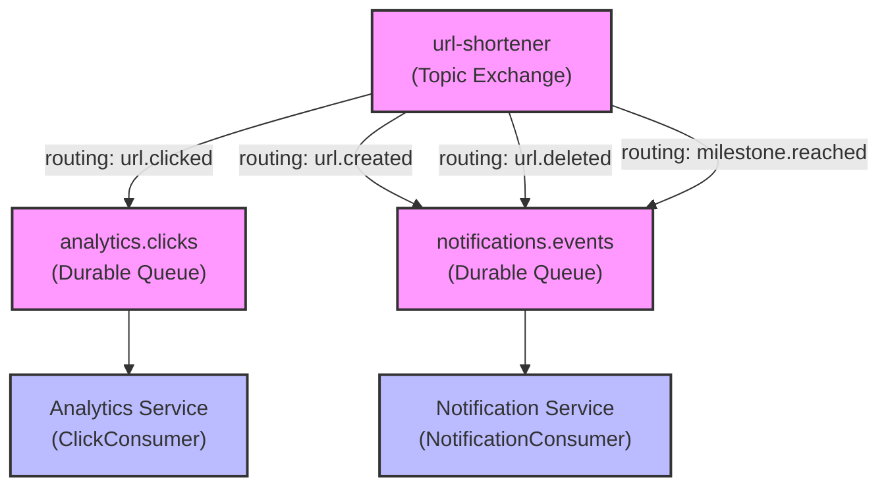
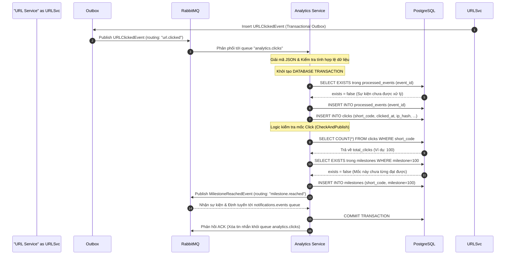
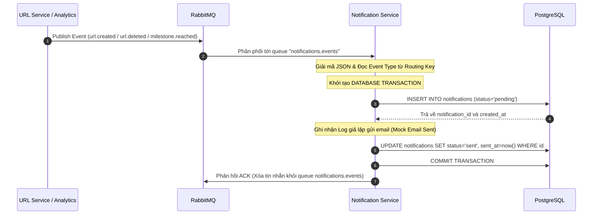
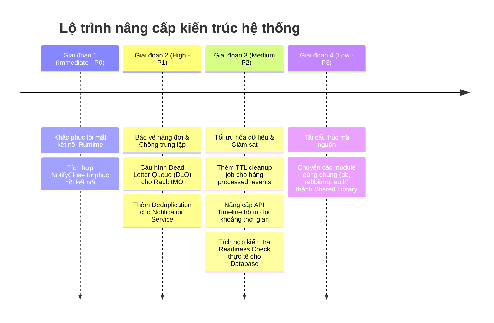
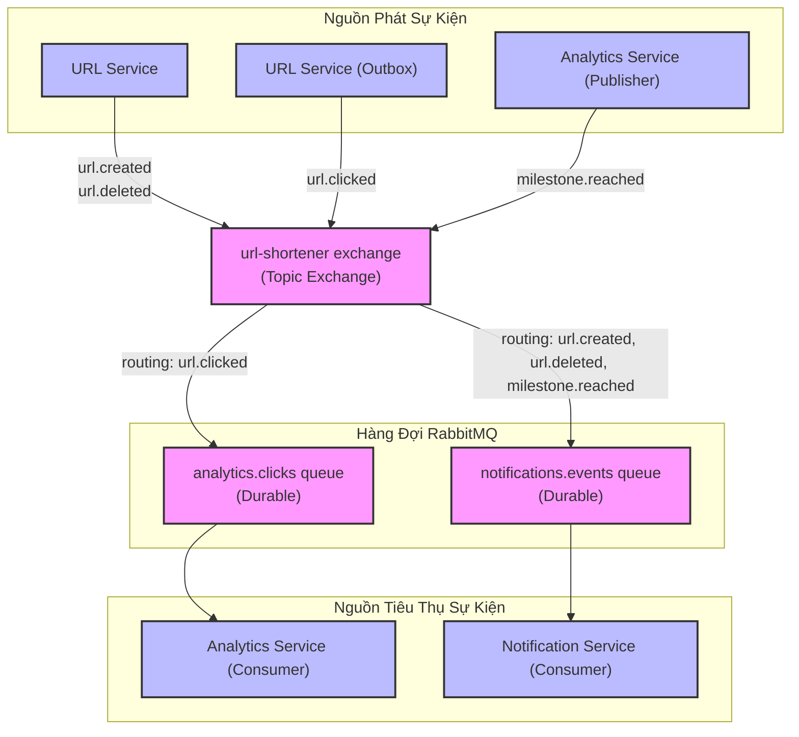

# Báo Cáo Thiết Kế Kiến Trúc: Event-Driven Architecture, Analytics & Notification Services

---
## Mục Lục

1. [Tổng Quan về Event-Driven Architecture (EDA)](#1-tong-quan-ve-event-driven-architecture-eda)
2. [Định Nghĩa Event Types](#2-dinh-nghia-event-types)
3. [Cấu Hình RabbitMQ (Exchange, Queue, Binding, Routing)](#3-cau-hinh-rabbitmq-exchange-queue-binding-routing)
4. [Sơ Đồ Luồng Sự Kiện (Event Flow Diagrams)](#4-so-do-luong-su-kien-event-flow-diagrams)
5. [Phân Tích Kiến Trúc Analytics Service](#5-phan-tich-kien-truc-analytics-service)
6. [Phân Tích Kiến Trúc Notification Service](#6-phan-tich-kien-truc-notification-service)
7. [Phân Tích Delivery Guarantees](#7-phan-tich-delivery-guarantees)
8. [Phân Tích Reconnection Handling](#8-phan-tich-reconnection-handling)
9. [Thiết Kế Stats API Endpoints](#9-thiet-ke-stats-api-endpoints)
10. [Bảng Tổng Kết Hệ Thống](#10-bang-tong-ket-he-thong)
11. [Kết Luận & Đề Xuất Cải Tiến](#11-ket-luan-de-xuat-cai-tien)

---

## 1. Tổng Quan về Event-Driven Architecture (EDA)

### 1.1. Giới thiệu
Hệ thống URL Shortener Microservices sử dụng **Event-Driven Architecture (EDA)** làm mô hình giao tiếp bất đồng bộ (asynchronous communication) chính giữa các dịch vụ thay vì gọi HTTP API trực tiếp. Mô hình này giúp tăng tính loose coupling (liên kết lỏng lẻo), cho phép mở rộng độc lập (independent scaling) và tối ưu khả năng chịu lỗi (fault tolerance).

### 1.2. Các thành phần chính trong EDA

| Thành phần | Mô tả |
|---|---|
| **Event Producers** | Các service phát sinh sự kiện (URL Service — tạo/xóa URL, URL Service (qua Outbox Coordinator) — click URL) |
| **Message Broker** | RabbitMQ — exchange topic `url-shortener`, chịu trách nhiệm nhận, định tuyến, và lưu trữ message |
| **Event Consumers** | Các service nhận và xử lý sự kiện (Analytics Service, Notification Service) |
| **Event Schema** | Định nghĩa cấu trúc dữ liệu của từng loại sự kiện (shared/events/events.go) |
| **Dead Letter / Retry** | (Chưa triển khai — sẽ phân tích ở phần Reconnection Handling) |

### 1.3. Nguyên lý hoạt động
1. **Producer** gửi sự kiện lên RabbitMQ Exchange đi kèm một Routing Key tương ứng.
2. **RabbitMQ Topic Exchange** đối chiếu Routing Key với các cấu hình Binding để chuyển hướng tin nhắn về đúng hàng đợi (queue) đã đăng ký.
3. **Consumer** lấy tin nhắn từ hàng đợi, thực hiện logic nghiệp vụ và phản hồi xác nhận xử lý (**ACK/NACK**).
4. Tin nhắn xử lý thành công sẽ bị xóa khỏi hàng đợi. Tin nhắn thất bại sẽ được đưa lại hàng đợi (requeue) tùy theo chính sách lỗi.

### 1.4. Lợi ích kiến trúc
* **Phân rã dịch vụ (Decoupling):** URL Service hoàn toàn độc lập với Analytics hay Notification Services.
* **Tự do mở rộng (Scalability):** Có thể mở rộng số lượng các instance của Analytics Service theo mô hình Competing Consumers mà không ảnh hưởng tới các dịch vụ khác.
* **Khả năng chịu lỗi (Fault Tolerance):** Nếu Notification Service tạm dừng hoạt động, tin nhắn vẫn tồn tại an toàn trên đĩa cứng của RabbitMQ và được xử lý lại khi dịch vụ trực tuyến.
* **Bất đồng bộ hóa (Asynchrony):** Xử lý lưu trữ thống kê click không làm nghẽn luồng chuyển hướng của khách hàng tại Gateway.

---

## 2. Định Nghĩa Event Types

### 2.1. Định Nghĩa Schema Dùng Chung
Các cấu trúc sự kiện hoạt động như một giao ước chung giữa các dịch vụ, đảm bảo tính nhất quán của dữ liệu truyền tải qua Message Broker.

### 2.2. Danh Sách Event Types

| Tên Sự Kiện | Routing Key | Mô Tả |
| :--- | :--- | :--- |
| `EventTypeURLCreated` | `url.created` | Kích hoạt khi một mã URL rút gọn mới được tạo |
| `EventTypeURLClicked` | `url.clicked` | Kích hoạt khi người dùng click vào mã URL rút gọn |
| `EventTypeURLDeleted` | `url.deleted` | Kích hoạt khi một mã URL rút gọn bị xóa khỏi hệ thống |
| `EventTypeMilestoneReached` | `milestone.reached` | Kích hoạt khi lượt click của URL đạt các mốc quy định |

### 2.3. BaseEvent (Envelope Sự Kiện Chung)
Tất cả các loại sự kiện đều chứa tập thuộc tính cơ bản để phục vụ việc định tuyến và tracking:

| Field | Kiểu | Ý nghĩa |
|---|---|---|
| `event_type` | `string` | Loại sự kiện, giúp consumer phân biệt mà không cần parse toàn bộ payload |
| `occurred_at` | `time.Time` | Thời điểm sự kiện được tạo (UTC) |
| `correlation_id` | `string` | ID xuyên suốt (tracing), giúp theo dõi một request từ đầu đến cuối qua nhiều service |
| `event_id` | `string` | UUID v4 duy nhất cho mỗi event — dùng để deduplication |

### 2.4. URLCreatedEvent
* **Producer:** URL Service  
* **Consumer:** Notification Service  
* **Cấu trúc trường mở rộng:**

| Thuộc Tính | Kiểu Dữ Liệu | Ý Nghĩa |
| :--- | :--- | :--- |
| `short_code` | String | Mã rút gọn của URL |
| `original_url` | String | Đường dẫn URL gốc |
| `user_id` | String | ID người dùng tạo mã |
| `user_email` | String | Email người dùng (phi chuẩn hóa nhằm gửi email trực tiếp không cần truy vấn User Svc) |
| `expires_at` | DateTime (Con trỏ) | Thời điểm hết hạn của URL (nếu có) |

### 2.5. URLClickedEvent
* **Producer:** URL Service (qua Outbox Coordinator)  
* **Consumer:** Analytics Service  
* **Cấu trúc trường mở rộng:**

| Thuộc Tính | Kiểu Dữ Liệu | Ý Nghĩa |
| :--- | :--- | :--- |
| `short_code` | String | Mã rút gọn được kích hoạt |
| `user_id` | String | ID của chủ sở hữu URL |
| `user_email` | String | Email của chủ sở hữu URL |
| `ip_hash` | String | IP người dùng đã băm muối (Salted Hash) nhằm đảm bảo bảo mật và tuân thủ GDPR |
| `user_agent` | String | Thông tin trình duyệt và hệ điều hành của client |
| `referer` | String | Nguồn liên kết giới thiệu (HTTP Referer) |
| `clicked_at` | DateTime | Thời điểm người dùng thực hiện click |

### 2.6. URLDeletedEvent
* **Producer:** URL Service  
* **Consumer:** Notification Service  
* **Cấu trúc trường mở rộng:**

| Thuộc Tính | Kiểu Dữ Liệu | Ý Nghĩa |
| :--- | :--- | :--- |
| `short_code` | String | Mã rút gọn bị xóa |
| `user_id` | String | ID người dùng sở hữu URL |
| `user_email` | String | Email người dùng sở hữu URL |

### 2.7. MilestoneReachedEvent
* **Producer:** Analytics Service  
* **Consumer:** Notification Service  
* **Cấu trúc trường mở rộng:**

| Thuộc Tính | Kiểu Dữ Liệu | Ý Nghĩa |
| :--- | :--- | :--- |
| `short_code` | String | Mã rút gọn đạt mốc click |
| `user_id` | String | ID chủ sở hữu URL |
| `user_email` | String | Email chủ sở hữu URL |
| `milestone` | Integer | Giá trị mốc đạt được (Ví dụ: 10, 100, 1000) |
| `total_clicks` | Long | Tổng số click hiện tại ghi nhận trong DB |

### 2.8. Bảng Tổng Hợp Event Types Định Tuyến

| Event Type | Producer | Consumer | Queue | Routing Key |
|---|---|---|---|---|
| `url.created` | URL Service | Notification Service | `notifications.events` | `url.created` |
| `url.clicked` | URL Service (qua Outbox Coordinator) | Analytics Service | `analytics.clicks` | `url.clicked` |
| `url.deleted` | URL Service | Notification Service | `notifications.events` | `url.deleted` |
| `milestone.reached` | Analytics Service | Notification Service | `notifications.events` | `milestone.reached` |

---

## 3. Cấu Hinh RabbitMQ (Exchange, Queue, Binding, Routing)

### 3.1. Exchange Topic
Hệ thống sử dụng một Exchange duy nhất kiểu **Topic** với tên `url-shortener`.
* **Durable:** `true` (Tự phục hồi cấu hình Exchange sau khi RabbitMQ restart).
* **Auto-Delete:** `false` (Không tự động xóa Exchange khi không còn queue liên kết).
* **Lý do chọn Topic:** Cho phép linh hoạt định tuyến thông qua các mẫu ký tự đại diện (`*`, `#`). Hỗ trợ thêm mới consumer trong tương lai mà không cần cấu trúc lại code của publisher.

### 3.2. Analytics Queue
* **Tên hàng đợi:** `analytics.clicks`
* **Durable:** `true` (Tin nhắn chưa xử lý được lưu trữ bền vững trên đĩa).
* **Binding Key:** `url.clicked` (Chỉ lắng nghe duy nhất sự kiện click URL).

### 3.3. Notification Queue
* **Tên hàng đợi:** `notifications.events`
* **Durable:** `true`
* **Binding Keys:** Bind đồng thời với 3 Routing Keys:
  * `url.created`
  * `url.deleted`
  * `milestone.reached`

### 3.4. Sơ Đồ Routing



### 3.5. AMQP Prefetch (QoS)
Cấu hình **QoS Prefetch Count = 1** được thiết lập trên cả hai consumers. 
* **Ý nghĩa:** Mỗi instance consumer chỉ được nhận tối đa 1 tin nhắn tại một thời điểm từ RabbitMQ. Nó bắt buộc phải phản hồi ACK/NACK trước khi nhận tin nhắn tiếp theo.
* **Mục đích:** Đảm bảo xử lý tuần tự, cân bằng tải động (Fair Dispatch) giữa các consumers đang chạy song song, giảm nguy cơ quá tải bộ nhớ đệm của ứng dụng.

### 3.6. Message Persistence
* **DeliveryMode = 2 (Persistent):** Toàn bộ tin nhắn được xuất bản từ các Publisher (URL Service (qua Outbox Coordinator), Analytics Service) đều được cấu hình lưu đĩa. Kết hợp với hàng đợi Durable, hệ thống đảm bảo an toàn dữ liệu ngay cả khi cụm RabbitMQ gặp sự cố sập nguồn đột ngột.

---

## 4. Sơ Đồ Luồng Sự Kiện (Event Flow Diagrams)

### 4.1. Sơ Đồ Luồng Sự Kiện Click (Luồng Chính)
Luồng xử lý bất đồng bộ từ lúc Gateway phát sinh click cho đến khi Analytics Service cập nhật dữ liệu, kiểm tra cột mốc và gửi tín hiệu mốc click:



### 4.2. Sơ Đồ Luồng Sự Kiện Notification
Luồng lưu trữ thông báo và giả lập gửi email cho khách hàng khi nhận các sự kiện hệ thống:



---

## 5. Phân Tích Kiến Trúc Analytics Service

### 5.1. Tổng Quan
Dịch vụ Analytics chịu trách nhiệm xử lý toàn bộ dữ liệu thống kê liên quan đến hành vi tương tác mã URL của người dùng, phân tích xu hướng truy cập theo nguồn giới thiệu (referer), cung cấp trục thời gian click (timeline) và kích hoạt các cột mốc thành tựu của URL.

### 5.2. Cấu Trúc Thành Phần
Dịch vụ được phân chia thành các cấu phần chức năng rõ rệt:

| Thành phần | Vai trò kiến trúc |
| :--- | :--- |
| **Khởi tạo hệ thống** | Cấu hình tham số môi trường, thiết lập kết nối cơ sở dữ liệu và RabbitMQ, chạy các script Migration tự động |
| **Bộ nhận tin nhắn (Consumer)** | Triển khai consumer xử lý các sự kiện click từ hàng đợi RabbitMQ |
| **Logic Cột mốc (Milestone)** | Kiểm tra các ngưỡng giới hạn (10, 100, 1000) và xuất bản sự kiện đạt mốc |
| **Lớp dữ liệu (Store Layer)** | Thực hiện các truy vấn đọc/ghi tối ưu hóa xuống PostgreSQL sử dụng Connection Pool |
| **Bộ xử lý API (Handler)** | Expose các REST API để phục vụ ứng dụng frontend truy vấn thống kê dữ liệu |

### 5.3. Quy Trình Khởi Tạo và Cấu Hình Thời Gian Chờ (Timeout)
Ứng dụng áp dụng quy trình khởi chạy tuần tự và cơ chế tự động thử lại kết nối (Exponential Backoff Retry) để đảm bảo tính sẵn sàng trước khi lắng nghe sự kiện:

| Tham số cấu hình | Giá trị mặc định | Vai trò |
| :--- | :--- | :--- |
| `databaseStartupTimeout` | 60 giây | Thời gian tối đa chờ khởi động và kết nối thành công tới Database |
| `rabbitMQStartupTimeout` | 120 giây | Thời gian tối đa để thử kết nối tới RabbitMQ Cluster |
| `shutdownTimeout` | 10 giây | Thời gian để kết thúc các tiến trình đang chạy khi nhận tín hiệu SIGTERM/SIGINT |
| `rabbitMQAttempts` | 10 lần | Số lần thử kết nối lại tối đa trước khi ứng dụng tự ngắt (crash/exit) |

### 5.4. ClickConsumer — Bộ Nhận và Xử Lý Sự Kiện Click

#### 5.4.1. Tham số Đăng Ký Lắng Nghe (Consume)
Khi đăng ký lắng nghe hàng đợi `analytics.clicks`, các tham số cấu hình kết nối được thiết lập chi tiết:

| Parameter | Giá trị | Ý nghĩa |
|---|---|---|
| `queue` | `"analytics.clicks"` | Tên hàng đợi cần tiêu thụ |
| `consumer` | `""` (empty) | RabbitMQ tự sinh tag định danh duy nhất cho Consumer này |
| `autoAck` | `false` | **Manual ACK** — consumer chủ động gửi ACK/NACK sau khi xử lý xong |
| `exclusive` | `false` | Cho phép nhiều consumer cùng truy cập song song (competing consumers) |
| `noLocal` | `false` | Nhận cả message được tạo ra từ chính connection này |
| `noWait` | `false` | Đợi broker xác nhận đăng ký thành công |
| `args` | `nil` | Không sử dụng cấu hình bổ sung |

* **Cơ chế giao dịch (Transaction Scope):** Tất cả các tiến trình ghi nhận click gồm: kiểm tra sự kiện trùng lặp (Dedup Check), chèn bản ghi đã xử lý (Processed Event), chèn thông tin lượt click (Clicks Table) và cập nhật cột mốc (Milestone Update) được gói gọn trong một Database Transaction duy nhất. Thiết kế này loại bỏ khả năng bất nhất dữ liệu nếu xảy ra lỗi giữa chừng.
* **Xử lý Poison Message:** Nếu sự kiện không thể giải mã JSON hoặc thiếu các thông tin bắt buộc (Event ID, Short Code), hệ thống sẽ chủ động phản hồi **ACK** để hủy bỏ tin nhắn đó, ngăn chặn vòng lặp xử lý lỗi vô hạn làm nghẽn hàng đợi (Poison Message Loop).
* **Phục hồi sự cố (Panic Recovery):** Sử dụng cơ chế phục hồi động (defer recover). Nếu xảy ra lỗi nghiêm trọng runtime (Panic), consumer sẽ tự phục hồi và phản hồi ACK để hủy bỏ tin nhắn, chấp nhận mất mát dữ liệu nhỏ để bảo toàn tính hoạt động liên tục của dịch vụ.

### 5.5. MilestoneChecker — Logic Kiểm Tra và Ghi Nhận Mốc Click
* **Mốc kiểm tra:** `[10, 100, 1000]`
* **Kiến trúc tránh trùng lặp cột mốc (Idempotent Milestone):**
  1. Đếm số click thực tế của short code trong Transaction hiện tại.
  2. Sử dụng câu lệnh `INSERT ... ON CONFLICT (short_code, milestone) DO NOTHING` để chống ghi đè hoặc tạo trùng lặp bản ghi cột mốc do tranh chấp luồng (Race Condition).
  3. Chỉ khi bản ghi cột mốc được chèn thành công mới phát đi sự kiện `MilestoneReachedEvent`.
* **Thiết kế xử lý lỗi gửi sự kiện:** Nếu việc xuất bản sự kiện `MilestoneReachedEvent` lên RabbitMQ bị lỗi, dịch vụ chỉ ghi nhận cảnh báo (Warn Log) và vẫn hoàn thành giao dịch (Commit Transaction). Điều này ưu tiên tính toàn vẹn của dữ liệu click thay vì rollback toàn bộ giao dịch chỉ vì broker gặp sự cố tạm thời.

### 5.6. AnalyticsPublisher — Bộ Phát Sự Kiện Mốc Click
* Gửi sự kiện lên Exchange `url-shortener` với Routing Key `milestone.reached`.
* Cấu hình tin nhắn bền vững (**Persistent Mode**).
* Sử dụng Context có giới hạn thời gian (**Timeout 3 giây**) để giải phóng tài nguyên hệ thống nếu Broker không phản hồi kịp thời.

### 5.7. Lớp Lưu Trữ Dữ Liệu (Store Layer)
Lớp dữ liệu sử dụng thư viện kết nối Pool tối ưu hóa, thực hiện các truy vấn thông qua các chỉ mục (Indexes) đã được tính toán kỹ lưỡng:

| Tên Truy Vấn / Thao Tác | Nội Dung SQL Tóm Tắt | Mục Đích | Index Được Sử Dụng |
| :--- | :--- | :--- | :--- |
| Insert Click | `INSERT INTO clicks (short_code, clicked_at, ip_hash, user_agent, referer) VALUES (...)` | Ghi nhận một lượt click mới | - |
| Count Clicks | `SELECT COUNT(*) FROM clicks WHERE short_code = $1` | Đếm tổng số click của một mã URL | `idx_clicks_short_code_time` |
| Count Clicks Since | `SELECT COUNT(*) FROM clicks WHERE short_code = $1 AND clicked_at >= $2` | Đếm số click trong một khoảng thời gian (24h, 7d) | `idx_clicks_short_code_time` |
| Top Referers | `SELECT referer, COUNT(*) FROM clicks WHERE short_code = $1 GROUP BY referer ORDER BY cnt DESC LIMIT $2` | Liệt kê nguồn giới thiệu hàng đầu | `idx_clicks_referer` (Partial Index) |
| Timeline Buckets | `SELECT date_trunc($1, clicked_at) AS period, COUNT(*) FROM clicks WHERE short_code = $2 GROUP BY period ORDER BY period ASC` | Phân nhóm thống kê theo giờ/ngày | `idx_clicks_short_code_time` |
| Check Milestone | `SELECT EXISTS(SELECT 1 FROM milestones WHERE short_code = $1 AND milestone = $2)` | Kiểm tra mốc click đã đạt được chưa | `idx_milestones_code_milestone` |
| Insert Milestone | `INSERT INTO milestones (short_code, milestone) VALUES (...) ON CONFLICT DO NOTHING` | Ghi nhận mốc click mới (idempotent) | `idx_milestones_code_milestone` |
| Check Processed Event | `SELECT EXISTS(SELECT 1 FROM processed_events WHERE event_id = $1)` | Kiểm tra sự kiện đã xử lý chưa (dedup) | PK của `processed_events` |
| Insert Processed Event | `INSERT INTO processed_events (event_id) VALUES (...) ON CONFLICT DO NOTHING` | Ghi nhận sự kiện đã xử lý | PK của `processed_events` |

### 5.8. Cấu Trúc Bảng Cơ Sở Dữ Liệu

#### 5.8.1 Bảng `clicks`
Bảng lưu trữ vết truy cập chi tiết của người dùng.

| Cột | Kiểu | Ràng buộc | Mô tả |
|---|---|---|---|
| `id` | UUID | PRIMARY KEY, mặc định `gen_random_uuid()` | ID tự sinh cho mỗi click |
| `short_code` | TEXT | NOT NULL | Mã rút gọn của URL |
| `clicked_at` | TIMESTAMPTZ | NOT NULL | Thời điểm xảy ra click |
| `ip_hash` | TEXT | NOT NULL | Giá trị IP đã được băm bảo mật |
| `user_agent` | TEXT | NOT NULL, mặc định `''` | Trình duyệt người dùng |
| `referer` | TEXT | NULL | Nguồn giới thiệu |

* **Khóa chỉ mục:**
  * `idx_clicks_short_code_time` trên `(short_code, clicked_at DESC)`: Composite index phục vụ đếm và phân trang thời gian.
  * `idx_clicks_referer` trên `(short_code, referer) WHERE referer IS NOT NULL`: Partial index giúp tăng tốc truy vấn thống kê referer và tiết kiệm không gian lưu trữ do bỏ qua các click không có referer.

#### 5.8.2 Bảng `milestones`
Lưu trữ lịch sử đạt mốc của các mã URL rút gọn.

| Cột | Kiểu | Ràng buộc | Mô tả |
|---|---|---|---|
| `id` | UUID | PRIMARY KEY, mặc định `gen_random_uuid()` | ID duy nhất của cột mốc đạt được |
| `short_code` | TEXT | NOT NULL | Mã rút gọn đạt mốc |
| `milestone` | INT | NOT NULL | Ngưỡng mốc click đạt (10, 100, 1000) |
| `triggered_at` | TIMESTAMPTZ | NOT NULL, mặc định `now()` | Thời gian đạt mốc |

* **Ràng buộc nghiệp vụ:** Ràng buộc độc nhất `UNIQUE(short_code, milestone)` đảm bảo mỗi mốc click chỉ được kích hoạt một lần duy nhất cho mỗi URL.

#### 5.8.3 Bảng `processed_events`
Bảng phục vụ kiểm tra trùng lặp sự kiện (Deduplication Log).

| Cột | Kiểu | Ràng buộc | Mô tả |
|---|---|---|---|
| `event_id` | TEXT | PRIMARY KEY | UUID v4 độc nhất của sự kiện click |
| `processed_at` | TIMESTAMPTZ | NOT NULL, mặc định `now()` | Thời điểm xử lý xong sự kiện |

* *Lưu ý kiến trúc:* Hiện tại bảng này chưa cấu hình thời gian sống (TTL), về lâu dài cần thiết lập cơ chế dọn dẹp định kỳ để tránh phình to dung lượng dữ liệu.

---

## 6. Phân Tích Kiến Trúc Notification Service

### 6.1. Tổng Quan
Dịch vụ thông báo đảm nhận vai trò cầu nối thông tin tới người dùng. Dịch vụ thu nhận các biến động hệ thống (Tạo URL mới, xóa URL cũ, đạt cột mốc tương tác), lưu trữ lịch sử thông báo và thực thi việc gửi thông tin phản hồi (trong phiên bản hiện tại là ghi log giả lập email).

### 6.2. Cấu Trúc Thành Phần
Notification Service được tổ chức gọn nhẹ với các cấu phần:
* **Khởi tạo hệ thống:** Thiết lập môi trường và cấu hình tự động migration cơ sở dữ liệu.
* **Consumer:** Lắng nghe 3 sự kiện chính cấu hình trong Queue.
* **Store Layer:** Thực thi các tác vụ ghi thông báo và đọc danh sách thông báo phân trang.
* **Handler:** Cung cấp HTTP API bảo vệ bằng JWT để người dùng lấy danh sách thông báo cá nhân.

### 6.3. Quy Trình Khởi Tạo Hệ Thống
Quy trình tương đồng với Analytics Service, sử dụng cơ chế Exponential Backoff để tăng tính tự phục hồi khi khởi chạy.

### 6.4. NotificationConsumer — Bộ Nhận Sự Kiện Thông Báo
* **Sử dụng Routing Key phân nhánh:** Consumer đọc giá trị `RoutingKey` từ siêu dữ liệu của Broker để ánh xạ kiểu sự kiện thay vì giải mã toàn bộ JSON payload trước. Điều này tăng hiệu năng xử lý đáng kể.

#### 6.4.1 Bảng so sánh cơ chế Consumer

| Aspect | ClickConsumer | NotificationConsumer |
|---|---|---|
| **ACK strategy** | Manual (`autoAck = false`) | Manual (`autoAck = false`) |
| **Validation** | Parse + validate các trường bắt buộc | Parse + validate các trường bắt buộc |
| **Invalid message** | Phản hồi ACK và loại bỏ | Phản hồi ACK và loại bỏ |
| **Error during processing** | Phản hồi NACK và requeue | Phản hồi NACK và requeue |
| **Transaction** | Mở/đóng trực tiếp ở Consumer xử lý | Thực thi bên trong hàm store repository |
| **Deduplication** | Có (bảng `processed_events`) | Không có |

### 6.5. Lớp Lưu Trữ Thông Báo

#### 6.5.1 Tiến trình giao dịch tạo thông báo:
1. Tạo bản ghi thông báo mới ở trạng thái chờ gửi (`status = 'pending'`).
2. Thực thi giả lập gửi email thông qua hệ thống Logs (`Mock Email Sent`).
3. Cập nhật trạng thái thông báo thành hoàn thành (`status = 'sent'`) kèm thời gian gửi (`sent_at = now()`).
4. Commit toàn bộ giao dịch để đảm bảo ghi nhận đồng bộ.

#### 6.5.2 Phân trang danh sách thông báo (Cursor-based Pagination):
Để phục vụ danh sách thông báo hiệu năng cao cho người dùng, dịch vụ sử dụng phân trang dạng Keyset (Cursor-based) thay vì Offset truyền thống.
* **Cursor được chọn:** Cặp giá trị kết hợp `(created_at, id)`.
* **So sánh cơ chế phân trang:**

| Aspect | Offset-based | Keyset (Cursor-based) |
|---|---|---|
| **Performance** | Suy giảm nghiêm trọng khi offset lớn (tải trang sâu) | Tốc độ truy xuất ổn định O(log n) |
| **Stability** | Thao tác chèn mới trong lúc đọc dễ làm lệch trang, lặp bản ghi | Ổn định tuyệt đối, không bị trùng/lặp bản ghi |
| **Implementation** | Đơn giản, dễ viết | Phức tạp hơn (sử dụng so sánh giá trị cặp trường) |
| **Use case** | Phù hợp cho hiển thị UI đơn giản, ít cập nhật | Phù hợp cho hệ thống Real-time Feed, API phân trang vô hạn |

### 6.6. Cấu Trúc Bảng Cố Định

#### Bảng `notifications`

| Cột | Kiểu | Ràng buộc | Mô tả |
|---|---|---|---|
| `id` | UUID | PRIMARY KEY, mặc định `gen_random_uuid()` | ID duy nhất của thông báo |
| `user_id` | UUID | NOT NULL | ID người dùng nhận thông báo |
| `event_type` | TEXT | NOT NULL | Loại sự kiện phát sinh |
| `payload` | JSONB | NOT NULL | Toàn bộ thông tin gốc JSON của sự kiện |
| `status` | TEXT | NOT NULL, mặc định `'sent'` | Trạng thái gửi thông báo (`pending`/`sent`) |
| `created_at` | TIMESTAMPTZ | NOT NULL, mặc định `now()` | Thời điểm tạo thông báo |
| `sent_at` | TIMESTAMPTZ | NULL | Thời điểm gửi email thực tế |

* **Chỉ mục:** `idx_notifications_user_created` trên `(user_id, created_at DESC)` hỗ trợ tối ưu hóa tối đa truy vấn phân trang của người dùng.

### 6.7. Bộ Xử Lý Endpoint API (Handler)
* Endpoint chính: `GET /notifications?limit=20&after=<cursor_id>`
* Giới hạn kích thước trang (Limit Cap): Tối đa `100` bản ghi trên một truy vấn để tránh tấn công từ chối dịch vụ (DoS) qua API.
* Xác thực: Bắt buộc đính kèm JWT Bearer Token trong header HTTP.

### 6.8. Mô-đun Xác Thực Hệ Thống
* Middleware giải mã JWT và lưu trữ thông tin User Claims (`sub` làm `user_id`, `email`) vào HTTP Request Context.
* Các API handlers phía sau trích xuất an toàn `user_id` để thực thi phân quyền dữ liệu, đảm bảo người dùng không thể truy cập trái phép thông báo của người khác.

---

## 7. Phân Tích Delivery Guarantees

### 7.1. Các Mức Đảm Bảo Delivery

| Mức | Mô tả | Ví dụ |
|---|---|---|
| **At-most-once** | Message được gửi tối đa một lần. Có thể mất message nhưng không có duplicate. | Fire-and-forget, auto-ACK trước khi xử lý |
| **At-least-once** | Message được gửi ít nhất một lần. Không mất message nhưng có thể có duplicate. | Manual ACK sau khi xử lý thành công |
| **Exactly-once** | Message được gửi đúng một lần. Không mất, không duplicate. | At-least-once kết hợp deduplication |

### 7.2. Analytics Service Delivery Guarantee
Đạt mức **Exactly-once** nhờ thiết kế phối hợp:

```mermaid
flowchart TD
    Producer([Producer]) --> RabbitMQ{RabbitMQ}
    RabbitMQ --> Consumer[Consumer (autoAck=false)]
    Consumer --> Check{Kiểm tra Event ID<br>đã tồn tại trong DB?}
    Check -->|Đã tồn tại| AckDiscard[Phản hồi ACK & Bỏ qua xử lý]
    Check -->|Chưa tồn tại| Process[Bắt đầu Xử lý sự kiện]
    Process --> DBTx{Database Transaction}
    DBTx -->|Ghi dữ liệu thành công| Commit[Commit Transaction]
    Commit --> Ack[Phản hồi ACK gửi Broker]
    DBTx -->|Lỗi ghi dữ liệu| Rollback[Rollback Transaction]
    Rollback --> Nack[Phản hồi NACK & Đưa lại Queue]
```

### 7.3. Notification Service Delivery Guarantee
Đạt mức **At-least-once**.
* Không có cơ chế Deduplication riêng biệt tại tầng nhận thông báo.
* Nếu consumer xảy ra sự cố đột ngột sau khi đã ghi nhận cơ sở dữ liệu thành công nhưng chưa kịp gửi phản hồi ACK về cho RabbitMQ, tin nhắn sẽ được Broker đưa lại hàng đợi và phân phối lại. Điều này dẫn tới khả năng lặp thông báo (Duplicate Notification) đối với người dùng cuối.

### 7.4. So Sánh Đảm Bảo Delivery

| Service | autoAck | Manual ACK | Dedup | Guarantee | Rủi ro |
|---|---|---|---|---|---|
| **Analytics** | `false` | ACK sau commit | processed_events table | Exactly-once | Mất message nếu panic (ACK trong recoverDeliveryPanic) |
| **Notification** | `false` | ACK sau insert | Không có | At-least-once | Duplicate notification |

### 7.5. Xử Lý Poison Message
Hệ thống áp dụng các phản ứng khác nhau đối với lỗi phát sinh trong luồng xử lý sự kiện:

| Loại lỗi | Analytics | Notification |
|---|---|---|
| **Invalid JSON** | ACK (discard) | ACK (discard) |
| **Missing required field** | ACK (discard) | ACK (discard) |
| **Unsupported routing key** | N/A | ACK (discard) |
| **Panic** | ACK (discard) | ACK (discard) |
| **DB error** | NACK requeue | NACK requeue |

---

## 8. Phân Tích Reconnection Handling

### 8.1. Kết Nối Khi Khởi Chạy
Hệ thống sử dụng Exponential Backoff để kết nối với RabbitMQ khi khởi chạy:
* Khoảng thời gian giãn cách khởi đầu: `1 giây`.
* Cơ chế nhân đôi giãn cách sau mỗi lần thử sai: `1s -> 2s -> 4s -> 8s -> 16s -> 30s...` (Giới hạn tối đa `30 giây`).
* Số lần thử tối đa: `10 lần`.

### 8.2. Mất Kết Nối Khi Đang Chạy — Vấn Đề Thiết Kế
* **Hiện trạng sự cố:** Khi kết nối tới RabbitMQ Cluster bị đứt lúc dịch vụ đang hoạt động ổn định (Runtime), kênh phân phối tin nhắn (`deliveries`) sẽ bị đóng phát đi tín hiệu `ok = false`.
* **Hậu quả:** Cả hai dịch vụ Analytics và Notification Consumers đều chỉ thiết lập biến trạng thái sức khỏe `healthy = false` và chuyển sang trạng thái treo chờ Context bị hủy bỏ. Dịch vụ **hoàn toàn ngừng việc tiêu thụ tin nhắn vĩnh viễn** cho tới khi quản trị viên thực hiện khởi động lại container thủ công. Dữ liệu trong hàng đợi RabbitMQ sẽ tích lũy gây phình to bộ nhớ đệm của Broker.

### 8.3. Giải Pháp Tự Động Kết Nối Lại Đề Xuất
Để khắc phục lỗi thiết kế trên, cần nâng cấp quy trình xử lý mất kết nối tự động (Self-Healing Connection):
1. **Đăng ký sự kiện đóng kết nối:** Sử dụng hàm lắng nghe thông báo đóng kênh (`conn.NotifyClose`) và đóng kết nối (`channel.NotifyClose`).
2. **Khởi động vòng lặp kết nối lại (Reconnection Loop):** Khi nhận tín hiệu đứt kết nối, kích hoạt tiến trình thiết lập lại kết nối mới sau một khoảng thời gian chờ tăng dần.
3. **Đăng ký lại Consumer:** Sau khi kết nối thành công, tiến hành khai báo lại Exchange, các Queue, thiết lập lại QoS và đăng ký lắng nghe kênh phân phối (`Consume`) mới.

### 8.4. So Sánh Với URL Service
URL Service đóng vai trò là Publisher (Người phát tin nhắn). Khi mất kết nối RabbitMQ, nó sẽ trả về lỗi HTTP 500 trực tiếp cho các yêu cầu tạo/xóa URL. Mặc dù làm giảm trải nghiệm người dùng, lỗi này vẫn có thể khắc phục được bằng cách người dùng thực hiện gửi lại request (Client Retry). Với tầng Consumer, việc mất kết nối âm thầm mà không tự hồi phục có mức độ nghiêm trọng cao hơn nhiều do làm gián đoạn hoàn toàn luồng xử lý bất đồng bộ phía sau.

---

## 9. Thiết Kế Stats API Endpoints

### 9.1. Endpoint Kiểm Tra Sức Khỏe
* **Đường dẫn:** `GET /health`
* **Cơ chế:** Trả về mã JSON tĩnh đã được mã hóa trước để tăng tối đa hiệu năng phản hồi. Tuy nhiên, endpoint này chưa tích hợp kiểm tra kết nối thực tế tới Database hay RabbitMQ (chỉ là Liveness Check chứ chưa đạt chuẩn Readiness Check).

### 9.2. Endpoint Đo Lường Chỉ Số Metrics
* **Đường dẫn:** `GET /metrics`
* **Mô tả:** Expose dữ liệu đo lường theo chuẩn Prometheus phục vụ hệ thống giám sát hiệu năng trực quan.

### 9.3. Endpoint Thống Kê Tổng Quan URL
* **Đường dẫn:** `GET /stats/{code}`
* **Cơ chế xử lý song song (Concurrency Model):** Để tối ưu hóa tốc độ phản hồi API, dịch vụ sử dụng mô hình đồng thời `errgroup` để thực thi song song 4 câu lệnh truy vấn dữ liệu độc lập:
  1. Đếm tổng lượt click.
  2. Đếm số lượt click trong vòng 24 giờ qua.
  3. Đếm số lượt click trong vòng 7 ngày qua.
  4. Lấy danh sách 5 nguồn giới thiệu hàng đầu (Top Referers).
* Nếu bất kỳ truy vấn nào gặp lỗi, toàn bộ tiến trình sẽ bị hủy bỏ ngay lập tức để tiết kiệm tài nguyên hệ thống (Fail-Fast).

### 9.4. Endpoint Lược Sử Theo Trục Thời Gian
* **Đường dẫn:** `GET /stats/{code}/timeline?interval=day`
* **Tham số phân nhóm (Interval):** Bắt buộc phải là `"day"` hoặc `"hour"`.
* **Cơ chế tối ưu hóa DB:** Sử dụng hàm `date_trunc` của PostgreSQL thực thi trực tiếp tại tầng cơ sở dữ liệu để phân nhóm thời gian theo múi giờ UTC, tránh việc tải lượng lớn dữ liệu thô về bộ nhớ của ứng dụng để phân tích.
* *Hạn chế:* API chưa hỗ trợ tham số lọc khoảng thời gian (`from` và `to`), dẫn đến nguy cơ trả về payload dung lượng quá lớn nếu URL có lịch sử hoạt động lâu năm.

### 9.5. Endpoint Xem Danh Sách Thông Báo
* **Đường dẫn:** `GET /notifications`
* **Xác thực:** JWT Bearer Token.
* **Cơ chế phân trang:** Keyset Pagination (Cursor) sử dụng UUID.

---

## 10. Bảng Tổng Kết Hệ Thống

### 10.1. So Sánh Hai Service

| Aspect | Analytics Service | Notification Service |
|---|---|---|
| **Primary function** | Xử lý click events, thống kê | Xử lý notification events, mock email |
| **Queue** | `analytics.clicks` | `notifications.events` |
| **Routing keys** | 1: `url.clicked` | 3: `url.created`, `url.deleted`, `milestone.reached` |
| **autoAck** | `false` | `false` |
| **Dedup** | Có (processed_events table) | Không |
| **Delivery guarantee** | Exactly-once | At-least-once |
| **API endpoints** | `/stats/{code}`, `/stats/{code}/timeline` | `/notifications` |
| **API auth** | Không | JWT required |
| **Transaction scope** | Consumer (1 transaction) | Store (1 transaction) |
| **Producer** | Có (`MilestoneReachedEvent`) | Không |
| **DB tables** | `clicks`, `milestones`, `processed_events` | `notifications` |
| **DB indexes** | 2 composite, 1 partial | 1 composite |
| **Migration** | SQL embedding (`go:embed`) | SQL embedding (`go:embed`) |

### 10.2. Cấu Hình Hàng Đợi RabbitMQ

| Item | Giá trị |
|---|---|
| **Exchange name** | `url-shortener` |
| **Exchange type** | `topic` |
| **Durable** | `true` |
| **Auto-delete** | `false` |
| **Queue analytics** | `analytics.clicks` (durable) |
| **Queue notification** | `notifications.events` (durable) |
| **Routing keys (analytics)** | `url.clicked` |
| **Routing keys (notification)** | `url.created`, `url.deleted`, `milestone.reached` |
| **Prefetch count (analytics)** | 1 |
| **Prefetch count (notification)** | 1 |

### 10.3. Bảng Tóm Tắt Thuộc Tính Events Payload

| Event | Producer | Routing Key | Queues | Payload Fields |
|---|---|---|---|---|
| **URLCreatedEvent** | URL Service | `url.created` | `notifications.events` | `ShortCode`, `OriginalURL`, `UserID`, `UserEmail`, `ExpiresAt` |
| **URLClickedEvent** | URL Service (qua Outbox Coordinator) | `url.clicked` | `analytics.clicks` | `ShortCode`, `UserID`, `UserEmail`, `IPHash`, `UserAgent`, `Referer`, `ClickedAt` |
| **URLDeletedEvent** | URL Service | `url.deleted` | `notifications.events` | `ShortCode`, `UserID`, `UserEmail` |
| **MilestoneReachedEvent** | Analytics Svc | `milestone.reached` | `notifications.events` | `ShortCode`, `UserID`, `UserEmail`, `MilestoneN`, `TotalClicks` |

### 10.4. Các Bảng Cơ Sở Dữ Liệu Tóm Tắt

| Service | Table | PK | Unique Constraints | Indexes |
|---|---|---|---|---|
| **Analytics** | `clicks` | `id` (UUID) | - | `(short_code, clicked_at DESC)`, `(short_code, referer) WHERE referer IS NOT NULL` |
| **Analytics** | `milestones` | `id` (UUID) | `(short_code, milestone)` | `(short_code, milestone)` |
| **Analytics** | `processed_events` | `event_id` (TEXT) | - | - |
| **Notification** | `notifications` | `id` (UUID) | - | `(user_id, created_at DESC)` |

### 10.5. Chiến Lược Xử Lý Lỗi Và Định Tuyến Hàng Đợi

| Scenario | Analytics | Notification |
|---|---|---|
| **Invalid JSON** | ACK + log và loại bỏ tin | ACK + log và loại bỏ tin |
| **Missing required field** | ACK + log và loại bỏ tin | ACK + log và loại bỏ tin |
| **DB error (transient)** | NACK requeue thử lại sau | NACK requeue thử lại sau |
| **DB error (permanent)** | NACK requeue (loop vô hạn) | NACK requeue (loop vô hạn) |
| **Panic** | ACK + log + recover tự phục hồi | ACK + log + recover tự phục hồi |
| **Duplicate event** | ACK bỏ qua (đã ghi nhận DB) | Không áp dụng (ghi nhận lại tin) |
| **Unsupported event type** | N/A | ACK + log bỏ qua |
| **Milestone publish fail** | WARN + commit giao dịch | N/A |

### 10.6. Cấu Hình Biến Môi Trường (Environment Variables)

| Variable | Analytics | Notification | Ý nghĩa kiến trúc |
|---|---|---|---|
| `DATABASE_URL` | Bắt buộc | Bắt buộc | Chuỗi kết nối tới cơ sở dữ liệu PostgreSQL |
| `RABBITMQ_URL` | Bắt buộc | Bắt buộc | Chuỗi kết nối tới Broker RabbitMQ |
| `PORT` | Optional (Mặc định `8080`) | Optional (Mặc định `8080`) | Cổng lắng nghe của HTTP Server |
| `JWT_SECRET` | Không dùng | Bắt buộc | Khóa giải mã chữ ký số JWT của người dùng |
| `IP_HASH_SALT` | Tùy chọn | Không dùng | Muối (Salt) dùng để băm IP chống dịch ngược |

---

## 11. Kết Luận & Đề Xuất Cải Tiến

### 11.1. Điểm Mạnh Kiến Trúc
1. **Thiết kế Event-Driven chuẩn hóa:** Tách biệt rõ ràng trách nhiệm giữa các dịch vụ thông qua Topic Exchange, Queue Durable và Persistent Message.
2. **Exactly-once đảm bảo tại lõi hệ thống:** Đảm bảo thống kê click chính xác tuyệt đối nhờ sự kết hợp giữa Transaction Atomicity và bảng Deduplication Log.
3. **Phân trang Keyset thông minh:** Tối ưu hóa hiệu năng tải danh sách thông báo cho người dùng cuối.
4. **Xử lý Graceful Shutdown hoàn chỉnh:** Giải phóng tài nguyên an toàn khi có tín hiệu dừng hệ thống.

### 11.2. Điểm Yếu Cần Khắc Phục
1. **Runtime Reconnection (Nghiêm trọng - P0):** Consumer bị treo vĩnh viễn khi mất kết nối RabbitMQ trong lúc vận hành.
2. **Thiếu hàng đợi Dead Letter Queue (P1):** Các tin nhắn gặp lỗi cơ sở dữ liệu tạm thời bị đưa lại hàng đợi và thử lại lập tức liên tục, dễ gây tràn CPU của dịch vụ.
3. **Trùng lặp thông báo (P1):** Notification Service chưa áp dụng cơ chế lọc trùng lặp sự kiện như Analytics Service.
4. **Thiếu cơ chế dọn dẹp (P2):** Bảng `processed_events` phình to không giới hạn theo thời gian.
5. **Độ trễ khi khôi phục sự kiện mốc (P2):** Lỗi gửi sự kiện milestone không được lưu lại để thử lại tự động ở background worker.

### 11.3. Lộ Trình Cải Tiến Khuyến Nghị



---

## Phụ Lục: Sơ Đồ Luồng Sự Kiện Tổng Thể (Mermaid)

Sơ đồ tổng quan mô tả dòng chảy của các loại sự kiện chạy xuyên suốt qua hệ thống URL Shortener:


