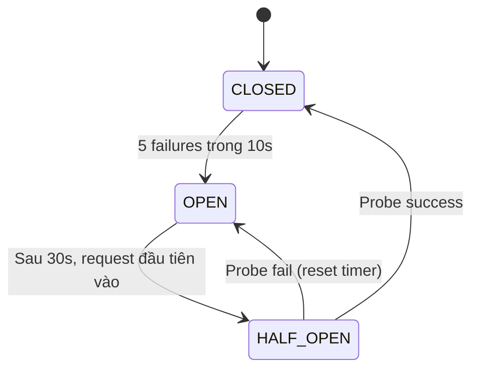
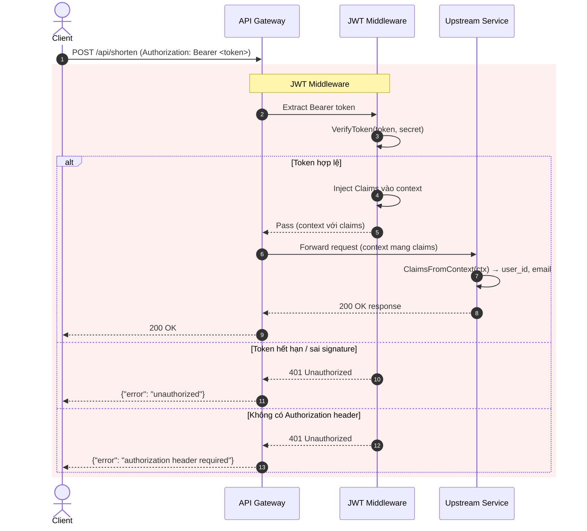

# Bảo Mật & Chịu Lỗi (Security & Resilience)

---
## Mục Lục

1. [Xác Thực Người Dùng (User Authentication)](#1-xác-thực-người-dùng-user-authentication)
2. [JWT Token Management](#2-jwt-token-management)
3. [Mật Khẩu & Bảo Mật](#3-mật-khẩu--bảo-mật)
4. [Circuit Breaker (Gateway)](#4-circuit-breaker-gateway)
5. [Rate Limiter (Gateway)](#5-rate-limiter-gateway)
6. [Shared Auth Package](#6-shared-auth-package)

---

## 1. Xác Thực Người Dùng (User Authentication)

### What

`user-service` chịu trách nhiệm đăng ký (register) và đăng nhập (login), exposed qua Gateway tại `/api/auth/register` và `/api/auth/login`.

### How

- **Password**: bcrypt cost factor 12 (~200ms/hash)
- **Session**: JWT HS256, 24h TTL
- **Lưu trữ**: PostgreSQL `users` table với `password_hash` là bcrypt string

### Problem (Cũ) — Timing Attack

Khi email không tồn tại trong DB, handler trả về lỗi ngay lập tức mà không chạy bcrypt verify. Kẻ tấn công đo được:
- Email **tồn tại**: response ~200ms (bcrypt verify mất ~200ms)
- Email **không tồn tại**: response ~1ms (không chạy bcrypt)

→ Dễ dàng brute-force danh sách email hợp lệ.

### Solution — Dummy bcrypt Hash

```go
const dummyBcryptHash = "$2a$12$MB4lTvA5UVWJU8GPtVFSne/kMHaXBSz45DWvIl/4AS9NLnz7tavNm"
```

Khi `FindByEmail` trả về `nil`, handler vẫn gọi `hasher.Verify(password, dummyBcryptHash)`:

- Response time đồng nhất ~200ms cho cả email tồn tại và không tồn tại
- Attacker không thể phân biệt dựa trên timing

### Register Flow

| Bước | Thành phần | Hành động |
| :--- | :--------- | :-------- |
| 1 | Client | `POST /api/auth/register` với JSON `{email, password}` |
| 2 | Gateway | Bỏ qua JWT (route public), forward đến user-service |
| 3 | Handler | Validate Content-Type, body size (1MB max), email format, password ≥ 8 chars |
| 4 | PasswordHasher | `bcrypt.GenerateFromPassword(password, cost=12)` |
| 5 | UserRepository | `INSERT INTO users (email, password_hash)` |
| 6 | — | Nếu `ErrDuplicateEmail` → 409 Conflict |
| 7 | Handler | Trả về 201 Created `{user_id, email}` |

### Login Flow

| Bước | Thành phần | Hành động |
| :--- | :--------- | :-------- |
| 1 | Client | `POST /api/auth/login` với JSON `{email, password}` |
| 2 | Gateway | Bỏ qua JWT, forward đến user-service |
| 3 | Handler | Validate request body |
| 4 | UserRepository | `FindByEmail` — truy vấn PostgreSQL |
| 5 | — | Nếu **user == nil** → `hasher.Verify(password, dummyBcryptHash)` → 401 |
| 6 | — | Nếu **user tồn tại** → `hasher.Verify(password, user.PasswordHash)` |
| 7 | — | Nếu **password sai** → 401 |
| 8 | TokenIssuer | Sinh JWT HS256 với claims `sub`, `email`, `iss`, `iat`, `exp` |
| 9 | Handler | Trả về 200 OK `{token, expires_at}` |

---

## 2. JWT Token Management

### What / How

`jwtTokenIssuer` trong user-service sử dụng `golang-jwt/jwt/v5` để sinh và verify token:

| Thuộc tính | Giá trị |
| :--------- | :------ |
| **Thuật toán** | HS256 (HMAC-SHA256) |
| **Signing key** | Symmetric secret (shared giữa user-service và gateway) |
| **TTL** | 24 giờ |
| **Claims** | `sub` (user_id UUID), `email`, `iss` (`"url-shortener"`), `iat`, `exp` |

### Vấn Đề Hiện Tại

| Vấn đề | Mô tả | Mức độ |
| :----- | :---- | :----- |
| **Symmetric key shared** | user-service sinh token, gateway verify — cả 2 dùng chung 1 secret. Nếu 1 service bị lộ, attacker tự do forge token. | **Cao** |
| **Không có refresh token** | Token hết hạn sau 24h, client phải login lại. UX kém cho mobile/long-lived sessions. | **Trung bình** |
| **No revocation** | Không thể thu hồi token trước hạn. Nếu token bị rò rỉ, attacker dùng được đến khi hết hạn. | **Cao** |
| **Stateless verification** | Gateway verify token mà không cần gọi user-service (nhanh) nhưng không check blacklist. | — |

### Future

- **Refresh token**: Token ngắn hạn (15p) + refresh token dài hạn (7 ngày) lưu trong DB
- **Redis blacklist**: Danh sách token bị thu hồi với TTL = token expiry

---

## 3. Mật Khẩu & Bảo Mật

### bcrypt Cost Factor

```go
func NewPasswordHasher(cost int) PasswordHasher {
    if cost < bcrypt.MinCost { cost = bcrypt.MinCost }
    if cost > bcrypt.MaxCost  { cost = bcrypt.MaxCost }
    return &bcryptHasher{cost: cost}
}
```

| Cost | ~Thời gian | Bảo mật |
| :--- | :--------- | :------ |
| 10 (default) | ~100ms | Cơ bản |
| **12** | **~200ms** | **Hiện tại — cân bằng speed/security** |
| 14 (max) | ~800ms | Quá chậm cho hệ thống production |

Giới hạn `[MinCost, MaxCost]` ngăn config lỗi đặt cost ngoài range.

### hashIP (Analytics & URL Service)

SHA-256 + salt để băm IP client trước khi lưu:

- **Mục đích**: Đếm unique clicks mà không lưu PII (Personal Identifiable Information)
- **GDPR compliance**: IP gốc không bao giờ được lưu vào DB
- **Salt**: Cấu hình qua env, tránh rainbow table

### SQL Injection Protection

Toàn bộ truy vấn sử dụng **parameterized queries** (`pgx` — PostgreSQL driver):

```sql
-- users table migration
CREATE TABLE IF NOT EXISTS users (
    id UUID PRIMARY KEY DEFAULT gen_random_uuid(),
    email TEXT UNIQUE NOT NULL,
    password_hash TEXT NOT NULL,
    created_at TIMESTAMPTZ NOT NULL DEFAULT now()
);
```

Mọi `INSERT`, `SELECT`, `UPDATE` đều dùng `$1, $2, ...` — không concatenate chuỗi user input vào SQL.

---

## 4. Circuit Breaker (Gateway)

### What

Tự triển khai 3-state machine tại Gateway để bảo vệ upstream service khỏi cascading failure.

### Problem

Upstream service (vd: url-service) gặp sự cố → Gateway tiếp tục forward request → Chờ timeout → Tài nguyên cạn kiệt → Các service khác cũng bị ảnh hưởng (cascading failure).

### How — 3-State Machine

| State | Hành vi | Điều kiện chuyển |
| :---- | :------ | :--------------- |
| **CLOSED** | Requests pass through, đếm failure trong `failureWindow` | — |
| **OPEN** | Reject ngay lập tức với `ErrCircuitOpen` (503) | failures ≥ maxFailures (5) trong 10s |
| **HALF_OPEN** | Cho phép probe request kiểm tra | OPEN timeout 30s expired + request mới tới |

### State Diagram



### Chi Tiết Implementation

| Khía cạnh | Mô tả |
| :-------- | :---- |
| **State struct** | `CircuitBreaker` với `sync.Mutex`, State, `failures`, `lastFailureTime`, `maxFailures` (5), `openTimeout` (30s), `failureWindow` (10s) |
| **Thread safety** | `sync.Mutex` — lock khi đọc/ghi state và counters |
| **Half-open probe** | Biến `halfOpenProbe` bool: khi đang HALF_OPEN, chỉ 1 request được phép pass, các request khác bị reject |
| **Context cancellation** | Kiểm tra `ctx.Done()` trước khi gọi upstream — tránh goroutine leak |
| **State change callback** | `onStateChange(from, to State)` gọi sau khi unlock mutex, dùng cho Prometheus metrics |

### Metrics (Prometheus)

| Metric | Type | Labels |
| :----- | :--- | :----- |
| `circuit_breaker_state` | Gauge | `service="url-service"` — 0=CLOSED, 1=OPEN, 2=HALF_OPEN |
| `circuit_breaker_trips_total` | Counter | `service="url-service"` — số lần OPEN |
| `circuit_breaker_requests_rejected_total` | Counter | `service="url-service"` — số request bị reject |

### Hạn Chế

- **Không sliding window thực sự**: `failureWindow` reset toàn bộ counter khi hết window, không phải sliding
- **Không exponential backoff**: OPEN timeout cố định 30s, không tăng dần theo số lần trip
- **Chỉ bảo vệ url-service**: Các upstream khác (user-service, notification-service) chưa được cấu hình CB

---

## 5. Rate Limiter (Gateway)

### What

Fixed Window Counter algorithm trên Redis, giới hạn request theo IP.

### Problem

Một user gửi request với tần suất cao → Quá tải upstream → Tăng latency, giảm throughput cho user khác.

### How — Fixed Window Counter trên Redis

```go
// Lua-equivalent logic:
count := redis.INCR("rl:" + key)
if count == 1 { redis.EXPIRE(key, windowSecs) }
if count > limit { REJECT }
```

| Endpoint | Limit | Window | Ý nghĩa |
| :------- | :---- | :----- | :------ |
| `shorten` | 10 | 60s | Tối đa 10 request mỗi 60 giây |
| `redirect` | 300 | 60s | Tối đa 300 request mỗi 60 giây |
| `Redis timeout` | 100ms | Timeout per Redis call |

### Fail-Open

Khi Redis lỗi hoặc timeout, RateLimiter **allow request** và ghi WARN log:

```go
count, err := rl.client.Incr(ctx, fullKey).Result()
if err != nil {
    return true, 0, err  // fail-open: allow request
}
```

Quyết định thiết kế: **Availability > Consistency** — ưu tiên dịch vụ hoạt động hơn là chặn thiếu chính xác.

### Xác Định Client IP

```go
func clientIP(r *http.Request) string {
    // 1. X-Forwarded-For header (first IP)
    // 2. X-Real-IP header
    // 3. RemoteAddr (fallback)
}
```

Hỗ trợ reverse proxy chain (Nginx → Gateway).

### Hạn Chế

- **IP-based**: Không phân biệt user trong cùng IP (NAT, shared IP). User hợp lệ có thể bị ảnh hưởng bởi user khác.
- **Không per-endpoint chi tiết**: Chỉ có 2 key (`shorten`, `redirect`). Các endpoints auth (`/register`, `/login`) không có rate limit riêng.
- **Fixed Window**: Dễ bị burst ở boundary (vd: 100 req ở giây cuối + 100 req ở giây đầu của window kế).

---

## 6. Shared Auth Package

### Claims & VerifyToken

`shared/auth/auth.go` định nghĩa cấu trúc JWT claims chung cho toàn hệ thống:

| Field | JSON | Kiểu | Bắt buộc | Mô tả |
| :---- | :--- | :--- | :------- | :---- |
| **Sub** | `sub` | `string` (UUID) | ✓ | User ID |
| **Email** | `email` | `string` | ✓ | Email user (denormalized) |
| **Iss** | `iss` | `string` | ✓ | Luôn `"url-shortener"` |
| **Iat** | `iat` | `int64` (Unix) | ✓ | Issued at |
| **Exp** | `exp` | `int64` (Unix) | ✓ | Expiry |

`VerifyToken` kiểm tra:
1. Algorithm = HMAC (ngăn attack `alg=none`)
2. Signature hợp lệ
3. Tất cả required claims tồn tại và đúng kiểu
4. `iss` = `"url-shortener"`

### JWTMiddleware (Gateway)

`shared/auth/middleware.go` — middleware HTTP pattern:

```go
func JWTMiddleware(secret string) func(http.Handler) http.Handler {
    return func(next http.Handler) http.Handler {
        return http.HandlerFunc(func(w http.ResponseWriter, r *http.Request) {
            // 1. Extract Bearer token từ Authorization header
            // 2. VerifyToken (signature + claims validation)
            // 3. context.WithValue → inject claims vào request context
            // 4. next.ServeHTTP
        })
    }
}
```

### Luồng JWT Middleware



### Dual Verification (Defense in Depth)

1. **Gateway**: JWTMiddleware chặn request không hợp lệ trước khi forward
2. **Upstream service**: Mỗi service gọi `ClaimsFromContext` để verify lại — nếu request bypass Gateway (mạng nội bộ), vẫn được bảo vệ

---

## Tổng Kết

| Lĩnh vực | Cơ chế chính | Hạn chế / Future |
| :------- | :----------- | :--------------- |
| **Xác thực** | bcrypt cost 12, dummy hash chống timing attack | — |
| **JWT** | HS256, 24h TTL, symmetric key | Không refresh token, không revocation |
| **Password** | bcrypt [10-14], parameterized queries | — |
| **Circuit Breaker** | 3-state, 5 failures/10s, 30s timeout | Chỉ url-service, không exponential backoff |
| **Rate Limiter** | Fixed Window Counter Redis, fail-open | IP-based, fixed window |
| **Auth middleware** | Dual verify (gateway + service) | — |

---
