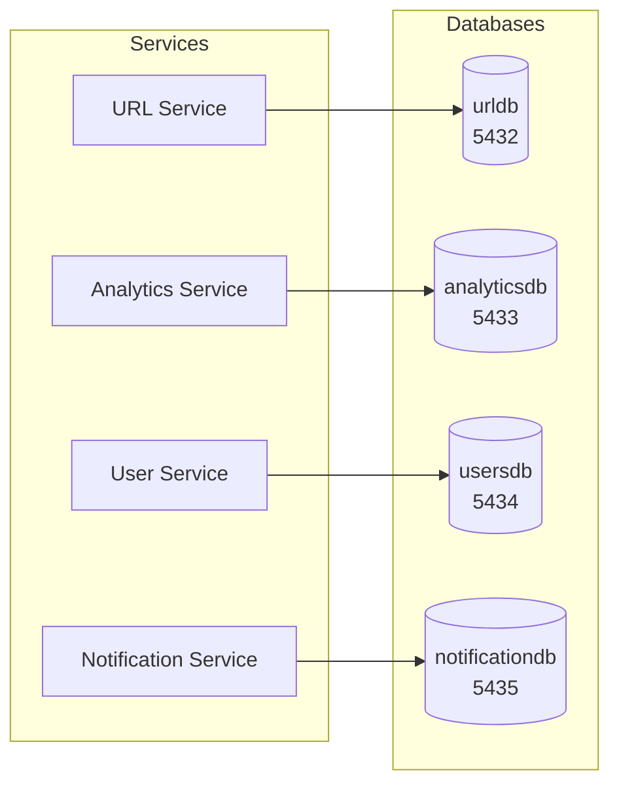
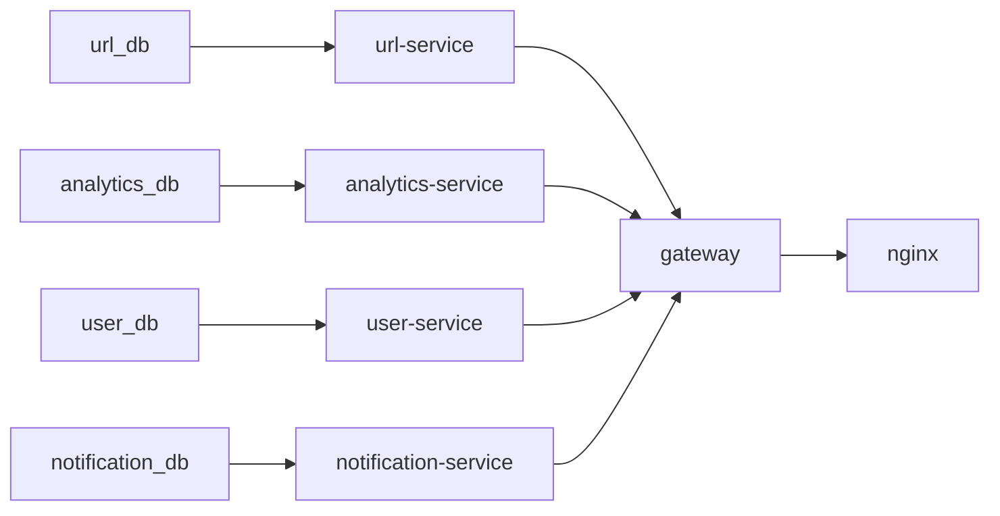

# Cơ Sở Dữ Liệu (Database)

---
## Mục Lục

1. [Database-per-Service Pattern](#1-database-per-service-pattern)
2. [Schema từng Service](#2-schema-từng-service)
3. [Indexes](#3-indexes)
4. [Migration Strategy](#4-migration-strategy)
5. [Cursor-based Pagination](#5-cursor-based-pagination)
6. [Docker Compose DB Configuration](#6-docker-compose-db-configuration)

---

## 1. Database-per-Service Pattern

### What
4 PostgreSQL instances riêng biệt — mỗi service một database, 4 container, không chia sẻ.

### Why
- **Isolation**: Lỗi/service đi xuống không ảnh hưởng dữ liệu service khác
- **Independent scaling**: Mỗi database scale riêng — URL service cần nhiều connection hơn User service
- **Bounded context ownership**: Mỗi team/service tự do chọn schema, index, migration strategy

### Trade-off
- Không cross-service JOIN — aggregate ở application layer, query riêng rẽ
- **Eventual consistency**: Không có FK constraint xuyên database — dữ liệu nhất quán cuối cùng qua outbox pattern

### Danh sách Database

| Database | Service | Container | Port host |
|---|---|---|---|
| `urldb` | URL Service | `url_db` | 5432 |
| `analyticsdb` | Analytics Service | `analytics_db` | 5433 |
| `usersdb` | User Service | `user_db` | 5434 |
| `notificationdb` | Notification Service | `notification_db` | 5435 |



---

## 2. Schema từng Service

### urldb — URL Service

**Bảng `urls`**

| Cột | Kiểu | RB | Ghi chú |
|---|---|---|---|
| `id` | UUID | PK, DEFAULT gen_random_uuid() | |
| `short_code` | VARCHAR(10) | UNIQUE NOT NULL | Mã rút gọn 7 ký tự |
| `original_url` | TEXT | NOT NULL | URL gốc |
| `user_id` | UUID | NOT NULL | Chủ sở hữu |
| `user_email` | TEXT | NOT NULL DEFAULT '' | Email người tạo |
| `created_at` | TIMESTAMPTZ | NOT NULL DEFAULT now() | |
| `expires_at` | TIMESTAMPTZ | NULL | NULL = vô hạn |
| `is_active` | BOOLEAN | NOT NULL DEFAULT true | Soft delete |

**Bảng `outbox`** — Transactional Outbox

| Cột | Kiểu | RB | Ghi chú |
|---|---|---|---|
| `id` | UUID | PK, DEFAULT gen_random_uuid() | |
| `event_type` | TEXT | NOT NULL | Routing key, e.g. `url.created` |
| `payload` | JSONB | NOT NULL | Event body |
| `created_at` | TIMESTAMPTZ | NOT NULL DEFAULT now() | |
| `locked_until` | TIMESTAMPTZ | NULL | Claim lock cho worker |
| `published_at` | TIMESTAMPTZ | NULL | NULL = chưa publish |

### analyticsdb — Analytics Service

**Bảng `clicks`**

| Cột | Kiểu | RB | Ghi chú |
|---|---|---|---|
| `id` | UUID | PK, DEFAULT gen_random_uuid() | |
| `short_code` | TEXT | NOT NULL | Logical FK → urls.short_code |
| `clicked_at` | TIMESTAMPTZ | NOT NULL | |
| `ip_hash` | TEXT | NOT NULL | SHA-256(IP + salt) |
| `user_agent` | TEXT | NOT NULL DEFAULT '' | |
| `referer` | TEXT | NULL | |

**Bảng `milestones`** — Theo dõi mốc click

| Cột | Kiểu | RB |
|---|---|---|
| `id` | UUID | PK, DEFAULT gen_random_uuid() |
| `short_code` | TEXT | NOT NULL |
| `milestone` | INT | NOT NULL |
| `triggered_at` | TIMESTAMPTZ | NOT NULL DEFAULT now() |
| UNIQUE | (short_code, milestone) | |

**Bảng `processed_events`** — Idempotency cho consumer

| Cột | Kiểu |
|---|---|
| `event_id` | TEXT PK |
| `processed_at` | TIMESTAMPTZ NOT NULL DEFAULT now() |

### notificationsdb — Notification Service

**Bảng `notifications`**

| Cột | Kiểu | RB | Ghi chú |
|---|---|---|---|
| `id` | UUID | PK, DEFAULT gen_random_uuid() | |
| `user_id` | UUID | NOT NULL | Logical FK → users.id |
| `event_type` | TEXT | NOT NULL | |
| `payload` | JSONB | NOT NULL | Thông tin milestone, URL |
| `status` | TEXT | NOT NULL DEFAULT 'sent' | sent / failed / pending |
| `created_at` | TIMESTAMPTZ | NOT NULL DEFAULT now() | |
| `sent_at` | TIMESTAMPTZ | NULL | |

### usersdb — User Service

**Bảng `users`**

| Cột | Kiểu | RB |
|---|---|---|
| `id` | UUID | PK, DEFAULT gen_random_uuid() |
| `email` | TEXT | UNIQUE NOT NULL |
| `password_hash` | TEXT | NOT NULL |
| `created_at` | TIMESTAMPTZ | NOT NULL DEFAULT now() |

### Khác biệt chính giữa các schema

| Đặc điểm | `urls` | `users` | `notifications` | `clicks` |
|---|---|---|---|---|
| Soft delete | `is_active` | — | — | — |
| Expiry | `expires_at` | — | — | — |
| State machine | — | — | `status` | — |
| JSONB payload | Chỉ outbox | — | `payload` | — |
| Logical FK | user_id | — | user_id | short_code |
| Dùng `gen_random_uuid()` | Có | Có | Có | Có |

> Tất cả FK đều **logical** (không DB constraint) — đúng tinh thần database-per-service. Nhờ `gen_random_uuid()` ở mọi PK, insert không phụ thuộc sequence.

---

## 3. Indexes

| Tên Index | Bảng | Cột | Loại | Mục đích |
|---|---|---|---|---|
| `idx_urls_short_code` | urls | short_code | UNIQUE B-Tree | Tra cứu redirect O(log n) |
| `idx_urls_user_id_created` | urls | (user_id, created_at DESC) | Composite B-Tree | Danh sách user, cursor pagination |
| `idx_outbox_unpublished` | outbox | created_at ASC | Partial (published_at IS NULL) | Quét outbox event chưa gửi |
| `idx_outbox_unpublished_unlocked` | outbox | created_at ASC | Partial (published_at IS NULL AND locked_until IS NULL) | Quét outbox không lock |
| `idx_clicks_short_code_time` | clicks | (short_code, clicked_at DESC) | Composite B-Tree | Thống kê click theo URL |
| `idx_clicks_referer` | clicks | (short_code, referer) | Partial (referer IS NOT NULL) | Thống kê referrer |
| `idx_milestones_code_milestone` | milestones | (short_code, milestone) | UNIQUE B-Tree | Chống milestone trùng |
| `idx_notifications_user_created` | notifications | (user_id, created_at DESC) | Composite B-Tree | Tra notification của user |
| `idx_users_email` | users | email | UNIQUE B-Tree | Login, unique constraint |

### Điểm đáng chú ý

- **Partial indexes trên outbox**: Chỉ index row `published_at IS NULL` — index nhỏ gọn, outbox poller không bao giờ scan published rows
- **Composite + DESC**: `ORDER BY id DESC` với index `(user_id, created_at DESC)` cho phép index-only scan, không cần sort step
- **Không index JSONB payload**: Dữ liệu event chỉ ghi + đọc toàn bộ — không query nội dung

---

## 4. Migration Strategy

### Cách hoạt động

```go
//go:embed migration.sql
var migrationSQL string

func RunMigrations(ctx context.Context, pool *pgxpool.Pool) error {
    _, err := pool.Exec(ctx, migrationSQL)
    return err
}
```

- **Embedded SQL**: File `.sql` nhúng vào binary tại compile time
- **Startup migration**: Chạy ngay khi service init, trước khi serve request
- **Idempotent**: Mọi câu lệnh đều dùng `IF NOT EXISTS` — chạy lại vô hại

### Bảng ưu / nhược điểm

| Ưu điểm | Nhược điểm |
|---|---|
| Zero dependency — không cần tool | Không versioning — không biết schema ở version nào |
| Idempotent — chạy lại an toàn | Chỉ CREATE, không ALTER/DROP — không mutable |
| Đơn giản — một file SQL, ai cũng hiểu | Không review migration theo PR |
| Startup-time — DB ready ngay | Không rollback — muốn revert phải manual |
| Dễ dev — không cần migrate up/down | Scale kém khi nhiều môi trường |

### Khi nào phù hợp

- **MVP / dự án nhỏ**: Simplicity > control
- **Schema ổn định**: URL service schema ít thay đổi sau khi định hình
- **Giới hạn**: Nếu cần ALTER TABLE / nhiều môi trường → chuyển sang `golang-migrate` hoặc `atlas`

---

## 5. Cursor-based Pagination

### Problem với OFFSET

```
OFFSET 10000 → scan 10000 rows rồi bỏ qua → O(n)
```
- Performance giảm dần theo số trang
- Dữ liệu thay đổi giữa request → page bị lặp/mất row

### Solution: Keyset Pagination (URL Service)

```sql
-- Lấy limit + 1 row để xác định hasMore
WHERE user_id = $1 AND id < $cursor AND is_active = true
      AND (expires_at IS NULL OR expires_at > NOW())
ORDER BY id DESC
LIMIT $limit + 1
```

**UUID id** làm cursor:
- Sort ổn định, không thay đổi
- `WHERE id < $cursor` index seek trực tiếp — O(log n)

```go
hasMore := len(results) > limit
if hasMore {
    results = results[:limit]  // bỏ row thừa
}
```

### Hiệu năng

| Phương pháp | Page 1 | Page 100 | Page 10000 |
|---|---|---|---|
| OFFSET | ~0.3ms | ~5ms | ~15ms |
| Cursor | ~0.3ms | ~0.3ms | ~0.3ms |

Cursor-based cho performance **ổn định O(log n)** — không degrade theo số lượng data.

---

## 6. Docker Compose DB Configuration

| Service | Image | Port map | User | Password | Database | Volume |
|---|---|---|---|---|---|---|
| `url_db` | postgres:16-alpine | 5432:5432 | urluser | urlpass | urldb | url_db_data |
| `analytics_db` | postgres:16-alpine | 5433:5432 | analyticsuser | analyticspass | analyticsdb | analytics_db_data |
| `user_db` | postgres:16-alpine | 5434:5432 | useruser | userpass | userdb | user_db_data |
| `notification_db` | postgres:16-alpine | 5435:5432 | notificationuser | notificationpass | notificationdb | notification_db_data |

### Health Check

```yaml
healthcheck:
  test: ["CMD-SHELL", "pg_isready -U <user> -d <db>"]
  interval: 5s
  timeout: 5s
  retries: 10
  start_period: 10s
```

- **pg_isready**: Kiểm tra qua Unix socket — không cần password
- **start_period 10s**: Cho PostgreSQL init trước khi health check bắt đầu
- **depends_on condition: service_healthy**: Service chỉ start sau khi DB pass health

### depends_on chain



---

## Tổng kết

| Khía cạnh | Lựa chọn | Lý do |
|---|---|---|
| Pattern | Database-per-Service | Isolation, bounded context |
| Migration | Embedded SQL + IF NOT EXISTS | Zero dependency, idempotent |
| Pagination | Cursor-based | Performance O(log n), consistent |
| Index | Partial + Composite B-Tree | Tối ưu query pattern cụ thể |
| Deploy | Docker Compose + health check | Dev/CI friendly, reproducible |

> **Hạn chế lớn nhất**: Migration không versioning. Khi dự án lớn cần multi-environment, nên chuyển sang golang-migrate / atlas để có migrate up/down, review migration file, và rollback an toàn.
