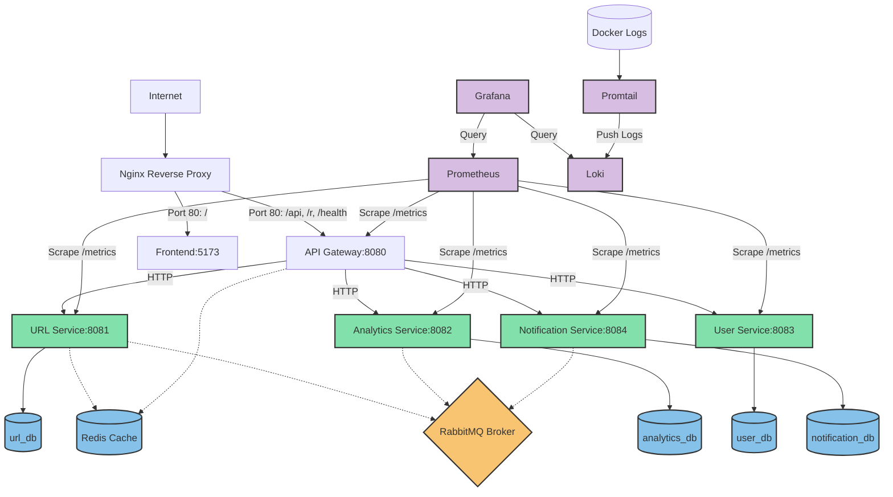
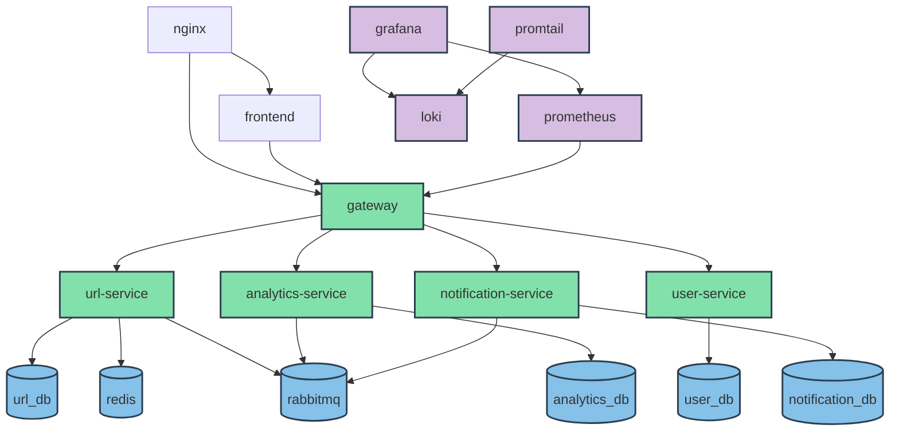
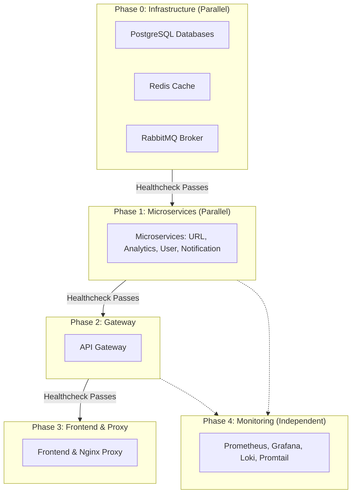

# Phân Tích Chi Tiết: Deployment, Docker Compose, Kubernetes, CI/CD và Monitoring

---
## Mục Lục

1. [Tổng Quan Kiến Trúc Triển Khai](#1-tổng-quan-kiến-trúc-triển-khai)
2. [Docker Compose & Dockerfiles — Phát Triển & Build](#2-docker-compose--dockerfiles--phát-triển--build)
   - 2.1. Cấu Hình Chi Tiết Các Container
   - 2.2. Tài Nguyên, Phụ Thuộc và Môi Trường
   - 2.3. Quy trình Build Docker (Dockerfiles)
3. [Kubernetes Manifests](#3-kubernetes-manifests)
   - 3.1. Namespace
   - 3.2. ConfigMap và Secrets
   - 3.3. Infrastructure Deployments
   - 3.4. Application Deployments
   - 3.5. Services và NodePort
   - 3.6. Phân Tích Deployment vs StatefulSet
4. [Health Checks — Liveness và Readiness](#4-health-checks--liveness-và-readiness)
   - 4.1. ReadinessProbe trong Docker Compose
   - 4.2. ReadinessProbe trong Kubernetes
   - 4.3. So Sánh và Đối Chiếu
5. [Infrastructure Components](#5-infrastructure-components)
   - 5.1. PostgreSQL (4 Instances)
   - 5.2. Redis Cache
   - 5.3. RabbitMQ Message Broker
   - 5.4. Nginx Reverse Proxy
   - 5.5. Adminer
6. [CI/CD Pipeline — GitHub Actions](#6-cicd-pipeline--github-actions)
   - 6.1. Continuous Integration (CI)
   - 6.2. Continuous Delivery (CD)
   - 6.3. Build Matrix
   - 6.4. Docker Layer Caching
   - 6.5. Multi-Arch Build
   - 6.6. Deploy to AKS
7. [Monitoring Stack](#7-monitoring-stack)
   - 7.1. Prometheus — Cấu Hình Scrape
   - 7.2. Grafana — Dashboards
   - 7.3. Loki — Log Aggregation
   - 7.4. Promtail — Log Collector
   - 7.5. Datasource Provisioning
8. [Logging Stack](#8-logging-stack)
   - 8.1. Loki Configuration
   - 8.2. Promtail Configuration
   - 8.3. Grafana Log Explorer
9. [Container Dependency Graph](#9-container-dependency-graph)
   - 9.1. Dependency Tree
   - 9.2. Startup Order
   - 9.3. Critical Path Analysis
10. [Production Deployment Recommendations](#10-production-deployment-recommendations)
    - 10.1. Ingress Controller
    - 10.2. Horizontal Pod Autoscaler (HPA)
    - 10.3. StatefulSet cho Databases
    - 10.4. Resource Requests và Limits
    - 10.5. PersistentVolumeClaims
    - 10.6. Network Policies
    - 10.7. Pod Disruption Budgets
    - 10.8. Secret Management
11. [Kết Luận](#11-kết-luận)

---

## 1. Tổng Quan Kiến Trúc Triển Khai

Dự án URL Shortener Microservices sử dụng kiến trúc microservices với ngôn ngữ Go cho backend (5 services), Node.js/Vite cho frontend, và cơ sở dữ liệu PostgreSQL phân tán (4 databases riêng biệt). Hệ thống áp dụng hai chiến lược triển khai song song:

| Môi Trường | Platform | Mục Đích |
|-----------|----------|----------|
| Development | Docker Compose | 18 containers chạy local, phát triển và debug |
| Production | Kubernetes (AKS) | Triển khai cloud-native, scale tự động |

Kiến trúc triển khai tổng thể được biểu diễn như sơ đồ dưới đây:



Mỗi microservice có cơ sở dữ liệu riêng (database-per-service pattern), giao tiếp đồng bộ qua HTTP (qua gateway) và bất đồng bộ qua RabbitMQ (message queue pattern). Redis đóng vai trò cache cho URL shortener. Gateway đóng vai trò API gateway duy nhất, chịu trách nhiệm xác thực JWT, rate limiting, circuit breaker, và thu thập metrics.

---

## 2. Docker Compose & Dockerfiles — Phát Triển & Build

File `docker-compose.yml` định nghĩa 18 containers chạy trong một network bridge duy nhất mang tên `url-shortener`.

### 2.1. Cấu Hì̀nh Chi Tiết Các Container

Dưới đây là bảng tổng hợp danh sách các container, image tương ứng, cấu hình cổng (port mapping) và cơ chế kiểm tra sức khỏe (healthcheck):

| Container | Image & Tag | Cổng (Host:Container) | Chức Năng Chính & Cơ Chế Healthcheck |
|-----------|-------------|-----------------------|--------------------------------------|
| `url_db` | `postgres:16-alpine` | `5432:5432` | DB URL Service. Healthcheck: `pg_isready` (5s interval, 10 retries) |
| `analytics_db` | `postgres:16-alpine` | `5433:5432` | DB Analytics Service. Healthcheck: `pg_isready` |
| `user_db` | `postgres:16-alpine` | `5434:5432` | DB User Service. Healthcheck: `pg_isready` |
| `notification_db` | `postgres:16-alpine` | `5435:5432` | DB Notification Service. Healthcheck: `pg_isready` |
| `adminer` | `adminer:latest` | `8090:8080` | GUI quản lý database. Không có healthcheck |
| `rabbitmq` | `rabbitmq:3.13-management-alpine` | `5672:5672`, `15672:15672` | Message broker. Healthcheck: `rabbitmq-diagnostics ping` (10s interval) |
| `redis` | `redis:7-alpine` | `6379:6379` | Ephemeral cache (`--save "" --appendonly no`). Healthcheck: `redis-cli ping` |
| `nginx` | `nginx:1.27-alpine` | `80:80` | Reverse proxy routing. Không có healthcheck |
| `url-service` | Build local (Go) | `8081:8080` | Microservice URL. Healthcheck: `wget /health` (10s interval, 5 retries) |
| `analytics-service`| Build local (Go) | `8082:8080` | Microservice Analytics. Healthcheck: `wget /health` |
| `user-service` | Build local (Go) | `8083:8080` | Microservice User. Healthcheck: `wget /health` |
| `notification-service` | Build local (Go) | `8084:8080` | Microservice Notification. Healthcheck: `wget /health` |
| `gateway` | Build local (Go) | `8080:8080` | API Gateway chính. Healthcheck: `wget /health` |
| `frontend` | Build local (Node) | `5173:5173` | React/Vite dev server. Không có healthcheck |
| `prometheus` | `prom/prometheus:v2.53.0` | `9090:9090` | Thu thập metrics. Không có healthcheck |
| `grafana` | `grafana/grafana:11.1.0` | `3000:3000` | Trực quan hóa dashboard. Không có healthcheck |
| `loki` | `grafana/loki:2.9.1` | `3100:3100` | Tập hợp logs. Không có healthcheck |
| `promtail` | `grafana/promtail:latest` | N/A (internal: 9080) | Thu thập logs từ host/socket. Không có healthcheck |

### 2.2. Tài Nguyên, Phụ Thuộc và Môi Trường

- **Volumes & Mounts:** Định nghĩa 8 named volumes cho việc lưu trữ dữ liệu (DBs, RabbitMQ, Redis, Prometheus, Grafana). Sử dụng bind mounts ở chế độ chỉ đọc (`ro`) cho các file cấu hình (`nginx.conf`, `prometheus.yml`, `loki-config.yml`, `promtail-config.yml`) và Docker socket (`/var/run/docker.sock` cho Promtail).
- **Ràng Buộc Khởi Động:** Thứ tự khởi động sử dụng điều kiện `service_healthy`: 
  Databases/Cache/Broker (Phase 0) $\rightarrow$ Microservices (Phase 1) $\rightarrow$ Gateway (Phase 2) $\rightarrow$ Frontend/Nginx (Phase 3).
- **Biến Môi Trường:**
  - *Databases/Broker:* Cấu hình thông tin đăng nhập mặc định (`guest/guest` cho RabbitMQ, `admin/admin` cho Grafana, credentials riêng cho từng PostgreSQL).
  - *Go Services & Gateway:* Nhận cấu hình kết nối qua `DATABASE_URL`, `REDIS_URL`, `RABBITMQ_URL` và các cấu hình bảo mật `JWT_SECRET`, `IP_HASH_SALT`.
- **Restart Policies:** Chỉ có Nginx và stack monitoring được gán chính sách `unless-stopped`. Các microservices và databases mặc định là `no` (không tự khởi động lại).

### 2.3. Quy trình Build Docker (Dockerfiles)

Các thành phần trong hệ thống được đóng gói thông qua Dockerfile riêng biệt:
- **Go Services & Gateway:** Quy trình build 2 giai đoạn (multi-stage build):
  - *Giai đoạn 1 (Build):* Sử dụng `golang:1.23-alpine`, copy toàn bộ mã nguồn (`COPY . .`), và biên dịch bằng `go build -o main .`.
  - *Giai đoạn 2 (Runtime):* Sử dụng `alpine:latest`, chỉ sao chép file binary đã biên dịch từ Giai đoạn 1 nhằm giảm dung lượng ảnh (~15 MB).
  - *Khuyến nghị tối ưu:* Cấu hình build tĩnh (`CGO_ENABLED=0`), nén binary (`-ldflags="-s -w"`), thêm `ca-certificates` cho SSL, sao chép `go.mod`/`go.sum` trước để tận dụng Docker layer cache, và thêm `.dockerignore`.
- **Frontend React/Vite:** 
  - *Môi trường phát triển:* Build 1 giai đoạn trên `node:22-alpine` chạy dev mode (`npm run dev`) để hỗ trợ hot-reload.
  - *Khuyến nghị Production:* Đóng gói multi-stage (Giai đoạn 1 build code static, Giai đoạn 2 sử dụng Nginx alpine phục vụ static assets).
- **Phân tích kỹ thuật build:** Quy trình build sử dụng Go Workspace (`go.work`) để liên kết các module cục bộ (`gateway`, `services/*`, `shared/*`). Cần bổ sung file `.dockerignore` tại thư mục root của dự án để tránh copy thừa dữ liệu không liên quan (như node_modules, k8s manifests, logs) gây invalidate cache.

---

## 3. Kubernetes Manifests

Hệ thống được cấu trúc hóa để chạy trên Kubernetes thông qua các tài nguyên được chia nhóm.

### 3.1. Namespace

Toàn bộ tài nguyên được cô lập trong namespace `url-shortener` để tránh xung đột với các ứng dụng khác trong cluster.

### 3.2. ConfigMap và Secrets

- **ConfigMap `app-config`:** Lưu trữ các cấu hình tĩnh và phi nhạy cảm, bao gồm các URL dịch vụ nội bộ (ví dụ: `http://url-service:8080`), cổng hoạt động, và chuỗi kết nối database có vô hiệu hóa SSL (`sslmode=disable`).
- **Secret `app-secrets`:** Lưu trữ khóa `JWT_SECRET`.
- **Khuyến nghị bảo mật:** Các chuỗi kết nối PostgreSQL và RabbitMQ hiện đang nằm trong ConfigMap cần được di chuyển hoàn toàn sang Secrets vì chúng chứa thông tin xác thực (username/password).

### 3.3. Infrastructure Deployments

Phần hạ tầng bao gồm Redis, RabbitMQ và 4 database PostgreSQL được định nghĩa dưới dạng các Kubernetes `Deployment` kết hợp với `Service` nội bộ (`ClusterIP`).

| Dịch Vụ | Loại Service | Cổng Khai Báo |
|---------|--------------|---------------|
| `redis` | ClusterIP | 6379 |
| `rabbitmq` | ClusterIP | 5672 (AMQP), 15672 (Management UI) |
| Databases (x4) | ClusterIP | 5432 |

Việc sử dụng tài nguyên loại `Deployment` đi kèm lưu trữ dạng `emptyDir` cho PostgreSQL là một rủi ro cực lớn. Khi các Pod bị tắt hoặc lên lịch lại (rescheduled), toàn bộ dữ liệu ghi nhận trong database sẽ bị xóa sạch. Databases trong môi trường thực tế bắt buộc phải sử dụng `StatefulSet` kết hợp với `PersistentVolumeClaim` (PVC) như phân tích ở mục 3.6.

### 3.4. Application Deployments

Khai báo tài nguyên cho các ứng dụng nghiệp vụ:

| Tên Service | Số Lượng Pod (Replicas) | Image Pull Policy | Cách Expose |
|-------------|-------------------------|-------------------|-------------|
| `url-service` | 3 | IfNotPresent | ClusterIP |
| `analytics-service` | 1 | IfNotPresent | ClusterIP |
| `user-service` | 1 | IfNotPresent | ClusterIP |
| `notification-service` | 1 | IfNotPresent | ClusterIP |
| `gateway` | 2 | IfNotPresent | NodePort (Cổng host: 30080) |

API Gateway là điểm tiếp nhận duy nhất từ bên ngoài qua NodePort `30080`, từ đó định tuyến lưu lượng đến các service nội bộ khác.

### 3.5. Services và NodePort

Mô hình mạng thiết lập toàn bộ các service phụ trợ và microservice chạy ẩn dưới dạng `ClusterIP`. Chỉ có API Gateway được cấu hình `NodePort` để mở luồng traffic từ bên ngoài đi vào hệ thống.

### 3.6. Phân Tích Deployment vs StatefulSet

Hạ tầng hiện tại cần được nâng cấp cho môi trường sản xuất theo các tiêu chuẩn sau:
- **Stateless Services:** (Microservices & Gateway) tiếp tục duy trì dạng `Deployment` để dễ dàng nâng scale và roll-out.
- **Stateful Services:** (PostgreSQL, RabbitMQ) cần chuyển đổi sang `StatefulSet` để đảm bảo tính định danh mạng cố định (ví dụ: `url-db-0`) và liên kết chặt chẽ với các volume lưu trữ vật lý độc lập thông qua `volumeClaimTemplates`.

---

## 4. Health Checks — Liveness và Readiness

### 4.1. ReadinessProbe trong Docker Compose

Docker Compose sử dụng thẻ `healthcheck` để giám sát sức khỏe container. Nếu lệnh kiểm tra trả về mã lỗi khác `0`, container sẽ mang trạng thái "unhealthy", giúp trì hoãn các tiến trình phụ thuộc khởi động sau. Tuy nhiên, nó không tự động restart container bị lỗi trừ phi được cấu hình đi kèm chính sách restart cụ thể.

### 4.2. ReadinessProbe trong Kubernetes

Kubernetes sử dụng `readinessProbe` để kiểm tra khả năng sẵn sàng nhận tải của Pod. Nếu probe thất bại, Pod sẽ bị gỡ bỏ khỏi danh sách endpoint của Service, ngắt toàn bộ traffic đi vào nó.
- **Microservices & Gateway:** Thực hiện HTTP GET đến endpoint `/health` trên cổng `8080`.
- **Redis / RabbitMQ / Postgres:** Sử dụng các lệnh kiểm tra nội bộ thông qua cơ chế `exec` (`redis-cli ping`, `rabbitmq-diagnostics ping`, và `pg_isready`).

### 4.3. So Sánh và Đối Chiếu

| Đặc Điểm | Docker Compose Healthcheck | Kubernetes ReadinessProbe |
|----------|--------------------------|---------------------------|
| **Mục Tiêu** | Xác định trạng thái container | Định tuyến traffic, ngắt traffic khi lỗi |
| **Phản Ứng** | Ghi nhận trạng thái | Gỡ Pod khỏi Service Routing |
| **Tự Phục Hồi** | Không (cần restart policy hỗ trợ) | Chỉ thực hiện khi có thêm LivenessProbe |

Hệ thống hiện tại trên Kubernetes hoàn toàn thiếu vắng `livenessProbe` (để tự động khởi động lại Pod khi bị treo/deadlock) và `startupProbe` (giúp bảo vệ các service khởi động chậm như RabbitMQ khỏi bị kill sớm trong quá trình init). Cần bổ sung cả hai loại probe này cho môi trường production.

---

## 5. Infrastructure Components

### 5.1. PostgreSQL (4 Instances)

- **Đặc điểm:** Triển khai độc lập cho từng service, sử dụng phiên bản `postgres:16-alpine`.
- **Kết nối:** Chuỗi kết nối nội bộ dạng `postgres://[user]:[pass]@[db-host]:5432/[db-name]?sslmode=disable`.
- **Khuyến nghị Production:** Kích hoạt mã hóa SSL (`sslmode=require`), bổ sung PgBouncer để quản lý pool kết nối, thiết lập cơ chế sao lưu định kỳ (WAL archiving/pg_dump), và cấu hình Replication (Master-Slave) để dự phòng thảm họa.

### 5.2. Redis Cache

- **Đặc điểm:** Dùng làm cache phân tán cho URL lookups và lưu bộ đếm rate limit.
- **Chế độ chạy:** Chạy lưu hoàn toàn trên RAM (ephemeral mode: `--save "" --appendonly no`) để tối ưu hiệu năng.
- **Khuyến nghị Production:** Cấu hình xác thực mật khẩu, giới hạn dung lượng RAM tối đa (`maxmemory`), và triển khai mô hình Redis Sentinel hoặc Redis Cluster để đảm bảo tính sẵn sàng cao.

### 5.3. RabbitMQ Message Broker

- **Đặc điểm:** Làm trung gian truyền thông điệp bất đồng bộ giữa các service (`url-service` đẩy sự kiện, `analytics-service` và `notification-service` tiêu thụ).
- **Các Queue chính:** `url.created`, `url.accessed`, `url.deleted`, `user.registered`, `notification.send`.
- **Khuyến nghị Production:** Thay đổi tài khoản mặc định `guest`, cấu hình kết nối bảo mật AMQPS (SSL/TLS), và sử dụng Quorum Queues để bảo toàn thông điệp khi xảy ra lỗi node.

### 5.4. Nginx Reverse Proxy

Nginx đóng vai trò là cổng định tuyến ở mức ứng dụng ngoài cùng trong file compose:

| Đường Dẫn (Path) | Dịch Vụ Đích (Upstream) | Vai Trò |
|------------------|-------------------------|---------|
| `/api/` | `gateway:8080` | Chuyển tiếp các cuộc gọi API |
| `/r/` | `gateway:8080` | Định tuyến các request redirect URL ngắn |
| `/health` | `gateway:8080` | API check health của Gateway |
| `/` | `frontend:5173` | Phục vụ mã nguồn Frontend |

- **Khuyến nghị:** Cấu hình mã hóa SSL/TLS, thêm các header bảo mật (`HSTS`, `X-Frame-Options`), kích hoạt nén `gzip`, và cài đặt cấu hình giới hạn tần suất request (rate limiting) ngay tại lớp Nginx.

### 5.5. Adminer

GUI quản trị dữ liệu hoạt động trên cổng `8090`.
- **Khuyến nghị:** Gỡ bỏ hoàn toàn container này khỏi sơ đồ triển khai Production để tránh rò rỉ dữ liệu.

---

## 6. CI/CD Pipeline — GitHub Actions

### 6.1. Continuous Integration (CI)

Quy trình CI tự động chạy khi có Push hoặc Pull Request vào nhánh `main`:
1. **`go-lint-and-test`:** Kiểm tra định dạng code (`gofmt`), chạy phân tích tĩnh (`go vet`), và thực hiện unit test có bật tính năng phát hiện race condition (`go test -race`).
2. **`frontend-build`:** Cài đặt dependencies bằng lệnh tối ưu `npm ci` và build kiểm thử frontend.
3. **`docker-compose-check`:** Chạy lệnh build thử toàn bộ các Dockerfile để đảm bảo không bị lỗi cú pháp cấu hình.

### 6.2. Continuous Delivery (CD)

Kích hoạt khi push code lên `main` hoặc tạo tag dạng `v*`. Tiến hành build các image docker và đẩy (push) lên GitHub Container Registry (GHCR).

### 6.3. Build Matrix

Để tối ưu thời gian chạy, CD sử dụng một ma trận build (build matrix) chạy song song 6 jobs tương ứng với 6 thành phần:

| Thành Phần | Thư Mục Gốc (Context) | Đường Dẫn Dockerfile |
|------------|-----------------------|----------------------|
| `url-service` | `.` | `services/url-service/Dockerfile` |
| `analytics-service` | `.` | `services/analytics-service/Dockerfile` |
| `user-service` | `.` | `services/user-service/Dockerfile` |
| `notification-service` | `.` | `services/notification-service/Dockerfile` |
| `gateway` | `.` | `gateway/Dockerfile` |
| `frontend` | `.` | `frontend/Dockerfile` |

### 6.4. Docker Layer Caching

CD cấu hình cache thông qua GitHub Actions cache backend (`type=gha`, `mode=max`). Cơ chế này giúp giảm thời gian build các image từ 3-5 phút xuống còn dưới 60 giây ở các lần chạy sau.

### 6.5. Multi-Arch Build

- **Hiện tại:** Chỉ build cho kiến trúc `linux/amd64`.
- **Khuyến nghị:** Tích hợp `docker/setup-qemu-action` để hỗ trợ build thêm kiến trúc `linux/arm64` phục vụ các máy chủ tối ưu chi phí như AWS Graviton hoặc Azure ARM VMs.

### 6.6. Deploy to AKS

Tiến trình deploy tự động lên Azure Kubernetes Service (AKS) gồm các bước:
1. Đăng nhập Azure thông qua Service Principal credentials lưu trong GitHub Secrets.
2. Thiết lập cấu hình kết nối context AKS và cài đặt `kubectl`.
3. Tạo và cập nhật Secret truy cập Registry (`ghcr-secret`) vào namespace `url-shortener`.
4. Thay thế tag ảnh tĩnh trong file `k8s/apps.yaml` thành tag dạng động chứa commit SHA (`${{ github.sha }}`) bằng lệnh `sed`.
5. Apply các file manifest theo thứ tự: `config.yaml` -> `infra.yaml` -> `apps.yaml`.
6. Kiểm tra và xác nhận trạng thái triển khai thành công (`kubectl rollout status`) với thời gian chờ tối đa 2 phút.

---

## 7. Monitoring Stack

### 7.1. Prometheus — Cấu Hình Scrape

Prometheus hoạt động ở chế độ thu thập dữ liệu chủ động (pull-based) với chu kỳ rất ngắn (`scrape_interval: 5s` và `evaluation_interval: 5s`). Các endpoint thu thập bao gồm `/metrics` của cả 5 service backend (gateway và 4 microservices).
- **Khuyến nghị:** Điều chỉnh retention time (`storage.tsdb.retention.time`) từ `1h` (môi trường dev) lên `30d` ở production, đồng thời cấu hình thêm cảnh báo (Alertmanager).

### 7.2. Grafana — Dashboards

Grafana được thiết lập sẵn hai dashboard thông qua cơ chế tự động nạp cấu hình (provisioning):
1. **Services Overview:** Theo dõi tài nguyên hệ thống (số lượng Goroutines, bộ nhớ Heap tiêu thụ, tỷ lệ CPU, số file descriptor đang mở) và tích hợp log stream từ Loki.
2. **Circuit Breaker Monitor:** Theo dõi trạng thái của Circuit Breaker ở Gateway (0: CLOSED, 1: HALF_OPEN, 2: OPEN), số lượng yêu cầu bị từ chối, tần suất lỗi, và biểu đồ trễ p50/p95/p99.

### 7.3. Loki — Log Aggregation

Loki thu thập và nén log dạng phân tán. Cấu hình sử dụng động cơ lưu trữ TSDB (`schema: v13`) ghi trực tiếp lên ổ đĩa của container, và tắt chế độ xác thực (`auth_enabled: false`) cho môi trường dev.

### 7.4. Promtail — Log Collector

Promtail chạy dưới dạng một daemon thu thập log từ Docker socket (`/var/run/docker.sock`) và thư mục chứa log container của máy chủ (`/var/lib/docker/containers`). Nó tự động phân tích và gán nhãn log dựa trên compose metadata để đẩy về Loki.

### 7.5. Datasource Provisioning

Các nguồn dữ liệu Prometheus (mặc định) và Loki được tự động đăng ký vào Grafana khi container khởi chạy và bị khóa quyền chỉnh sửa từ giao diện người dùng (`editable: false`) để tránh sai lệch cấu hình.

---

## 8. Logging Stack

### 8.1. Loki Configuration

Loki chạy ở cấu hình Single Instance (`replication_factor: 1`, lưu trữ in-memory ring index). Các dữ liệu log mẫu cũ hơn 7 ngày sẽ bị từ chối nhận (`reject_old_samples_max_age: 168h`). Dữ liệu log được lưu trữ tại thư mục `/tmp/loki` nên mang tính tạm thời và sẽ biến mất khi container bị khởi động lại.

### 8.2. Promtail Configuration

Promtail thực hiện quét Docker socket định kỳ mỗi `5s` để nhận diện container mới. Nó chuyển đổi nhãn container nội bộ của Docker Compose thành các tag nhãn tường minh như `service` (tên dịch vụ) và `container` (tên container cụ thể) giúp dễ dàng truy vấn log. Vị trí dòng log cuối cùng đã đọc được lưu lại trong file `/tmp/positions.yaml` để tránh gửi trùng lặp log.

### 8.3. Grafana Log Explorer

Log được hiển thị trực tiếp trong dashboard tổng quan của Grafana. Người dùng có thể lọc nhanh log bằng biến môi trường `$service` được lấy động từ Loki. Panel hỗ trợ các tính năng như xem log theo thời gian thực (live tailing), tự động xuống dòng, và hiển thị cấu trúc JSON log đẹp mắt.

---

## 9. Container Dependency Graph

### 9.1. Dependency Tree

Quan hệ phụ thuộc giữa các thành phần được thể hiện qua sơ đồ kiến trúc dưới đây:



### 9.2. Startup Order

Trình tự khởi động tuần tự qua các giai đoạn được biểu diễn như sau:



### 9.3. Critical Path Analysis

**Tuyến Khởi Động Trọng Yếu (Critical Path):**
```
rabbitmq (Chờ 20s) -> url-service (Chờ 15s) -> gateway (Chờ 20s) -> nginx
```
Tổng thời gian để toàn bộ hệ thống ở trạng thái sẵn sàng tiếp nhận request rơi vào khoảng **70 đến 100 giây**.
- **Điểm nghẽn chính:** RabbitMQ mất nhiều thời gian nhất để khởi tạo và chạy các script diagnostics.
- **Điểm yếu hệ thống (SPOF):** RabbitMQ, Redis, Nginx, và các database PostgreSQL chỉ chạy duy nhất 1 instance. Nếu bất kỳ thành phần nào trong số này gặp sự cố, một phần hoặc toàn bộ hệ thống sẽ ngừng hoạt động.

---

## 10. Production Deployment Recommendations

### 10.1. Ingress Controller

Thay thế Nginx container bằng một Kubernetes Ingress Controller (ví dụ: Nginx Ingress) để quản lý traffic. Điều này giúp tích hợp giải pháp tự động cấp phát SSL/TLS (Cert-Manager với Let's Encrypt), định tuyến đường dẫn mềm dẻo, và thực hiện cân bằng tải tốt hơn ở lớp ngoài cùng của cluster.

### 10.2. Horizontal Pod Autoscaler (HPA)

Cần cấu hình tự động co giãn số lượng Pod dựa trên mức độ sử dụng tài nguyên thực tế:

| Dịch Vụ | Số Lượng Pod Min | Số Lượng Pod Max | Ngưỡng Kích Hoạt CPU | Ngưỡng Kích Hoạt Memory | Chỉ Số Đo Lường Khác |
|---------|------------------|------------------|----------------------|-------------------------|---------------------|
| `url-service` | 3 | 20 | 70% | 80% | > 1000 http_req/sec |
| `analytics-service` | 1 | 5 | 70% | 80% | N/A |
| `user-service` | 1 | 5 | 70% | 80% | N/A |
| `notification-service` | 1 | 5 | 70% | 80% | N/A |
| `gateway` | 2 | 10 | 70% | 80% | > 5000 http_req/sec |

### 10.3. StatefulSet cho Databases

Chuyển đổi toàn bộ các database PostgreSQL từ `Deployment` sang `StatefulSet` đi kèm với cấu hình `PersistentVolumeClaim` (PVC) để lưu trữ dữ liệu bền vững trên các Premium SSD (như `managed-premium` trên Azure). Thiết lập thời gian chờ tắt Pod (`terminationGracePeriodSeconds`) là `30s` để tránh ngắt đột ngột các transaction đang ghi dở như phân tích ở mục 3.6.

### 10.4. Resource Requests và Limits

Bắt buộc phải thiết lập hạn mức tài nguyên (Resource Quota) cho từng Pod để tránh tình trạng tranh chấp tài nguyên (Noisy Neighbor) trong cluster:

| Pod | CPU Request | Memory Request | CPU Limit | Memory Limit |
|-----|-------------|----------------|-----------|--------------|
| `url-service` | 200m | 256Mi | 1.0 | 1Gi |
| `analytics-service` | 100m | 128Mi | 500m | 512Mi |
| `user-service` | 100m | 128Mi | 500m | 512Mi |
| `notification-service` | 100m | 128Mi | 500m | 512Mi |
| `gateway` | 200m | 256Mi | 1.0 | 1Gi |
| `redis` | 100m | 128Mi | 500m | 512Mi |
| `rabbitmq` | 200m | 512Mi | 1.0 | 2Gi |
| `postgres` (x4) | 250m | 512Mi | 2.0 | 4Gi |
| `prometheus` | 500m | 1Gi | 2.0 | 4Gi |
| `loki` | 500m | 1Gi | 2.0 | 4Gi |

### 10.5. PersistentVolumeClaims

Cần cấp phát dung lượng ổ đĩa vật lý bền vững cho các thành phần lưu trữ:
- **Prometheus:** Cấp phát 50 GB.
- **Grafana:** Cấp phát 10 GB.
- **Loki:** Cấp phát 100 GB.
- **Dự toán lưu trữ trong 30 ngày:** Ước tính hệ thống tiêu tốn khoảng **205 GB** dung lượng đĩa Premium SSD cho toàn bộ database, log và metrics.

### 10.6. Network Policies

Thiết lập NetworkPolicies để phân đoạn mạng nội bộ cluster, ngăn chặn các truy cập trái phép chéo giữa các tầng:

| Lớp (Tier) | Nhãn Nhận Diện (Labels) | Cho Phép Nhận Traffic Từ (Ingress) | Quyền Gửi Traffic Đi (Egress) |
|------------|-------------------------|------------------------------------|-------------------------------|
| Database | `tier: database` | Chỉ từ `tier: backend` (Cổng 5432) | Không cho phép ra ngoài |
| Backend | `tier: backend` | Chỉ từ `app: gateway` (Cổng 8080) | Gửi đến Database, Redis, RabbitMQ |
| Gateway | `app: gateway` | Chỉ từ Ingress Controller | Gửi đến `tier: backend` |
| Frontend | `tier: frontend` | Chỉ từ Ingress Controller | Không có |

### 10.7. Pod Disruption Budgets

Thiết lập chính sách PDB để đảm bảo số lượng Pod tối thiểu luôn hoạt động khi cluster tiến hành nâng cấp hoặc bảo trì định kỳ:
- `url-service-pdb`: `minAvailable: 2` (Luôn duy trì ít nhất 2 Pod hoạt động).
- `gateway-pdb`: `minAvailable: 1`.

### 10.8. Secret Management

Sử dụng giải pháp quản lý khóa tập trung (như Azure Key Vault kết hợp với Secret Provider Class CSI Driver) thay vì lưu trực tiếp khóa Base64 trong các file YAML. Pod sẽ lấy quyền truy cập thông qua cơ chế AAD Pod Identity hoặc Managed Identity một cách an toàn.

---

## 11. Kết Luận

### Tổng Kết Kiến Trúc

Hệ thống URL Shortener Microservices đã xây dựng được một nền tảng triển khai microservices bài bản: tách biệt database cho từng dịch vụ, hỗ trợ đầy đủ các cơ chế kiểm tra sức khỏe và ràng buộc thứ tự khởi động, tích hợp sẵn pipeline CI/CD tự động hóa, cùng hệ thống thu thập log/metrics toàn diện qua Grafana.

### Điểm Mạnh và Điểm Yếu

Hệ thống có ưu điểm lớn ở tính cô lập dịch vụ (database-per-service), khả năng giám sát trạng thái chi tiết, và quy trình CI/CD hoàn thiện. Tuy nhiên, kiến trúc triển khai hiện tại vẫn còn nhiều lỗ hổng lớn cần khắc phục trước khi đưa vào vận hành thực tế:

| Vấn Đề | Mức Độ | Giải Pháp |
|--------|--------|-----------|
| Mất dữ liệu database khi Pod restart | **CRITICAL** | Chuyển PostgreSQL sang `StatefulSet` + PVC như phân tích mục 3.6 |
| Lộ mật khẩu trong ConfigMap | **HIGH** | Di chuyển toàn bộ thông tin nhạy cảm sang K8s Secrets hoặc Vault |
| Không giới hạn tài nguyên Pod | **HIGH** | Bổ sung khai báo `requests` và `limits` cho mọi Pod |
| Hạ tầng database/broker chỉ có 1 node | **HIGH** | Triển khai mô hình Cluster cho PostgreSQL, Redis, RabbitMQ |
| Thiếu cơ chế tự phục hồi Pod khi treo | **MEDIUM** | Bổ sung `livenessProbe` và `startupProbe` |

### Security Checklist cho Production

- [ ] Thay đổi toàn bộ thông tin xác thực mặc định (đổi pass `guest`, pass admin Grafana).
- [ ] Mã hóa toàn bộ dữ liệu truyền nhận nội bộ cluster bằng SSL/TLS.
- [ ] Chuyển các key và pass sang Azure Key Vault.
- [ ] Áp dụng NetworkPolicies để cô lập cơ sở dữ liệu.
- [ ] Quét lỗ hổng bảo mật của các Docker Image (`Trivy` hoặc `Snyk`) trong pipeline CI/CD.

### Dự Toán Chi Phí Hàng Tháng (Azure AKS)

Ước tính chi phí vận hành hệ thống ở quy mô sản xuất tiêu chuẩn (3 nodes `Standard_D4s_v3`, 8 Premium SSDs, Azure Database for PostgreSQL Flexible, Azure Cache for Redis) rơi vào khoảng **$1,340 / tháng**. Chúng ta có thể tiết kiệm chi phí bằng cách tự vận hành PostgreSQL trên Kubernetes StatefulSet thay vì sử dụng dịch vụ Managed Database của Azure.
