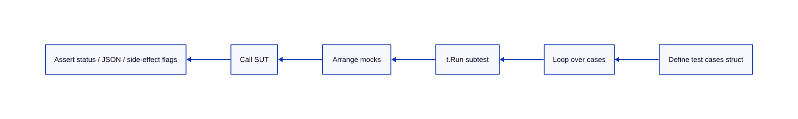
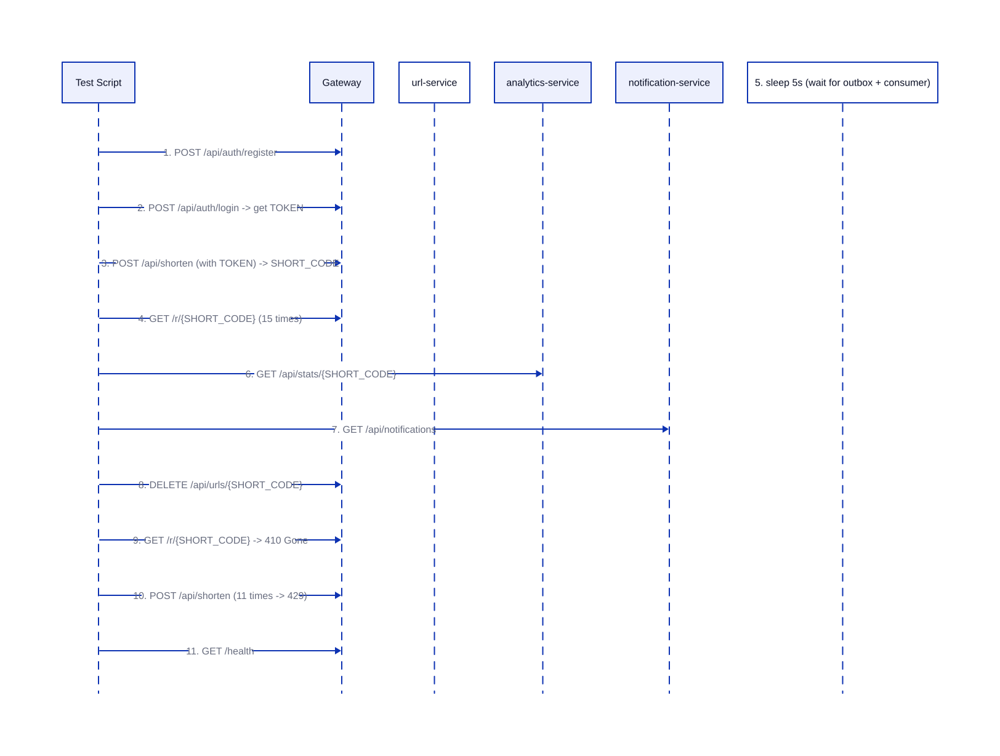
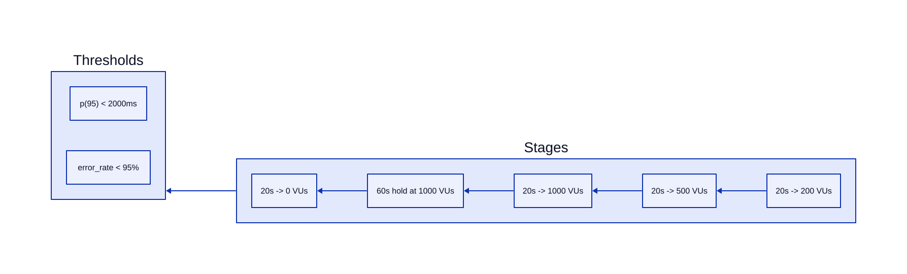

# Kiểm Thử (Testing) — url-shortener-microservices

---
## 1. Unit Tests

- **What**: Go `testing` package, table-driven tests với struct test cases, subtest qua `t.Run`
- **Where**: 6 file test trên 6 packages — url-service (base62, validation, cache, handler), gateway (circuit breaker, rate limiter, JWT, CORS), user-service (auth, bcrypt, JWT), analytics-service (click, milestone, stats), notification-service (consumer, handler), shared/events (JSON roundtrip)
- **Why**: Cô lập từng module, verify state machine chuyển tiếp (CB), roundtrip encoding (base62), và HTTP status mapping

### Coverage chính

| Package | File Test | Số test case | Input mẫu | Expected |
|---|---|---|---|---|
| base62 | `url_test.go` | 3 func (8+5 cases) | `0→"0"`, `61→"z"`, `62→"10"` | Encode/Decode roundtrip, lỗi invalid chars, codegen |
| cache | `url_test.go` | 1 func (4 subtests) | miss, hit, delete, bad client fallback | Get/Set/Delete, nil fallback when Redis down |
| handler shorten | `url_test.go` | 4 subtests | valid URL, collision retry, unauthorized, invalid URL | 201 Created, 401, 400, retry logic |
| handler redirect | `url_test.go` | 5 subtests | cache hit, cache miss→DB, deactivated, expired, not found | 308, 410 (×2), 404 |
| handler list/delete | `url_test.go` | 4 subtests | success with pagination, hasMore, delete success, forbidden | 200, cursor, 204, 403 |
| circuitbreaker | `gateway_test.go` | 1 func (full lifecycle) | 2 failures→OPEN, reject, half-open success→CLOSED, probe fail→OPEN | State machine CLOSED→OPEN→HALF-OPEN→CLOSED/OPEN |
| ratelimit | `gateway_test.go` | 1 func (2 scenarios) | deny→429 with Retry-After, fail-open when Redis down→201 | 429 / 201 Created |
| JWT middleware | `gateway_test.go` | 2 func (3 scenarios) | missing token→401, valid token→204, public route skip | 401 / 204 / next called |
| CORS middleware | `gateway_test.go` | 1 func (2 scenarios) | OPTIONS preflight→204 with headers, GET→200 with ACAO | 204 + CORS headers, 200 |
| user-service | `user_test.go` | 12+ func | email/password validation, bcrypt hash/verify, JWT issue/verify, register/login handlers | 201/200/400/401/409 |

### Pattern chung



---

## 2. Error Handling & HTTP Mapping

- **What**: Sentinel errors pattern — `var ErrX = errors.New("...")` ở mỗi service
- **Why**: So sánh bằng `errors.Is()` thay vì string matching; mapping tập trung ở handler layer

### Bảng mapping error → HTTP status

| Error | HTTP Status | Ý nghĩa |
|---|---|---|
| `ErrInvalidURL` | 400 Bad Request | URL không hợp lệ |
| `ErrAlreadyExists` | 409 Conflict | Short code đã tồn tại |
| `ErrForbidden` | 403 Forbidden | Không phải chủ sở hữu |
| `ErrNotFound` | 404 Not Found | Không tìm thấy URL |
| `ErrExpired` / `ErrDeactivated` | 410 Gone | Link hết hạn hoặc bị xóa |
| `ErrDatabaseError` | 500 Internal Server Error | Lỗi DB |
| `ErrCircuitOpen` | 503 Service Unavailable | Circuit breaker đang OPEN |
| `ErrDuplicateEmail` | 409 Conflict | Email đã được đăng ký |
| `ErrUserNotFound` / `ErrTokenInvalid` | 401 Unauthorized | Sai credentials / token |
| `ErrInvalidEmail` / `ErrInvalidPassword` | 400 Bad Request | Validation đầu vào |

### Kiến trúc sentinel errors

```
services/url-service/errors.go     → 8 sentinel errors
services/user-service/errors.go    → 6 sentinel errors
gateway/errors.go                  → writeError helper
gateway/circuitbreaker.go          → ErrCircuitOpen
services/analytics-service/errors.go → writeError helper
services/notification-service/errors.go → writeError helper
```

---

## 3. E2E Testing

- **What**: Shell script `e2e_test.sh` dùng `curl` + `python3` inline
- **Why**: Mô phỏng real-user flow qua gateway, kiểm tra toàn bộ chain service

### Flow 11 bước



### Bước kiểm thử chi tiết

| Bước | Endpoint | Expected | Xác minh |
|---|---|---|---|
| register | `POST /api/auth/register` | 201 | JSON response |
| login | `POST /api/auth/login` | 200 | Trích xuất `token` |
| shorten | `POST /api/shorten` | 201 | Trích xuất `short_code` |
| redirect (×15) | `GET /r/{code}` | 301 / 308 | HTTP status code |
| stats | `GET /api/stats/{code}` | 200 | `total_clicks ≥ 15` |
| notifications | `GET /api/notifications` | 200 | có `milestone.reached` |
| delete | `DELETE /api/urls/{code}` | 204 | HTTP status |
| deleted redirect | `GET /r/{code}` | 410 | Gone status |
| rate limit | `POST /api/shorten ×11` | 429 | Eventually rate limited |
| correlation | `GET /health` | 200 | `X-Correlation-ID` header |

---

## 4. Load Testing (k6)

- **What**: 2 kịch bản k6 — `load_test.js` (ramping VUs) và `load_test_1m_rps.js` (constant arrival rate)
- **Why**: Đo throughput thực tế dưới tải, kiểm tra circuit breaker trip/recover

### Scenario 1 — Ramping VUs (`load_test.js`)



| Stage | Duration | Target VUs | Mục đích |
|---|---|---|---|
| Warm-up | 20s | 200 | Khởi tạo kết nối |
| Build-up | 20s | 500 | Tăng dần tải |
| Peak ramp | 20s | 1000 | Đạt ~10k req/s |
| Hold | 60s | 1000 | Quan sát CB trip/recover |
| Ramp down | 20s | 0 | Dừng an toàn |

- **Custom metrics**: `circuit_breaker_open_responses` (Counter), `error_rate` (Rate), `redirect_duration_ms` (Trend)
- **Circuit breaker simulation**: `docker compose stop url-service` trong lúc chạy → gateway trả 503

### Scenario 2 — Constant Arrival Rate (`load_test_1m_rps.js`)

- **Executor**: `constant-arrival-rate`, rate = 100.000 req/s (cấu hình qua `-e RATE=`)
- **Pre-allocated VUs**: 2.000, max VUs: 50.000
- **Mixed workload**: `30% create` + `70% redirect` (tỷ lệ cấu hình qua `CREATE_RATIO`)
- **URL pool**: Setup tự động tạo pool codes để tránh contention

### Thresholds so sánh

| Scenario | p(95) | Failure rate | Ghi chú |
|---|---|---|---|
| Ramping VUs (redirect) | < 2000ms | < 95% | Relaxed — kỳ vọng CB mở |
| Constant arrival (mixed) | < 10000ms | < 99% | High-throughput tolerant |

---

## Tổng kết

- **Unit test**: 6 file, ~50+ test case, coverage trải đều 6 services
- **Error mapping**: 8 sentinel errors ở url-service, mapping rõ ràng ra HTTP status
- **E2E**: 11 bước flow xuyên suốt register→login→shorten→redirect→stats→notification→delete→rate limit
- **Load test**: Kịch bản ramping VUs lên 1000, constant arrival lên 100K req/s, verify CB behavior
