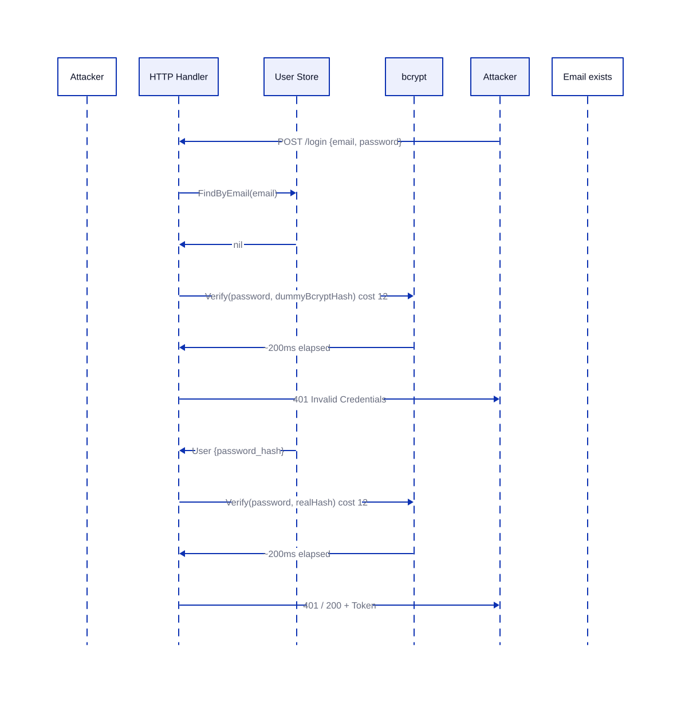
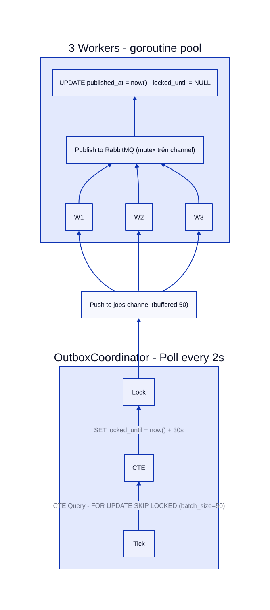
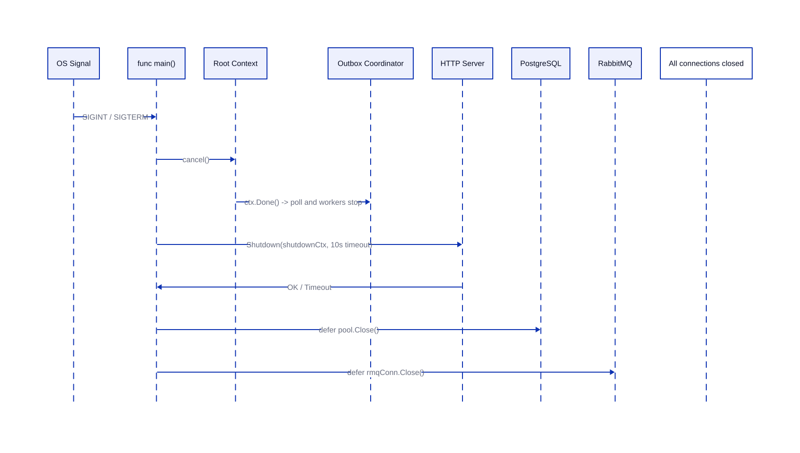

# Góc Nhìn Kỹ Thuật — Timing Attack, Outbox Lock & Graceful Shutdown

---
## 1. Timing Attack Mitigation — Login Endpoint

### Vấn đề

Nếu handler chỉ gọi `bcrypt.Verify` khi user tồn tại, response time sẽ khác nhau giữa email hợp lệ (~200ms) và không hợp lệ (~1ms), tạo timing side-channel cho attacker dò email.

### Giải pháp: Dummy Bcrypt Hash

Code hiện tại đã áp dụng dummy bcrypt — luôn gọi `Verify` với hash giả khi user không tồn tại, xoá timing difference:

```go
if user == nil {
    _ = h.hasher.Verify(req.Password, dummyBcryptHash) // ~200ms
    writeError(w, http.StatusUnauthorized, "invalid credentials")
    return
}
```



### Phân tích

- **Ưu điểm**: Xoá timing side-channel, dùng đúng bcrypt cost, không leak email info.
- **Nhược điểm**: CPU waste — mỗi request email sai vẫn tốn ~200ms bcrypt. Trên high-traffic login, DDoS amplification risk (attacker spam email sai → server chạy bcrypt vô ích).
- **Alternative**: Dùng sleep-based delay nhẹ hơn (`time.Sleep` sau DB miss), nhưng dễ bị phát hiện qua timing pattern và không an toàn nếu goroutine scheduler delay không ổn định. Cách dùng bcrypt dummy an toàn hơn nhưng nặng CPU hơn.

| Tiêu chí | Dummy bcrypt | Sleep delay |
|---|---|---|
| Timing consistency | Rất tốt (thuật toán cố định) | Phụ thuộc scheduler |
| CPU cost | Cao (~200ms/request) | Rất thấp |
| DDoS resilience | Kém (tốn CPU) | Tốt hơn |
| Implementation | Đơn giản, khó sai | Dễ sai (sleep không đủ) |

---

## 2. Outbox Pattern & FOR UPDATE SKIP LOCKED

### Vấn đề

URL Service dùng transactional outbox để đảm bảo at-least-once delivery. Nhiều replica chạy `OutboxCoordinator.Run()` đồng thời, cùng quét bảng `outbox` → **duplicate processing, double-send nếu không có cơ chế lock**.

### Giải pháp: CTE + `FOR UPDATE SKIP LOCKED`

```sql
WITH claimed AS (
    SELECT id
    FROM outbox
    WHERE published_at IS NULL
      AND (locked_until IS NULL OR locked_until < now())
    ORDER BY created_at ASC
    LIMIT $1
    FOR UPDATE SKIP LOCKED
)
UPDATE outbox o
SET locked_until = now() + interval '30 seconds'
FROM claimed
WHERE o.id = claimed.id
RETURNING o.id, o.event_type, o.payload, o.created_at, o.locked_until, o.published_at
```

| Thành phần | Vai trò |
|---|---|
| `WITH claimed ... FOR UPDATE SKIP LOCKED` | Chọn bản ghi chưa published và **không bị replica khác lock**, bỏ qua bản ghi đang xử lý |
| `UPDATE ... SET locked_until = now() + 30s` | Giành quyền xử lý, các replica khác sẽ bỏ qua trong 30s |
| `RETURNING` | Trả về dữ liệu ngay, tránh SELECT riêng |



### Thread Safety

- Worker gọi `publisher.Publish()` → bên trong dùng `sync.Mutex` trên `amqp.Channel` (RabbitMQ channel không thread-safe).
- Mỗi worker publish xong mới `MarkPublished` — nếu mark fail, record vẫn unpublished, sẽ được poll lại sau 30s.

### Phân tích

| Khía cạnh | Đánh giá |
|---|---|
| At-least-once | ✅ Đảm bảo — nếu crash giữa publish và mark, record sẽ được retry |
| Exactly-once | ❌ Không — consumer phải tự deduplicate bằng event ID |
| Dead letter queue | ❌ **Không có** — events fail nhiều lần (VD: publish lỗi liên tục) sẽ stuck mãi, không có DLQ để routing |
| Lock expiration | 30s — nếu worker crash, record được release sau 30s; nếu publish lâu hơn 30s, replica khác có thể pick up duplicate |

---

## 3. Graceful Shutdown

### Vấn đề

Khi nhận SIGINT/SIGTERM, nếu shutdown đột ngột có thể gây:

- Mất event trong jobs channel chưa publish
- Transaction dang dở
- Corrupted state ở RabbitMQ/RDB

### Giải pháp: Context Cascade + HTTP Drain



| Bước | Hành động | Chi tiết |
|---|---|---|
| 1 | Nhận signal | `signal.Notify(quit, syscall.SIGTERM, syscall.SIGINT)` |
| 2 | Cancel root context | `cancel()` → `OutboxCoordinator.Run()` thoát vòng lặp, close jobs channel, `workers.Wait()` |
| 3 | HTTP Shutdown | `srv.Shutdown(shutdownCtx)` với timeout 10s — drain active requests |
| 4 | Đóng pool | `pool.Close()` (DB), `redisClient.Close()`, `rmqConn.Close()` qua defer |

### Điểm yếu trong implementation hiện tại

| Service | Vấn đề |
|---|---|
| **url-service** | `srv.Shutdown` chạy sau `cancel()`, nhưng `pool.Close()` qua defer — nếu shutdown timeout, defer vẫn chạy nên không mất kết nối. **Tuy nhiên**: không chờ `OutboxCoordinator` worker finish hẳn trước khi đóng DB. |
| **user-service** | `srv.Shutdown(ctx)` dùng **ctx đã bị cancel** → shutdown context hết hiệu lực ngay lập tức, **không có drain đúng nghĩa**. Shutdown timeout = 0. |
| **gateway** | `srv.Shutdown(context.Background())` — dùng context vô hạn, tốt nhưng không có timeout. |

### Khuyến nghị

- Dùng `shutdownCtx` riêng với timeout (giống url-service) thay vì dùng lại ctx đã cancel.
- Chờ `OutboxCoordinator` workers hoàn thành trước khi `pool.Close()` — hiện tại chạy đồng thời qua defer, có nguy cơ DB đóng giữa lúc worker gọi `MarkPublished`.

---

_Báo cáo phân tích từ codebase thực tế — tập trung vào 3 góc nhìn kỹ thuật có tính ứng dụng cao._
